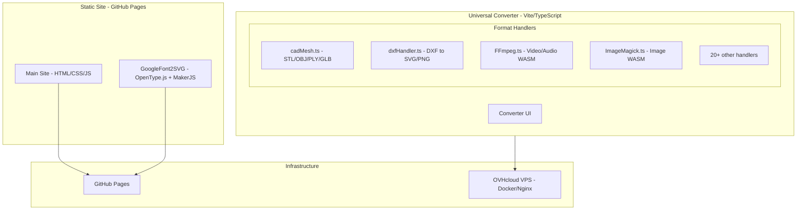
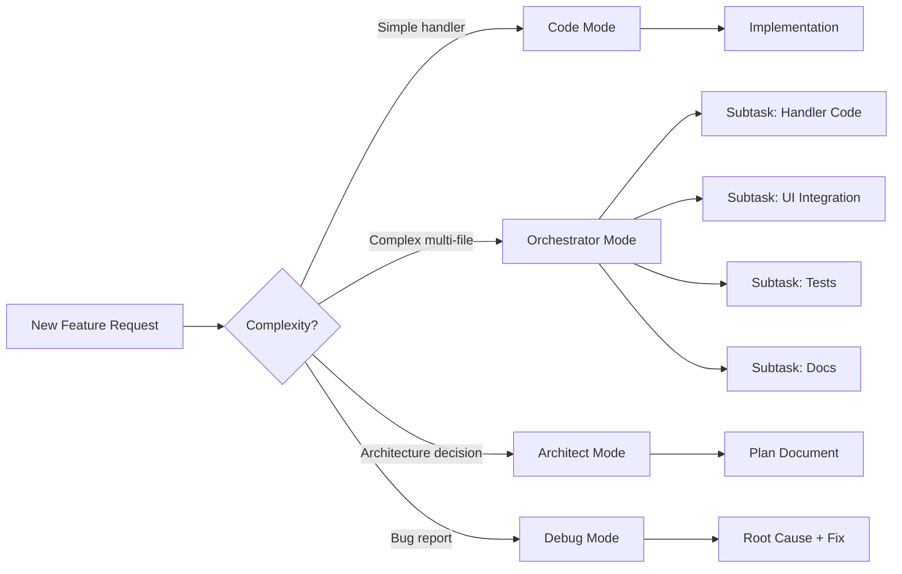
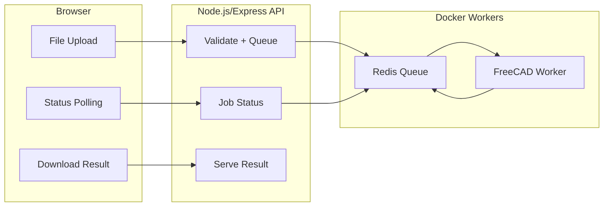
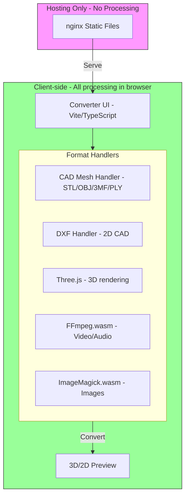
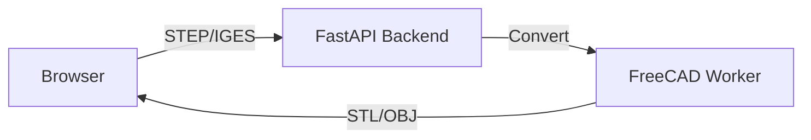
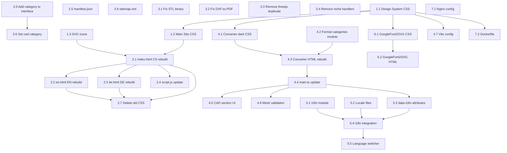

# RIPlay Master Unified Plan + Log + Agent Attention Hold
**Date:** February 21 2026  
**Project:** riplay.cz — privacy-first toolbox + agentic AI tools  
**Repo:** https://github.com/Aeell/riplay  
**Live:** Full VPS serve at https://riplay.cz (Nginx + Docker-ready)  
**Current active task:** ONLY the Toolbox section (hub + PDF Toolkit priority)  
**Status:** Chill first-person overhaul already live

## AGENT ATTENTION HOLD — READ THIS FIRST (Sanity Guardrails)

**DO NOT TOUCH**:
- The big Universal Converter (`tools/converter/`) — it stays exactly as-is (Vite/WASM heavy tool)
- Any old corporate tone or purple/cyan colors — everything uses the new ember-fire `rds-*` design system
- GitHub Pages rules — we are on VPS, so COOP/COEP headers only needed on converter path

**MUST USE**:
- All new pages import `../css/riplay-design-system.css` (or absolute `/css/riplay-design-system.css`)
- `.rds-card` + exact card HTML pattern from `/tools/GoogleFont2SVG/index.html`
- `data-i18n` pattern for CS/EN/DE
- Client-side first, VPS `/api/` only for heavy stuff (PDF compress, image batch >20 MB)

**Current live reality**:
- Full chill overhaul (hero/about/use-cases) is already deployed
- Cookie consent + GA4 + new logo live
- Only a tiny inline tools section on main page — we are replacing it with proper /tools/ hub

**Output rules for every task**:
- Exact full file code (never partial)
- Exact search-replace diffs for nav/main files
- Production-ready, <150 KB gzipped per page, mobile-perfect (48 px touches, clamp, snap-scroll)
- Update sitemap.xml + robots.txt + README.md

**Sanity checklist before every response**:
- Does it reuse rds-* classes exactly?
- Are paths correct (`/tools/index.html`, `/tools/en.html`, `/tools/de.html`)?
- Is PDF Toolkit client-side except compress?
- Is nav updated on all 6 HTML files?
- Zero bloat, zero new frameworks

---

## 2. Kilo Code MCP Infrastructure & Tooling Plan
# Kilo Code MCP Infrastructure & Tooling Plan for RIPlay

> **Date:** 2026-02-19  
> **Project:** riplay.cz — Full-stack web platform with file conversion tools  
> **Current Stack:** Static HTML/CSS/JS + Vite/TypeScript converter + Three.js/WASM + Docker/Nginx  
> **VPS:** OVHcloud VPS-2 (6 vCores, 12GB RAM, 100GB SSD)

---

## Table of Contents

1. [Project Context Summary](#1-project-context-summary)
2. [MCP Server Recommendations](#2-mcp-server-recommendations)
3. [Kilo Code Skills & Configuration](#3-kilo-code-skills--configuration)
4. [Toolchain & Ecosystem Integration](#4-toolchain--ecosystem-integration)
5. [Scalability & Future-Proofing](#5-scalability--future-proofing)
6. [Gaps & Risks](#6-gaps--risks)
7. [Implementation Roadmap](#7-implementation-roadmap)

---

## 1. Project Context Summary

### Current Architecture



### Key Observations from Code Analysis

| Aspect | Current State | Notes |
|--------|--------------|-------|
| MCP Config | Empty — [`mcp.json`](.kilocode/mcp.json:1) has `{"mcpServers":{}}` | No MCP servers configured |
| CI/CD | Basic GitHub Pages deploy — [`github-pages.yml`](.github/workflows/github-pages.yml:1) | No build step for converter |
| Converter | 22+ format handlers in [`handlers/index.ts`](tools/converter/src/handlers/index.ts:1) | Plugin architecture via [`FormatHandler`](tools/converter/src/FormatHandler.ts:35) interface |
| Build | Vite + TypeScript — [`vite.config.js`](tools/converter/vite.config.js:1) | WASM static copy for FFmpeg, ImageMagick, Reflo |
| Docker | Bun build + Nginx static — [`Dockerfile`](tools/converter/docker/Dockerfile:1) | Multi-stage, production-ready |
| 3D/CAD | Three.js loaders/exporters — [`cadMesh.ts`](tools/converter/src/handlers/cadMesh.ts:1) | STL, OBJ, PLY, GLB with image rendering |
| 2D CAD | dxf-parser — [`dxfHandler.ts`](tools/converter/src/handlers/dxfHandler.ts:1) | DXF to SVG/PNG, PDF stub |
| Font Tools | OpenType.js + MakerJS — [`index.js`](tools/googlefont2svg/index.js:1) | Font to SVG/DXF with Google Fonts API |

---

## 2. MCP Server Recommendations

### Tier 1: Essential — Install Immediately

These MCP servers provide the highest immediate value for the riplay.cz project.

#### 2.1 Context7 MCP Server
- **Purpose:** Real-time library/API documentation lookup during development
- **Why:** Already referenced in your global rules. Provides up-to-date docs for Three.js, Vite, TypeScript, dxf-parser, OpenType.js, and every npm dependency without leaving the editor
- **Install:** `npx -y @context7/mcp@latest`
- **Config:**
```json
{
  "mcpServers": {
    "context7": {
      "command": "npx",
      "args": ["-y", "@context7/mcp@latest"]
    }
  }
}
```
- **Value:** Eliminates hallucinated API calls; ensures code generation uses correct, current library signatures

#### 2.2 Filesystem MCP Server
- **Purpose:** Structured file operations — read, write, search, move files across the workspace
- **Why:** The project has a complex multi-tool structure with `tools/converter/`, `tools/googlefont2svg/`, `3rd_party/convert/`, `docs/`, `plans/`. Filesystem MCP gives Kilo Code reliable file manipulation beyond basic tool calls
- **Install:** `npx -y @anthropic/mcp-filesystem`
- **Config:**
```json
{
  "mcpServers": {
    "filesystem": {
      "command": "npx",
      "args": ["-y", "@anthropic/mcp-filesystem", "c:/develop/riplay"]
    }
  }
}
```

#### 2.3 GitHub MCP Server
- **Purpose:** Repository management — issues, PRs, branches, releases, Actions workflows
- **Why:** Your project is on GitHub with Pages deployment. This enables Kilo Code to create issues for new converter features, manage PRs, trigger deployments, and inspect workflow runs
- **Install:** `npx -y @anthropic/mcp-github`
- **Config:**
```json
{
  "mcpServers": {
    "github": {
      "command": "npx",
      "args": ["-y", "@anthropic/mcp-github"],
      "env": {
        "GITHUB_TOKEN": "<your-github-pat>"
      }
    }
  }
}
```

#### 2.4 Docker MCP Server
- **Purpose:** Container management — build, run, inspect, logs for Docker containers
- **Why:** Your converter uses Docker for production deployment ([`Dockerfile`](tools/converter/docker/Dockerfile:1)). Future server-side STEP/IGES conversion will need FreeCAD workers in containers. Docker MCP lets Kilo Code build images, inspect running containers, and debug deployment issues
- **Install:** `npx -y @anthropic/mcp-docker`
- **Config:**
```json
{
  "mcpServers": {
    "docker": {
      "command": "npx",
      "args": ["-y", "@anthropic/mcp-docker"]
    }
  }
}
```

### Tier 2: High Value — Install for Active Development

#### 2.5 Puppeteer / Browser MCP Server
- **Purpose:** Browser automation for testing converter UI, screenshot verification, E2E testing
- **Why:** Your converter is 100% client-side with WASM. Visual regression testing and automated conversion verification require browser interaction. Puppeteer is already a devDependency in [`package.json`](tools/converter/package.json:14)
- **Install:** `npx -y @anthropic/mcp-puppeteer`
- **Config:**
```json
{
  "mcpServers": {
    "puppeteer": {
      "command": "npx",
      "args": ["-y", "@anthropic/mcp-puppeteer"]
    }
  }
}
```

#### 2.6 PostgreSQL / SQLite MCP Server
- **Purpose:** Database management for future backend features — user analytics, conversion logs, job queues
- **Why:** Phase 3 of your [`cad-cam-converter-plan.md`](plans/cad-cam-converter-plan.md:388) calls for a FastAPI backend with job queues. A database MCP server enables Kilo Code to design schemas, write migrations, and query data directly
- **Recommended:** Start with SQLite MCP for local dev, migrate to PostgreSQL MCP when backend goes live
- **Install:** `npx -y @anthropic/mcp-sqlite` or `npx -y @anthropic/mcp-postgres`

#### 2.7 Fetch / HTTP MCP Server
- **Purpose:** Make HTTP requests to external APIs — Google Fonts API, npm registry, CDN endpoints
- **Why:** Your GoogleFont2SVG tool calls the Google Fonts API ([`index.js`](tools/googlefont2svg/index.js:211)). Fetch MCP enables testing API endpoints, checking CDN availability, and validating deployment URLs
- **Install:** `npx -y @anthropic/mcp-fetch`
- **Config:**
```json
{
  "mcpServers": {
    "fetch": {
      "command": "npx",
      "args": ["-y", "@anthropic/mcp-fetch"]
    }
  }
}
```

### Tier 3: Strategic — Install When Needed

#### 2.8 Sentry MCP Server
- **Purpose:** Error tracking and monitoring integration
- **Why:** Production error monitoring for WASM crashes, conversion failures, and client-side exceptions
- **When:** After deploying to production VPS

#### 2.9 Cloudflare MCP Server
- **Purpose:** CDN, DNS, and edge function management
- **Why:** If you move to Cloudflare for CDN/DNS (recommended for WASM binary delivery performance)
- **When:** During CDN migration

#### 2.10 Linear / Jira MCP Server
- **Purpose:** Project management integration
- **Why:** Track converter feature requests, bug reports, and development sprints
- **When:** When team grows beyond solo development

#### 2.11 Memory / Knowledge Graph MCP Server
- **Purpose:** Persistent context about project decisions, architecture patterns, and conventions
- **Why:** Maintains institutional knowledge across sessions — remembers that DXF Y-axis is flipped, that SharedArrayBuffer needs COOP/COEP headers, etc.
- **Install:** `npx -y @anthropic/mcp-memory`

### Recommended Combined MCP Configuration

```json
{
  "mcpServers": {
    "context7": {
      "command": "npx",
      "args": ["-y", "@context7/mcp@latest"]
    },
    "filesystem": {
      "command": "npx",
      "args": ["-y", "@anthropic/mcp-filesystem", "c:/develop/riplay"]
    },
    "github": {
      "command": "npx",
      "args": ["-y", "@anthropic/mcp-github"],
      "env": {
        "GITHUB_TOKEN": "<your-github-pat>"
      }
    },
    "docker": {
      "command": "npx",
      "args": ["-y", "@anthropic/mcp-docker"]
    },
    "fetch": {
      "command": "npx",
      "args": ["-y", "@anthropic/mcp-fetch"]
    },
    "puppeteer": {
      "command": "npx",
      "args": ["-y", "@anthropic/mcp-puppeteer"]
    },
    "memory": {
      "command": "npx",
      "args": ["-y", "@anthropic/mcp-memory"]
    }
  }
}
```

---

## 3. Kilo Code Skills & Configuration

### 3.1 Custom Modes

Create project-specific modes to maximize productivity:

#### Converter Handler Mode
- **Purpose:** Specialized mode for creating new format handlers
- **File patterns:** `tools/converter/src/handlers/*.ts`, `tools/converter/src/handlers/index.ts`
- **Instructions:** Always follow the [`FormatHandler`](tools/converter/src/FormatHandler.ts:35) interface. Register new handlers in [`index.ts`](tools/converter/src/handlers/index.ts:1). Use try/catch wrapper pattern for handler registration. Test with both binary and text file inputs.
- **Context:** Auto-include `FormatHandler.ts` and `handlers/index.ts` as reference files

#### Frontend Tool Mode
- **Purpose:** Building new tool pages under `tools/`
- **File patterns:** `tools/**/*`
- **Instructions:** Follow the i18n pattern from GoogleFont2SVG (CS/EN/DE locales). Use the glassmorphism design system from [`style.css`](css/style.css:1). Ensure responsive design at 768px and 1024px breakpoints.

#### DevOps Mode
- **Purpose:** Docker, Nginx, CI/CD, and deployment tasks
- **File patterns:** `**/docker/**`, `**/Dockerfile`, `**/*.yml`, `**/nginx/**`
- **Instructions:** Use multi-stage Docker builds. Configure COOP/COEP headers for SharedArrayBuffer. Follow the deployment checklist in [`deployment.md`](docs/deployment.md:1).

### 3.2 Recommended Skills Configuration

| Skill Area | Configuration | Rationale |
|-----------|---------------|-----------|
| **TypeScript Strict** | Enable strict mode awareness | Converter uses TypeScript with strict config |
| **WASM Integration** | Know FFmpeg.wasm, ImageMagick.wasm patterns | Core conversion engine relies on WASM |
| **Three.js 3D** | Loader/Exporter patterns | CAD mesh handler uses Three.js extensively |
| **SVG Manipulation** | DOM-based SVG generation | DXF handler generates SVG programmatically |
| **Docker Multi-stage** | Build + runtime separation | Production deployment pattern |
| **Vite Plugin System** | Static copy, path resolution | Build configuration for WASM assets |

### 3.3 Project Rules (.kilocode/rules)

Create project-specific rules:

```markdown
# RIPlay Project Rules

## Converter Handler Development
- All new handlers MUST implement the FormatHandler interface from src/FormatHandler.ts
- Handler registration in handlers/index.ts MUST use try/catch wrapper
- Binary file formats MUST use Uint8Array, never string encoding
- All conversions MUST be client-side unless explicitly marked as server-side
- WASM modules MUST be lazy-loaded via dynamic import

## File Format Conventions
- DXF Y-axis is inverted relative to SVG — always negate Y coordinates
- STL files can be ASCII or binary — detect via magic bytes
- SVG output MUST include proper xmlns and viewBox attributes
- Font files (TTF/OTF/WOFF) use OpenType.js for parsing

## Internationalization
- All user-facing text MUST support CS, EN, DE locales
- Use JSON locale files following the pattern in tools/googlefont2svg/locales/
- Never hardcode user-visible strings in JavaScript/TypeScript

## Deployment
- Static assets served via Nginx with immutable cache headers
- WASM files require Cross-Origin-Embedder-Policy: require-corp
- SharedArrayBuffer requires Cross-Origin-Opener-Policy: same-origin
- HTML files MUST have no-cache headers
```

### 3.4 Mode Usage Strategy



---

## 4. Toolchain & Ecosystem Integration

### 4.1 Vector File Format Libraries

| Format | Library | Status | Notes |
|--------|---------|--------|-------|
| **DXF** | `dxf-parser` v1.1.2 | ✅ In use | Parse DXF to JSON entities |
| **SVG** | Native DOM API | ✅ In use | Programmatic SVG generation |
| **TTF/OTF** | `opentype.js` | ✅ In use | Font parsing in GoogleFont2SVG |
| **WOFF/WOFF2** | `opentype.js` | ✅ Supported | Same library handles WOFF |
| **DXF Export** | `makerjs` | ✅ In use | DXF export in GoogleFont2SVG |
| **SVG to DXF** | `svg-to-dxf` | ⬜ Recommended | Reverse conversion path |
| **PDF Generation** | `jspdf` + `svg2pdf.js` | ⬜ Recommended | Complete the PDF output stub in dxfHandler |
| **STL/OBJ/PLY/GLB** | Three.js loaders/exporters | ✅ In use | Full 3D mesh pipeline |
| **3MF** | `three/addons/loaders/3MFLoader` | ⬜ Planned | Listed in CAD plan |
| **STEP/IGES** | OpenCASCADE.js or FreeCAD backend | ⬜ Phase 3 | Requires server-side processing |

### 4.2 Backend Processing Pipeline (Phase 3)

When server-side conversion is needed:



**Recommended Stack:**
- **API:** Express.js or Fastify (Node.js) — consistent with existing TypeScript ecosystem
- **Queue:** BullMQ + Redis — battle-tested job queue for Node.js
- **CAD Engine:** FreeCAD headless in Docker — open-source, supports STEP/IGES/Parasolid
- **File Storage:** Local filesystem with TTL cleanup (1 hour) — matches security requirements in [`cad-cam-converter-plan.md`](plans/cad-cam-converter-plan.md:504)

### 4.3 Frontend Delivery Optimization

| Optimization | Tool | Impact |
|-------------|------|--------|
| **WASM Compression** | Brotli pre-compression in Nginx | 60-70% size reduction for WASM binaries |
| **Code Splitting** | Vite dynamic imports | Already in use — handlers lazy-loaded |
| **CDN** | Cloudflare or BunnyCDN | Serve WASM/JS from edge nodes |
| **Service Worker** | Workbox | Offline capability for converter |
| **Image Optimization** | Sharp or squoosh-cli | Convert logo PNG to WebP/AVIF |

### 4.4 Testing Infrastructure

| Layer | Tool | Purpose |
|-------|------|---------|
| **Unit Tests** | Vitest | Test individual handler conversion logic |
| **Integration Tests** | Vitest + jsdom | Test handler registration and routing |
| **E2E Tests** | Playwright or Puppeteer | Test full conversion flow in browser |
| **Visual Regression** | Playwright screenshots | Verify SVG/PNG output consistency |
| **Performance** | Lighthouse CI | Track WASM load times and conversion speed |

### 4.5 Monitoring & Analytics

| Tool | Purpose | Priority |
|------|---------|----------|
| **Plausible Analytics** | Privacy-friendly usage tracking | High — GDPR compliant |
| **Sentry** | Client-side error tracking | High — catch WASM crashes |
| **Uptime Robot** | VPS availability monitoring | Medium |
| **Grafana + Prometheus** | Server metrics when backend launches | Low — Phase 3 |

---

## 5. Scalability & Future-Proofing

### 5.1 Plugin Architecture for New Tools

The existing [`FormatHandler`](tools/converter/src/FormatHandler.ts:35) interface is well-designed for extensibility. To make onboarding new conversion features even more seamless:

#### Recommended: Handler Auto-Discovery

Instead of manually importing and registering each handler in [`index.ts`](tools/converter/src/handlers/index.ts:1), implement auto-discovery:

```typescript
// handlers/index.ts — proposed auto-discovery pattern
const handlerModules = import.meta.glob('./*.ts', { eager: false });

const handlers: FormatHandler[] = [];
for (const path in handlerModules) {
  if (path === './index.ts') continue;
  try {
    const module = await handlerModules[path]();
    const HandlerClass = module.default;
    if (HandlerClass && typeof HandlerClass === 'function') {
      handlers.push(new HandlerClass());
    } else if (HandlerClass && HandlerClass.name) {
      handlers.push(HandlerClass);
    }
  } catch (e) {
    console.warn('Failed to load handler from ' + path, e);
  }
}
```

**Benefits:**
- Drop a new `.ts` file in `handlers/` and it auto-registers
- No merge conflicts when multiple handlers are added simultaneously
- Cleaner separation of concerns

#### Recommended: Handler Metadata Schema

Add a standardized metadata export to each handler for UI generation:

```typescript
export const metadata = {
  category: 'cad-2d',        // cad-2d, cad-3d, image, video, audio, document, archive
  icon: 'drafting-compass',   // Icon identifier for UI
  description: 'Convert DXF drawings to SVG vector graphics',
  tags: ['cad', 'cnc', 'laser', 'vector'],
  maxFileSize: 50 * 1024 * 1024,  // 50MB
  estimatedSpeed: 'fast',     // fast, medium, slow
};
```

### 5.2 New Tool Onboarding Template

Create a scaffolding template for new tools:

```
tools/<tool-name>/
├── index.html          # Tool UI
├── index.css           # Tool styles
├── index.js or src/    # Tool logic
├── i18n.js             # Internationalization
├── locales/
│   ├── cs.json
│   ├── en.json
│   └── de.json
└── README.md           # Tool documentation
```

### 5.3 Monorepo Considerations

As the tool count grows, consider:

| Approach | When | Tool |
|----------|------|------|
| **Current structure** | 1-5 tools | Manual management |
| **npm workspaces** | 5-10 tools | Shared dependencies, unified build |
| **Turborepo** | 10+ tools | Incremental builds, caching, parallel execution |
| **Nx** | Enterprise scale | Full monorepo management with dependency graph |

**Recommendation:** Migrate to **npm workspaces** when you add the 3rd tool. This gives you:
- Shared `node_modules` across tools
- Unified `npm run build` from root
- Per-tool versioning
- No additional tooling overhead

### 5.4 API Versioning Strategy

For the future backend API:

```
/api/v1/convert     — Current conversion endpoints
/api/v1/formats     — Supported format listing
/api/v1/status/:id  — Job status
```

Use URL-based versioning from day one. This prevents breaking changes when adding new conversion capabilities.

### 5.5 Feature Flag System

Implement a simple feature flag system for gradual rollout of new converters:

```typescript
const FEATURES = {
  STEP_CONVERSION: false,    // Server-side STEP support
  BATCH_DOWNLOAD: true,      // ZIP batch download
  MESH_ANALYSIS: false,      // CNC mesh analysis tools
  DARK_MODE: true,           // UI dark mode
};
```

Store in a JSON config file that can be updated without redeployment.

---

## 6. Gaps & Risks

### 6.1 Critical Gaps

| Gap | Impact | Mitigation |
|-----|--------|------------|
| **No MCP servers configured** | Missing AI-assisted development capabilities | Install Tier 1 servers immediately |
| **No automated testing** | Conversion regressions go undetected | Add Vitest unit tests for each handler |
| **No CI/CD for converter** | Manual build/deploy process | Add GitHub Actions workflow for converter build |
| **PDF output is a stub** | [`dxfHandler.ts`](tools/converter/src/handlers/dxfHandler.ts:363) outputs SVG instead of PDF | Integrate jsPDF + svg2pdf.js |
| **No error monitoring** | Client-side WASM crashes are invisible | Add Sentry or similar |
| **Google Fonts API key exposed** | [`index.js`](tools/googlefont2svg/index.js:7) has hardcoded API key | Move to environment variable or restrict key |

### 6.2 Dependency Risks

| Dependency | Risk Level | Concern | Mitigation |
|-----------|-----------|---------|------------|
| `dxf-parser` v1.1.2 | **Medium** | Last npm publish was 2020; limited entity support | Fork and maintain; or evaluate `dxf` npm package as alternative |
| `@ffmpeg/ffmpeg` v0.12.x | **Low** | Active project but WASM builds can be fragile | Pin exact versions; test upgrades in isolation |
| `three` v0.182.x | **Low** | Very active; breaking changes in minor versions | Pin version; test loader/exporter compatibility on upgrade |
| `opentype.js` | **Low** | Stable, well-maintained | No action needed |
| `makerjs` | **Medium** | Microsoft project, maintenance varies | Already bundled as [`browser.maker.js`](tools/googlefont2svg/lib/browser.maker.js:1); self-contained |
| `imagetracer` v0.2.2 | **Medium** | Small package, limited maintenance | Consider `potrace` WASM as alternative for SVG tracing |
| Google Fonts API | **Low** | Google API, stable | Cache font list locally as fallback |

### 6.3 MCP Ecosystem Risks

| Risk | Description | Mitigation |
|------|-------------|------------|
| **MCP server instability** | Some community MCP servers may have breaking updates | Pin MCP server versions in config |
| **MCP server startup time** | npx-based servers have cold start overhead | Use locally installed servers for frequently-used ones |
| **Token/credential management** | GitHub tokens, API keys in MCP config | Use environment variables, never commit tokens |
| **MCP server conflicts** | Multiple servers may compete for same resources | Test server combinations; disable unused servers |

### 6.4 Architecture Risks

| Risk | Description | Mitigation |
|------|-------------|------------|
| **WASM binary size** | FFmpeg + ImageMagick + future WASM = large downloads | Lazy-load per handler; use CDN with Brotli compression |
| **SharedArrayBuffer restrictions** | Requires HTTPS + COOP/COEP headers | Already documented in [`deployment.md`](docs/deployment.md:160); enforce in CI |
| **Client-side memory limits** | Large CAD files may exceed browser memory | Add file size validation; show warnings for files over 50MB |
| **Cross-browser WASM support** | Safari has historically lagged on WASM features | Test on Safari; provide graceful degradation |
| **3rd_party/convert drift** | Upstream p2r3/convert may diverge from your fork | Track upstream releases; cherry-pick relevant updates |

### 6.5 Missing MCP Capabilities

| Desired Capability | Current MCP Status | Workaround |
|-------------------|-------------------|------------|
| **SVG manipulation** | No dedicated SVG MCP server | Use filesystem MCP + code mode with SVG DOM knowledge |
| **WASM debugging** | No WASM-specific MCP server | Use browser DevTools via Puppeteer MCP |
| **Font file inspection** | No font-specific MCP server | Use OpenType.js programmatically |
| **3D model preview** | No 3D rendering MCP server | Use Puppeteer MCP to screenshot Three.js renders |
| **DXF/CAD validation** | No CAD-specific MCP server | Build custom validation in handler code |

---

## 7. Implementation Roadmap

### Phase 1: Foundation — MCP & Dev Environment

```
[ ] Install and configure Tier 1 MCP servers (Context7, Filesystem, GitHub, Docker)
[ ] Create .kilocode/rules/riplay-rules.md with project-specific rules
[ ] Create custom Kilo Code modes (Converter Handler, Frontend Tool, DevOps)
[ ] Move Google Fonts API key to environment variable
[ ] Add Vitest to converter project for unit testing
```

### Phase 2: CI/CD & Quality

```
[ ] Create GitHub Actions workflow for converter build + test
[ ] Add Vitest unit tests for cadMesh and dxfHandler
[ ] Add Playwright E2E tests for conversion flow
[ ] Integrate Sentry for client-side error monitoring
[ ] Add Plausible Analytics for usage tracking
```

### Phase 3: Converter Enhancement

```
[ ] Implement PDF output in dxfHandler using jsPDF + svg2pdf.js
[ ] Add svg-to-dxf reverse conversion handler
[ ] Implement handler auto-discovery via import.meta.glob
[ ] Add handler metadata schema for UI generation
[ ] Create new tool scaffolding template
```

### Phase 4: Backend & Scale

```
[ ] Set up Express/Fastify API on VPS for server-side conversions
[ ] Deploy Redis + BullMQ for job queue
[ ] Create FreeCAD Docker worker for STEP/IGES conversion
[ ] Implement API versioning (v1)
[ ] Add CDN for WASM binary delivery
[ ] Migrate to npm workspaces for multi-tool management
```

### Phase 5: Production Hardening

```
[ ] Add feature flag system
[ ] Implement file size validation and memory guards
[ ] Add Service Worker for offline converter capability
[ ] Set up Grafana + Prometheus monitoring on VPS
[ ] Create automated backup strategy for VPS
```

---

## Appendix A: Complete MCP Server Reference

| Server | Category | Use Case | Priority |
|--------|----------|----------|----------|
| Context7 | Documentation | Library/API docs lookup | Tier 1 |
| Filesystem | File Operations | Structured file manipulation | Tier 1 |
| GitHub | Version Control | Repo, issues, PRs, Actions | Tier 1 |
| Docker | Infrastructure | Container management | Tier 1 |
| Puppeteer | Testing | Browser automation, E2E | Tier 2 |
| SQLite/PostgreSQL | Database | Schema, queries, migrations | Tier 2 |
| Fetch | HTTP | API testing, endpoint validation | Tier 2 |
| Memory | Knowledge | Persistent project context | Tier 2 |
| Sentry | Monitoring | Error tracking integration | Tier 3 |
| Cloudflare | CDN/DNS | Edge delivery management | Tier 3 |
| Linear/Jira | Project Mgmt | Issue tracking integration | Tier 3 |

## Appendix B: Key File Reference

| File | Purpose |
|------|---------|
| [`.kilocode/mcp.json`](.kilocode/mcp.json:1) | MCP server configuration — currently empty |
| [`tools/converter/src/FormatHandler.ts`](tools/converter/src/FormatHandler.ts:1) | Handler interface definition |
| [`tools/converter/src/handlers/index.ts`](tools/converter/src/handlers/index.ts:1) | Handler registration |
| [`tools/converter/src/handlers/cadMesh.ts`](tools/converter/src/handlers/cadMesh.ts:1) | 3D CAD mesh handler |
| [`tools/converter/src/handlers/dxfHandler.ts`](tools/converter/src/handlers/dxfHandler.ts:1) | 2D DXF handler |
| [`tools/converter/package.json`](tools/converter/package.json:1) | Converter dependencies |
| [`tools/converter/vite.config.js`](tools/converter/vite.config.js:1) | Vite build configuration |
| [`tools/converter/docker/Dockerfile`](tools/converter/docker/Dockerfile:1) | Production Docker build |
| [`tools/googlefont2svg/index.js`](tools/googlefont2svg/index.js:1) | Font to SVG/DXF tool |
| [`.github/workflows/github-pages.yml`](.github/workflows/github-pages.yml:1) | CI/CD pipeline |
| [`docs/architecture.md`](docs/architecture.md:1) | Architecture documentation |
| [`docs/deployment.md`](docs/deployment.md:1) | Deployment guide |
| [`plans/cad-cam-converter-plan.md`](plans/cad-cam-converter-plan.md:1) | CAD/CAM feature roadmap |

## 3. CAD/CAM File Converter Implementation Plan
# CAD/CAM File Converter - Implementation Plan

## Executive Summary

This plan outlines the implementation of a comprehensive CAD/CAM file conversion tool for RIPlay, targeting CNC shops, engineers, and designers working with SolidWorks, Inventor, PowerMill, Fusion 360, and similar software.

## Current State Analysis

### Existing Implementation
- **Location**: [`tools/converter/index.html`](tools/converter/index.html)
- **Current approach**: iframe embedding external service (convert.to.it)
- **Limitations**: No control over conversions, no CAD/CAM-specific features, dependency on external service

### Reference Repository: p2r3/convert ✅ ANALYZED
- **GitHub**: https://github.com/p2r3/convert
- **Live site**: https://convert.to.it
- **License**: GPL-2.0 (compatible with self-hosting and modification)
- **Goal**: Clone this functionality and host it ourselves on the VPS

#### Technology Stack
| Component | Technology |
|-----------|------------|
| Language | TypeScript |
| Build Tool | Vite + Bun |
| 3D Engine | Three.js (already integrated) |
| Video/Audio | FFmpeg.wasm (WebAssembly) |
| Images | ImageMagick.wasm, Canvas API |
| Archives | JSZip |
| Deployment | Docker + nginx |

#### Architecture Highlights
1. **100% Client-side** - All conversions happen in the browser using WebAssembly
2. **Handler-based plugin system** - Easy to extend with new formats
3. **Auto-routing** - Automatically finds conversion paths between formats
4. **Batch support** - Already handles multiple files
5. **No backend required** - Can be hosted as static files

#### Current Format Support (Relevant to CAD/CAM)
| Format | Status | Notes |
|--------|--------|-------|
| GLB | ✅ Input | Renders 3D model to PNG/JPEG/WebP |
| STL | ❌ Missing | Need to add handler |
| OBJ | ❌ Missing | Need to add handler |
| 3MF | ❌ Missing | Need to add handler |
| STEP | ❌ Missing | Complex - may need server-side |
| IGES | ❌ Missing | Complex - may need server-side |
| DXF | ❌ Missing | Need to add handler |
| SVG | ✅ Partial | Via svgTrace handler |

#### Key Files to Understand
- [`src/FormatHandler.ts`](3rd_party/convert/src/FormatHandler.ts) - Interface for all handlers
- [`src/handlers/threejs.ts`](3rd_party/convert/src/handlers/threejs.ts) - Example 3D handler using Three.js
- [`src/handlers/index.ts`](3rd_party/convert/src/handlers/index.ts) - Handler registration
- [`src/main.ts`](3rd_party/convert/src/main.ts) - Main application logic

### Available Infrastructure
- **VPS-2 at OVHcloud**
  - 6 vCores
  - 12 GB RAM
  - 100 GB Storage
- **Sufficient for**: Docker containers, conversion workers, file storage

---

## CAD/CAM Format Analysis

### Format Categories

#### 1. Mesh/Surface Formats (Client-side capable)
| Format | Extension | Use Case | JS Library Support |
|--------|-----------|----------|-------------------|
| STL | .stl | 3D printing, CNC mesh | Three.js, STLLoader |
| OBJ | .obj | 3D modeling exchange | Three.js, OBJLoader |
| 3MF | .3mf | Modern 3D printing | Three.js, 3MFLoader |
| PLY | .ply | 3D scanning | Three.js, PLYLoader |
| AMF | .amf | Additive manufacturing | Limited JS support |

#### 2. CAD Exchange Formats (Server-side required)
| Format | Extension | Use Case | Conversion Tool |
|--------|-----------|----------|-----------------|
| STEP | .step, .stp | Industry standard CAD exchange | FreeCAD, OpenCASCADE |
| IGES | .iges, .igs | Legacy CAD exchange | FreeCAD, OpenCASCADE |
| Parasolid | .x_t, .x_b | Siemens NX, SolidWorks kernel | FreeCAD (limited) |
| ACIS | .sat, .sab | Autodesk, other CAD | FreeCAD (limited) |
| JT | .jt | Siemens PLM | Limited open-source support |

#### 3. 2D Vector Formats
| Format | Extension | Use Case | JS Library Support |
|--------|-----------|----------|-------------------|
| DXF | .dxf | AutoCAD, CNC cutting | dxf-parser, dxftojs |
| DWG | .dwg | AutoCAD native | Server-side only |
| SVG | .svg | Web, laser cutting | Native browser support |
| HPGL | .plt | Plotter files | Limited support |

#### 4. Native CAD Formats (Limited support)
| Format | Extension | Software | Conversion Approach |
|--------|-----------|----------|-------------------|
| SLDPRT | .sldprt | SolidWorks | FreeCAD import (experimental) |
| IPT | .ipt | Inventor | FreeCAD import (experimental) |
| F3D | .f3d | Fusion 360 | Fusion API or export first |
| PRT | .prt | NX/Pro-E | Very limited support |

---

## Recommended Architecture

### Fork and Extend p2r3/convert (Client-side First)

The p2r3/convert repository is **100% client-side** using WebAssembly. This means:
- ✅ No backend required for mesh formats (STL, OBJ, 3MF, PLY)
- ✅ All conversions happen in the browser
- ✅ Can be hosted as static files on any web server
- ✅ Privacy-friendly - files never leave the user's browser



### Server-side Extension (Optional - Phase 3)

For STEP/IGES/Parasolid formats that cannot be converted client-side:



### File Structure (After Fork)

```
tools/converter/           # Forked from p2r3/convert
    src/
        handlers/
            cadMesh.ts     # NEW: STL/OBJ/3MF/PLY handler
            dxfHandler.ts  # NEW: DXF to SVG handler
            stepHandler.ts # NEW: STEP/IGES via API
            threejs.ts     # EXISTING: GLB support
            FFmpeg.ts      # EXISTING: Video/audio
            ImageMagick.ts # EXISTING: Images
            ...
        main.ts            # Main application
        FormatHandler.ts   # Handler interface
    dist/                  # Built static files
    package.json
    vite.config.js
```

### Technology Stack

#### Frontend
- **Framework**: Vanilla JS (consistent with existing site)
- **3D Preview**: Three.js with OrbitControls
- **2D Preview**: SVG rendering for DXF
- **File handling**: FileSaver.js, JSZip

#### Backend
- **API Server**: Node.js with Express
- **Job Queue**: Bull + Redis (handles concurrent conversions)
- **CAD Engine**: FreeCAD (Python-based, open-source)
- **Mesh Tools**: OpenCASCADE, trimesh, meshio
- **Storage**: Local filesystem with cleanup policy

#### Docker Containers
```yaml
services:
  - api: Node.js Express server
  - redis: Job queue backend
  - freecad-worker: FreeCAD Python environment
  - nginx: Reverse proxy and static files
```

---

## Conversion Matrix

### Phase 1: Client-side Mesh Conversions (No Backend)
| From | To | Method | Status |
|------|-----|--------|--------|
| STL | OBJ | Three.js geometry | Phase 1 |
| STL | GLB | Three.js GLTFExporter | Phase 1 |
| STL | 3MF | Three.js 3MFExporter | Phase 1 |
| OBJ | STL | Three.js STLLoader | Phase 1 |
| OBJ | GLB | Three.js GLTFExporter | Phase 1 |
| OBJ | 3MF | Three.js 3MFExporter | Phase 1 |
| PLY | STL/OBJ/GLB | Three.js conversion | Phase 1 |
| 3MF | STL/OBJ/GLB | Three.js 3MFLoader | Phase 1 |
| GLB | STL/OBJ | Three.js GLTFLoader | Phase 1 |

### Phase 2: 2D CAD Conversions
| From | To | Method | Status |
|------|-----|--------|--------|
| DXF | SVG | dxf-parser + svg.js | Phase 2 |
| DXF | PDF | SVG → PDF conversion | Phase 2 |
| SVG | DXF | svg-to-dxf library | Phase 2 |

### Phase 3: Server-side CAD Conversions (Optional Backend)
| From | To | Method | Status |
|------|-----|--------|--------|
| STEP | STL | FreeCAD backend | Phase 3 |
| STEP | OBJ | FreeCAD backend | Phase 3 |
| STEP | GLB | FreeCAD backend | Phase 3 |
| IGES | STL/OBJ | FreeCAD backend | Phase 3 |
| Parasolid | STEP | FreeCAD backend | Phase 3 |

### Already Supported (p2r3/convert)
| Category | Formats |
|----------|---------|
| Video | MP4, AVI, MOV, WebM, MKV, etc. |
| Audio | MP3, WAV, OGG, FLAC, etc. |
| Images | PNG, JPG, WebP, GIF, SVG, etc. |
| Documents | PDF, Markdown, HTML |
| Archives | ZIP, TAR, etc. |
| 3D | GLB (input only → images) |

---

## API Design

### Endpoints

```
POST /api/convert
  - Upload file and specify target format
  - Returns job ID for tracking

GET /api/status/:jobId
  - Check conversion status
  - Returns progress percentage

GET /api/download/:jobId
  - Download converted file

POST /api/preview
  - Generate preview thumbnail
  - Returns base64 image or 3D data

GET /api/formats
  - List supported format conversions
```

### Request/Response Example

```json
// POST /api/convert
{
  "source_format": "step",
  "target_format": "stl",
  "options": {
    "mesh_quality": "high",
    "units": "mm"
  }
}

// Response
{
  "job_id": "abc123",
  "status": "queued",
  "estimated_time": 15
}
```

---

## Implementation Phases

### Phase 0: Fork and Deploy p2r3/convert ✅ READY
**Goal**: Self-host the existing converter as foundation

- [x] Analyze repository structure and architecture
- [ ] Fork repository to RIPlay GitHub account
- [ ] Build and test locally with Bun + Vite
- [ ] Deploy to VPS using Docker configuration
- [ ] Configure nginx for riplay.cz/tools/converter/
- [ ] Remove iframe, serve directly

**Commands to deploy**:
```bash
# Clone with submodules
git clone --recursive https://github.com/p2r3/convert

# Install Bun and dependencies
bun install

# Build for production
bun run build

# Or use Docker
docker compose -f docker/docker-compose.yml up -d
```

### Phase 1: Add CAD Mesh Format Handlers (STL, OBJ, 3MF, PLY)
**Goal**: Extend Three.js handler for CAD mesh formats

**Files to create/modify**:
- Create: `src/handlers/cadMesh.ts` - New handler for CAD mesh formats
- Modify: `src/handlers/index.ts` - Register new handler

**Handler implementation**:
```typescript
// src/handlers/cadMesh.ts
import * as THREE from "three";
import { STLLoader } from "three/addons/loaders/STLLoader.js";
import { OBJLoader } from "three/addons/loaders/OBJLoader.js";
import { PLYLoader } from "three/addons/loaders/PLYLoader.js";
// 3MF requires additional setup

class cadMeshHandler implements FormatHandler {
  public name = "cadMesh";
  public supportedFormats = [
    { name: "Stereolithography", format: "stl", extension: "stl", 
      mime: "model/stl", from: true, to: true, internal: "stl" },
    { name: "Wavefront OBJ", format: "obj", extension: "obj", 
      mime: "model/obj", from: true, to: true, internal: "obj" },
    { name: "Polygon File Format", format: "ply", extension: "ply", 
      mime: "model/ply", from: true, to: true, internal: "ply" },
    { name: "3D Manufacturing Format", format: "3mf", extension: "3mf", 
      mime: "model/3mf", from: true, to: true, internal: "3mf" },
    // Output formats
    { name: "GL Transmission Format Binary", format: "glb", extension: "glb",
      mime: "model/gltf-binary", from: false, to: true, internal: "glb" },
  ];
  // ... conversion logic
}
```

**Conversions enabled**:
| From | To | Method |
|------|-----|--------|
| STL | OBJ | Three.js geometry conversion |
| STL | GLB | Three.js GLTFExporter |
| OBJ | STL | Three.js STLLoader + export |
| OBJ | GLB | Three.js GLTFExporter |
| PLY | STL/OBJ/GLB | Three.js conversion |
| 3MF | STL/OBJ/GLB | Three.js 3MFLoader |

### Phase 2: Add DXF Handler for 2D CAD
**Goal**: Support DXF files for CNC/laser cutting workflows

**Dependencies to add**:
- `dxf-parser` - Parse DXF files
- `svg.js` or native SVG for output

**Handler implementation**:
```typescript
// src/handlers/dxfHandler.ts
import DxfParser from "dxf-parser";

class dxfHandler implements FormatHandler {
  public name = "dxf";
  public supportedFormats = [
    { name: "AutoCAD DXF", format: "dxf", extension: "dxf",
      mime: "image/vnd.dxf", from: true, to: false, internal: "dxf" },
    { name: "Scalable Vector Graphics", format: "svg", extension: "svg",
      mime: "image/svg+xml", from: false, to: true, internal: "svg" },
    { name: "Portable Document Format", format: "pdf", extension: "pdf",
      mime: "application/pdf", from: false, to: true, internal: "pdf" },
  ];
  // ... DXF to SVG/PDF conversion
}
```

### Phase 3: Server-side STEP/IGES Conversion (Optional - Requires Backend)
**Goal**: Support professional CAD exchange formats

**Approach**: Create a separate backend service that the client can call

**Backend setup** (Python + FastAPI):
```python
# backend/converter.py
from fastapi import FastAPI, UploadFile
import FreeCAD as App

app = FastAPI()

@app.post("/convert/step-to-stl")
async def convert_step_to_stl(file: UploadFile):
    # FreeCAD conversion logic
    pass
```

**Frontend integration**:
```typescript
// src/handlers/stepHandler.ts
class stepHandler implements FormatHandler {
  async doConvert(files, inputFormat, outputFormat) {
    // Call backend API
    const response = await fetch("/api/convert/step-to-stl", {
      method: "POST",
      body: formData
    });
    return response.arrayBuffer();
  }
}
```

### Phase 4: CNC-specific Features
**Goal**: Add value for CNC shop users

- [ ] Mesh analysis (manifold check, holes, normals)
- [ ] Bounding box display with dimensions
- [ ] Unit conversion (mm/inch)
- [ ] Scale/rotate tools
- [ ] Measurement in 3D preview
- [ ] G-code preview (optional)

### Phase 5: UI/UX Polish
- [ ] Add CAD/CAM format category in UI
- [ ] 3D preview with orbit controls
- [ ] 2D preview for DXF/SVG
- [ ] Batch conversion progress
- [ ] Mobile responsiveness
**Goal**: Replace iframe with functional client-side converter

- [ ] Create new converter UI with drag-and-drop upload
- [ ] Implement Three.js for STL/OBJ/PLY conversions
- [ ] Add 3MF support using Three.js 3MF exporter/importer
- [ ] Implement DXF parser for 2D drawings
- [ ] Add SVG export for DXF files
- [ ] Create 3D preview with Three.js viewer
- [ ] Add 2D preview for DXF/SVG files
- [ ] Implement batch file upload and conversion
- [ ] Add ZIP download for batch results

**Libraries to include**:
- Three.js (STLLoader, OBJLoader, 3MFLoader, PLYLoader)
- JSZip for batch downloads
- dxf-parser for DXF reading
- svg.js for SVG generation

### Phase 2: Server-side CAD Conversions (VPS Backend)
**Goal**: Add support for STEP, IGES, Parasolid formats

- [ ] Set up Node.js API server with Express on VPS
- [ ] Install and configure FreeCAD Python environment
- [ ] Create conversion worker for STEP/IGES files
- [ ] Implement job queue with Bull + Redis
- [ ] Add progress tracking for server-side jobs
- [ ] Create API endpoints for file upload/download
- [ ] Integrate server API calls in frontend

### Phase 3: CNC-specific Features
**Goal**: Add value for CNC shop users

- [ ] Add mesh analysis tools (manifold check, holes detection)
- [ ] Implement unit conversion (mm/inch)
- [ ] Add bounding box display with dimensions
- [ ] Create measurement tools in 3D preview
- [ ] Add mesh repair functionality
- [ ] Implement scale/rotate tools

### Phase 4: Polish & Optimization
- [ ] Add conversion history (local storage)
- [ ] Implement file size optimization
- [ ] Add progress indicators
- [ ] Create error handling and user feedback
- [ ] Add keyboard shortcuts
- [ ] Mobile responsiveness

---

## CNC-Specific Features to Consider

### For CNC Shop Users
1. **Unit Conversion**: mm/inch automatic detection and conversion
2. **Mesh Analysis**: Check for manifold errors, holes, non-planar faces
3. **Bounding Box Display**: Show workpiece dimensions
4. **Scale Tools**: Resize for material constraints
5. **Orientation Helper**: Suggest optimal cutting orientation

### For CAD Users
1. **Assembly Explode**: View assembly components
2. **Section View**: Cross-section analysis
3. **Measurement Tool**: Distance, angle, radius measurement
4. **Property Extraction**: Volume, surface area, center of mass

---

## Security Considerations

1. **File Validation**: Verify file headers before processing
2. **Size Limits**: Max 50MB per file (configurable)
3. **Rate Limiting**: Prevent abuse with request limits
4. **File Cleanup**: Auto-delete after 1 hour
5. **Input Sanitization**: Prevent command injection
6. **Virus Scanning**: Optional ClamAV integration

---

## Resource Requirements

### VPS Resource Allocation
- **API Server**: 1 vCore, 2GB RAM
- **Redis**: 0.5 vCore, 1GB RAM
- **FreeCAD Worker**: 2 vCores, 4GB RAM (peak during conversion)
- **Nginx**: 0.5 vCore, 512MB RAM
- **Storage**: 20GB for temporary files, 80GB for system/logs

### Estimated Capacity
- **Concurrent conversions**: 3-5
- **Files per hour**: ~100-200 (depending on complexity)
- **Average conversion time**: 5-30 seconds

---

## Alternatives Considered

### 1. External API Services
- **Aspose.CAD**: Good quality, expensive ($1000+/month)
- **CAD Exchanger**: Professional, per-conversion pricing
- **AnyConv**: Free tier limited, no API control
- **Decision**: Self-hosted for cost and privacy

### 2. Pure Client-side
- **Pros**: No server cost, instant conversion
- **Cons**: Limited format support, large file issues
- **Decision**: Hybrid approach - client for mesh, server for CAD

### 3. Desktop Application
- **Pros**: Full FreeCAD power, no server needed
- **Cons**: Requires installation, not web-accessible
- **Decision**: Web tool for accessibility

---

## Success Metrics

1. **Format Coverage**: Support 15+ CAD/CAM formats
2. **Conversion Speed**: <30 seconds for typical files
3. **Accuracy**: Maintain dimensional accuracy within tolerance
4. **Uptime**: 99% availability
5. **User Adoption**: Track usage via analytics

---

## Next Steps

1. **Approve this plan** - Confirm architecture and priorities
2. **Set up VPS environment** - Docker, Node.js, FreeCAD
3. **Begin Phase 1 implementation** - Basic API infrastructure
4. **Iterate based on testing** - Real-world file testing

---

## User Requirements (Confirmed)

1. **Client-side priority** - Implement client-side conversions where possible (STL, OBJ, 3MF, DXF, SVG)
2. **Batch conversion** - Support multiple file conversions
3. **No external fallback** - Remove convert.to.it iframe dependency
4. **Anonymous usage** - No user authentication required
5. **Server-side for complex formats** - STEP, IGES, Parasolid require backend processing

---

## Revised Implementation Approach

### Phase 1: Client-side Mesh Conversions (No backend needed)
Focus on formats that can be converted entirely in the browser using JavaScript libraries:

| Conversion | Library | Status |
|------------|---------|--------|
| STL ↔ OBJ | Three.js | Client-side |
| STL ↔ 3MF | Three.js | Client-side |
| OBJ ↔ 3MF | Three.js | Client-side |
| DXF → SVG | dxf-parser + svg.js | Client-side |
| PLY ↔ STL | Three.js | Client-side |

### Phase 2: Server-side CAD Conversions (VPS backend)
For complex CAD formats that require server processing:

| Conversion | Tool | Status |
|------------|------|--------|
| STEP → STL/OBJ | FreeCAD | Server-side |
| IGES → STL/OBJ | FreeCAD | Server-side |
| Parasolid → STEP | FreeCAD | Server-side |

### Phase 3: Batch Processing
- Multiple file upload with drag-and-drop
- Queue management for batch jobs
- Progress tracking per file
- ZIP download of converted files
## 4. RIPlay VPS Implementation Plan

[Full content of the fourth document — VPS nginx config, deployment script, SSL, DNS, etc.]

---

## 5. RIPlay Deployment Instructions

# RIPlay Deployment Instructions

## Quick Deployment Guide

Since your VPS is already configured, follow these steps to deploy the latest changes.

---

## Step 1: Commit and Push from Local Machine

First, commit all the recent changes from your local development machine:

```bash
# Navigate to project directory
cd c:/develop/riplay

# Check what has changed
git status

# Add all changes
git add -A

# Commit with descriptive message
git commit -m "feat: Complete website restructure with agentic AI direction, cookie consent, and GA4"

# Push to GitHub
git push origin main
```

---

## Step 2: SSH into Your VPS

```bash
ssh your-user@135.125.131.4
```

Replace `your-user` with your actual VPS username.

---

## Step 3: Navigate to Repository and Pull

```bash
# Navigate to the repository (adjust path if different)
cd /var/www/riplay

# Pull latest changes from GitHub
git pull origin main
```

---

## Step 4: Build the Converter

```bash
# Navigate to converter directory
cd tools/converter

# Install/update dependencies
npm install

# Build for production
npm run build

# Generate cache file
node buildCache.js dist/cache.json
```

---

## Step 5: Set Permissions

```bash
# Set proper ownership for nginx
sudo chown -R www-data:www-data /var/www/riplay

# Set proper permissions
sudo find /var/www/riplay -type d -exec chmod 755 {} \;
sudo find /var/www/riplay -type f -exec chmod 644 {} \;
```

---

## Step 6: Verify nginx Configuration

```bash
# Test nginx configuration
sudo nginx -t

# If test passes, reload nginx
sudo systemctl reload nginx
```

---

## Step 7: Verify Deployment

Open your browser and check:

1. **Main site (Czech):** https://riplay.cz/
2. **English version:** https://riplay.cz/en.html
3. **German version:** https://riplay.cz/de.html
4. **GoogleFont2SVG:** https://riplay.cz/tools/googlefont2svg/
5. **Converter:** https://riplay.cz/tools/converter/

### Things to verify:
- [ ] New content appears (personal/agentic AI direction)
- [ ] Cookie consent banner shows on first visit
- [ ] Logo displays correctly (RIPlay icon)
- [ ] Google Analytics fires after accepting cookies (check browser dev tools → Network → filter for "google-analytics")

---

## Quick One-Liner Deployment

If you prefer, you can run all steps in one command:

```bash
cd /var/www/riplay && git pull origin main && cd tools/converter && npm install && npm run build && node buildCache.js dist/cache.json && cd ../.. && sudo chown -R www-data:www-data /var/www/riplay && sudo nginx -t && sudo systemctl reload nginx && echo "✅ Deployment complete!"
```

---

## Troubleshooting

### If git pull fails:
```bash
# Check for local changes that might conflict
git status

# If needed, stash local changes
git stash
git pull origin main
git stash pop
```

### If build fails:
```bash
# Clear node_modules and reinstall
rm -rf node_modules
npm install
npm run build
```

### If nginx test fails:
```bash
# Check error details
sudo nginx -t

# Check nginx error logs
sudo tail -50 /var/log/nginx/error.log
```

### If SharedArrayBuffer errors appear in browser console:
Verify your nginx config has these headers for the converter location:
```nginx
add_header Cross-Origin-Embedder-Policy "require-corp" always;
add_header Cross-Origin-Opener-Policy "same-origin" always;
```

---

## Rollback (if needed)

If something goes wrong:

```bash
cd /var/www/riplay

# View recent commits
git log --oneline -5

# Rollback to previous commit
git checkout <previous-commit-hash>

# Rebuild
cd tools/converter
npm run build

# Reload nginx
sudo systemctl reload nginx
```

---

## Summary of Recent Changes

This deployment includes:

1. **Website Restructure** - New personal/agentic AI direction
   - Updated all 3 language versions (CS, EN, DE)
   - New content sections: About me, Use Cases, Tools, Why I Do This, Contact

2. **Cookie Consent** - GDPR-compliant banner
   - Shows on first visit
   - Defers Google Analytics until user accepts
   - Stores consent in localStorage

3. **Google Analytics 4** - Measurement ID: G-K93YKBS0JP
   - Only loads after cookie consent
   - Added to all pages

4. **Logo Update** - New RIPlay icon across all pages


## 6. RIPlay Comprehensive Overhaul Plan
# RIPlay Comprehensive Overhaul Plan

> **Date:** 2026-02-19  
> **Status:** Draft — Single source of truth for all implementation work  
> **Scope:** Unified design system, main site rebuild, converter redesign, CAD/CAM section, i18n, SEO

---

## Table of Contents

1. [Unified Design System](#1-unified-design-system)
2. [Main Site Architecture](#2-main-site-architecture)
3. [General Converter UI Redesign](#3-general-converter-ui-redesign)
4. [CAD/CAM Converter Section](#4-cadcam-converter-section)
5. [Conversion Matrix Specification](#5-conversion-matrix-specification)
6. [Localization Strategy](#6-localization-strategy)
7. [SEO Normalization](#7-seo-normalization)
8. [File Structure](#8-file-structure)
9. [Implementation Order](#9-implementation-order)

---

## 1. Unified Design System

### 1.1 Design Philosophy

**Brand: Freelancer Cyberpunk — Engineered Precision**

Cold steel, dark interfaces, sharp accents of fire against cool metallic grays. Monospaced accent typography. Nothing template-generic or playful. The site should feel like a precision instrument — a tool built by someone who builds tools.

### 1.2 Color Palette

All colors defined as CSS custom properties in [`css/riplay-design-system.css`](css/riplay-design-system.css).

#### Core Backgrounds

| Variable | Hex | Usage |
|----------|-----|-------|
| `--rds-bg-void` | `#07080c` | Page background, deepest layer |
| `--rds-bg-primary` | `#0c0e14` | Main content background |
| `--rds-bg-surface` | `#12151e` | Cards, panels, elevated surfaces |
| `--rds-bg-elevated` | `#1a1e2a` | Hover states, active panels |
| `--rds-bg-overlay` | `rgba(7, 8, 12, 0.85)` | Modal overlays, backdrop |

#### Accent Colors — Fire

| Variable | Hex | Usage |
|----------|-----|-------|
| `--rds-accent-ember` | `#f97316` | Primary accent — buttons, links, highlights |
| `--rds-accent-ember-light` | `#fb923c` | Hover states for accent |
| `--rds-accent-ember-dark` | `#ea580c` | Active/pressed states |
| `--rds-accent-molten` | `#ef4444` | Warnings, destructive actions, critical |
| `--rds-accent-molten-light` | `#f87171` | Hover for warnings |
| `--rds-accent-forge` | `#f59e0b` | Secondary accent — badges, highlights |

#### Metal/Neutral Colors

| Variable | Hex | Usage |
|----------|-----|-------|
| `--rds-metal-100` | `#f1f5f9` | Primary text, headings |
| `--rds-metal-200` | `#e2e8f0` | Body text |
| `--rds-metal-300` | `#cbd5e1` | Secondary text |
| `--rds-metal-400` | `#94a3b8` | Muted text, placeholders |
| `--rds-metal-500` | `#64748b` | Disabled text, borders |
| `--rds-metal-600` | `#475569` | Subtle borders |
| `--rds-metal-700` | `#334155` | Dividers |
| `--rds-metal-800` | `#1e293b` | Subtle backgrounds |

#### Semantic Colors

| Variable | Hex | Usage |
|----------|-----|-------|
| `--rds-success` | `#22c55e` | Success states, completed |
| `--rds-info` | `#3b82f6` | Info states, links in context |
| `--rds-warning` | `#f59e0b` | Warning states |
| `--rds-error` | `#ef4444` | Error states |

#### Glassmorphism

| Variable | Value | Usage |
|----------|-------|-------|
| `--rds-glass-bg` | `rgba(18, 21, 30, 0.65)` | Glass card backgrounds |
| `--rds-glass-border` | `rgba(241, 245, 249, 0.06)` | Glass card borders |
| `--rds-glass-border-hover` | `rgba(249, 115, 22, 0.15)` | Glass card hover borders |
| `--rds-glass-blur` | `12px` | Backdrop blur amount |

#### Gradients

| Variable | Value | Usage |
|----------|-------|-------|
| `--rds-gradient-ember` | `linear-gradient(135deg, #f97316 0%, #ef4444 100%)` | Primary CTA gradient |
| `--rds-gradient-forge` | `linear-gradient(135deg, #f59e0b 0%, #f97316 100%)` | Secondary accent gradient |
| `--rds-gradient-steel` | `linear-gradient(135deg, #1a1e2a 0%, #0c0e14 100%)` | Surface gradient |
| `--rds-gradient-hero` | `linear-gradient(180deg, #0c0e14 0%, #12151e 50%, #0c0e14 100%)` | Hero section background |
| `--rds-gradient-glow` | `radial-gradient(circle, rgba(249,115,22,0.08) 0%, transparent 70%)` | Subtle background glow |

### 1.3 Typography

#### Font Stack

```css
--rds-font-body: 'Inter', system-ui, -apple-system, sans-serif;
--rds-font-mono: 'JetBrains Mono', 'Fira Code', 'SF Mono', monospace;
--rds-font-heading: 'Inter', system-ui, -apple-system, sans-serif;
```

**Google Fonts import:**
```html
<link href="https://fonts.googleapis.com/css2?family=Inter:wght@300;400;500;600;700;800&family=JetBrains+Mono:wght@400;500;600;700&display=swap" rel="stylesheet">
```

#### Type Scale

| Variable | Size | Weight | Line Height | Usage |
|----------|------|--------|-------------|-------|
| `--rds-text-display` | `4rem` / `64px` | 800 | 1.1 | Hero h1 |
| `--rds-text-h1` | `2.75rem` / `44px` | 700 | 1.2 | Section titles |
| `--rds-text-h2` | `2rem` / `32px` | 700 | 1.3 | Subsections |
| `--rds-text-h3` | `1.5rem` / `24px` | 600 | 1.4 | Card titles |
| `--rds-text-h4` | `1.25rem` / `20px` | 600 | 1.4 | Subheadings |
| `--rds-text-body` | `1rem` / `16px` | 400 | 1.7 | Body text |
| `--rds-text-body-lg` | `1.125rem` / `18px` | 400 | 1.7 | Lead text |
| `--rds-text-small` | `0.875rem` / `14px` | 400 | 1.5 | Captions, labels |
| `--rds-text-xs` | `0.75rem` / `12px` | 500 | 1.4 | Badges, tags |
| `--rds-text-mono-sm` | `0.85rem` / `13.6px` | 400 | 1.5 | Code, format labels |

#### Heading Gradient Treatment

Hero headings use a gradient text effect:

```css
.rds-heading-gradient {
  background: linear-gradient(135deg, #f1f5f9 0%, #f97316 60%, #ef4444 100%);
  -webkit-background-clip: text;
  -webkit-text-fill-color: transparent;
  background-clip: text;
}
```

### 1.4 Spacing Scale

```css
--rds-space-1: 0.25rem;   /*  4px */
--rds-space-2: 0.5rem;    /*  8px */
--rds-space-3: 0.75rem;   /* 12px */
--rds-space-4: 1rem;      /* 16px */
--rds-space-5: 1.25rem;   /* 20px */
--rds-space-6: 1.5rem;    /* 24px */
--rds-space-8: 2rem;      /* 32px */
--rds-space-10: 2.5rem;   /* 40px */
--rds-space-12: 3rem;     /* 48px */
--rds-space-16: 4rem;     /* 64px */
--rds-space-20: 5rem;     /* 80px */
--rds-space-24: 6rem;     /* 96px */
--rds-space-32: 8rem;     /* 128px */
```

### 1.5 Border Radius

```css
--rds-radius-sm: 4px;
--rds-radius-md: 8px;
--rds-radius-lg: 12px;
--rds-radius-xl: 16px;
--rds-radius-2xl: 20px;
--rds-radius-full: 9999px;
```

### 1.6 Shadows

```css
--rds-shadow-sm: 0 1px 2px rgba(0, 0, 0, 0.3);
--rds-shadow-md: 0 4px 6px -1px rgba(0, 0, 0, 0.4), 0 2px 4px -1px rgba(0, 0, 0, 0.3);
--rds-shadow-lg: 0 10px 25px -5px rgba(0, 0, 0, 0.5), 0 4px 10px -5px rgba(0, 0, 0, 0.3);
--rds-shadow-xl: 0 20px 40px -10px rgba(0, 0, 0, 0.5);
--rds-shadow-glow-ember: 0 0 30px rgba(249, 115, 22, 0.15);
--rds-shadow-glow-ember-hover: 0 0 40px rgba(249, 115, 22, 0.25);
--rds-shadow-glow-molten: 0 0 30px rgba(239, 68, 68, 0.15);
```

### 1.7 Animations & Transitions

```css
--rds-transition-fast: 150ms ease;
--rds-transition-base: 250ms ease;
--rds-transition-slow: 350ms ease;
--rds-transition-bounce: 400ms cubic-bezier(0.34, 1.56, 0.64, 1);

/* Hover lift */
--rds-hover-lift: translateY(-4px);
--rds-hover-lift-lg: translateY(-8px);
```

#### Keyframe Animations

```css
@keyframes rds-fade-in-up {
  from { opacity: 0; transform: translateY(20px); }
  to { opacity: 1; transform: translateY(0); }
}

@keyframes rds-pulse-glow {
  0%, 100% { box-shadow: 0 0 20px rgba(249, 115, 22, 0.1); }
  50% { box-shadow: 0 0 40px rgba(249, 115, 22, 0.2); }
}

@keyframes rds-shimmer {
  0% { background-position: -200% 0; }
  100% { background-position: 200% 0; }
}

@keyframes rds-border-glow {
  0%, 100% { border-color: rgba(249, 115, 22, 0.1); }
  50% { border-color: rgba(249, 115, 22, 0.25); }
}
```

### 1.8 Component Library

#### Buttons

```css
/* Primary CTA */
.rds-btn-primary {
  background: var(--rds-gradient-ember);
  color: white;
  padding: 0.875rem 2rem;
  border-radius: var(--rds-radius-lg);
  font-weight: 600;
  font-size: var(--rds-text-body);
  border: none;
  cursor: pointer;
  transition: all var(--rds-transition-base);
  box-shadow: 0 4px 20px rgba(249, 115, 22, 0.3);
}
.rds-btn-primary:hover {
  transform: var(--rds-hover-lift);
  box-shadow: 0 8px 30px rgba(249, 115, 22, 0.4);
}

/* Ghost/Secondary */
.rds-btn-ghost {
  background: transparent;
  color: var(--rds-metal-200);
  padding: 0.875rem 2rem;
  border: 1px solid var(--rds-metal-600);
  border-radius: var(--rds-radius-lg);
  font-weight: 600;
  cursor: pointer;
  transition: all var(--rds-transition-base);
}
.rds-btn-ghost:hover {
  background: rgba(241, 245, 249, 0.05);
  border-color: var(--rds-metal-400);
  transform: var(--rds-hover-lift);
}

/* Monospace tool button */
.rds-btn-tool {
  background: var(--rds-bg-elevated);
  color: var(--rds-accent-ember);
  padding: 0.75rem 1.5rem;
  border: 1px solid rgba(249, 115, 22, 0.2);
  border-radius: var(--rds-radius-md);
  font-family: var(--rds-font-mono);
  font-weight: 600;
  font-size: var(--rds-text-small);
  text-transform: uppercase;
  letter-spacing: 0.05em;
  cursor: pointer;
  transition: all var(--rds-transition-base);
}
.rds-btn-tool:hover {
  background: rgba(249, 115, 22, 0.1);
  border-color: var(--rds-accent-ember);
  box-shadow: var(--rds-shadow-glow-ember);
}
```

#### Cards

```css
/* Glass card — used across all three sub-sites */
.rds-card {
  background: var(--rds-glass-bg);
  backdrop-filter: blur(var(--rds-glass-blur));
  -webkit-backdrop-filter: blur(var(--rds-glass-blur));
  border: 1px solid var(--rds-glass-border);
  border-radius: var(--rds-radius-xl);
  padding: var(--rds-space-8);
  transition: all var(--rds-transition-slow);
  position: relative;
  overflow: hidden;
}

.rds-card::before {
  content: '';
  position: absolute;
  top: 0;
  left: 0;
  right: 0;
  height: 2px;
  background: var(--rds-gradient-ember);
  opacity: 0;
  transition: opacity var(--rds-transition-base);
}

.rds-card:hover {
  transform: var(--rds-hover-lift-lg);
  border-color: var(--rds-glass-border-hover);
  box-shadow: var(--rds-shadow-glow-ember);
}

.rds-card:hover::before {
  opacity: 1;
}
```

#### Navigation

```css
.rds-navbar {
  position: fixed;
  top: 0;
  left: 0;
  right: 0;
  z-index: 1000;
  display: flex;
  justify-content: space-between;
  align-items: center;
  padding: var(--rds-space-4) var(--rds-space-8);
  background: rgba(7, 8, 12, 0.9);
  backdrop-filter: blur(20px);
  -webkit-backdrop-filter: blur(20px);
  border-bottom: 1px solid var(--rds-glass-border);
  transition: background var(--rds-transition-base);
}

/* Scrolled state — applied via JS */
.rds-navbar--scrolled {
  background: rgba(7, 8, 12, 0.97);
  border-bottom-color: rgba(249, 115, 22, 0.08);
}
```

#### Mobile Hamburger Menu

```css
.rds-hamburger {
  display: none; /* visible at <= 768px */
  flex-direction: column;
  gap: 5px;
  cursor: pointer;
  padding: var(--rds-space-2);
  z-index: 1001;
}

.rds-hamburger span {
  display: block;
  width: 24px;
  height: 2px;
  background: var(--rds-metal-200);
  transition: all var(--rds-transition-base);
  transform-origin: center;
}

.rds-hamburger.active span:nth-child(1) {
  transform: rotate(45deg) translate(5px, 5px);
}
.rds-hamburger.active span:nth-child(2) {
  opacity: 0;
}
.rds-hamburger.active span:nth-child(3) {
  transform: rotate(-45deg) translate(5px, -5px);
}

@media (max-width: 768px) {
  .rds-hamburger { display: flex; }
  
  .rds-nav-links {
    position: fixed;
    top: 0;
    right: -100%;
    width: 280px;
    height: 100vh;
    background: var(--rds-bg-surface);
    border-left: 1px solid var(--rds-glass-border);
    flex-direction: column;
    padding: var(--rds-space-20) var(--rds-space-8);
    transition: right var(--rds-transition-slow);
  }
  
  .rds-nav-links.open {
    right: 0;
  }
}
```

#### Form Inputs

```css
.rds-input {
  width: 100%;
  padding: 0.875rem 1.25rem;
  border: 1px solid var(--rds-metal-600);
  border-radius: var(--rds-radius-lg);
  background: rgba(12, 14, 20, 0.6);
  color: var(--rds-metal-100);
  font-family: var(--rds-font-body);
  font-size: var(--rds-text-body);
  transition: all var(--rds-transition-base);
}
.rds-input:focus {
  outline: none;
  border-color: var(--rds-accent-ember);
  box-shadow: 0 0 0 3px rgba(249, 115, 22, 0.15);
}
.rds-input::placeholder {
  color: var(--rds-metal-500);
}
```

#### Loading States

```css
/* Skeleton loading */
.rds-skeleton {
  background: linear-gradient(90deg,
    var(--rds-bg-surface) 25%,
    var(--rds-bg-elevated) 50%,
    var(--rds-bg-surface) 75%);
  background-size: 200% 100%;
  animation: rds-shimmer 1.5s infinite;
  border-radius: var(--rds-radius-md);
}

/* Spinner */
.rds-spinner {
  width: 24px;
  height: 24px;
  border: 2px solid var(--rds-metal-600);
  border-top-color: var(--rds-accent-ember);
  border-radius: 50%;
  animation: spin 0.8s linear infinite;
}

/* Progress bar */
.rds-progress {
  height: 4px;
  background: var(--rds-bg-elevated);
  border-radius: var(--rds-radius-full);
  overflow: hidden;
}
.rds-progress-bar {
  height: 100%;
  background: var(--rds-gradient-ember);
  border-radius: var(--rds-radius-full);
  transition: width var(--rds-transition-slow);
}
```

#### Modal / Popup

```css
.rds-modal-overlay {
  position: fixed;
  inset: 0;
  background: var(--rds-bg-overlay);
  backdrop-filter: blur(4px);
  z-index: 2000;
  display: flex;
  align-items: center;
  justify-content: center;
}

.rds-modal {
  background: var(--rds-bg-surface);
  border: 1px solid var(--rds-glass-border);
  border-radius: var(--rds-radius-2xl);
  padding: var(--rds-space-8);
  max-width: 480px;
  width: 90%;
  box-shadow: var(--rds-shadow-xl);
}
```

### 1.9 Shared CSS File Strategy

The design system lives in a single file that all three sub-sites import:

- **File:** [`css/riplay-design-system.css`](css/riplay-design-system.css) — Custom properties + reset + components
- **Main site:** `<link rel="stylesheet" href="css/riplay-design-system.css">` + `<link rel="stylesheet" href="css/main-site.css">`
- **Converter:** `<link rel="stylesheet" href="/css/riplay-design-system.css">` + local `style.css` for converter-specific styles
- **GoogleFont2SVG:** `<link rel="stylesheet" href="/css/riplay-design-system.css">` + local `index.css` for tool-specific styles

In the Docker/VPS deployment, the converter fetches the design system CSS from the main domain using an absolute URL or the CSS is bundled at build time via Vite.

---

## 2. Main Site Architecture

### 2.1 Content Strategy Resolution

**Problem:** CS/EN pages pitch "workflow automation"; DE pages pitch "local AI agents" — completely different businesses.

**Decision: Merge toward a unified freelancer pitch that incorporates both.**

The unified narrative:

> RIPlay — freelance IT automation specialist. I build custom automation solutions for individuals and SMBs: workflow automation, system integration, AI-powered agents (local or cloud), and data processing. Open-source first, privacy-respecting, no vendor lock-in.

**Services to unify across all languages (6 cards):**

1. **Workflow Automation** — Automating repetitive processes (email, approvals, data entry)
2. **System Integration** — Connecting tools and APIs into cohesive workflows
3. **AI Agents** — Local or cloud-based AI solutions for customer support, data analysis, content generation
4. **Data Processing** — ETL, reporting dashboards, automated data pipelines
5. **Security & Privacy** — GDPR-compliant solutions, local deployment, open-source stack
6. **Training & Support** — Team training on deployed solutions, documentation, ongoing maintenance

This keeps the DE page's strong "local AI" angle as one service among several, while CS/EN keep their broader automation pitch. All three languages now describe the same business.

### 2.2 Section Structure

Each language file follows this identical section structure:

```
┌─────────────────────────────┐
│  NAVBAR (fixed)             │  Logo | Nav links | Lang switcher | Hamburger
├─────────────────────────────┤
│  HERO                       │  Gradient heading | Subtitle | 2 CTAs
├─────────────────────────────┤
│  SERVICES (6 cards grid)    │  Workflow | Integration | AI | Data | Security | Training
├─────────────────────────────┤
│  TOOLS (2 cards)            │  GoogleFont2SVG | Universal Converter
├─────────────────────────────┤
│  ABOUT / WHY US             │  Value props list | Visual element
├─────────────────────────────┤
│  CONTACT                    │  Info column | Formspree form
├─────────────────────────────┤
│  FOOTER                     │  Logo | Links | Copyright
└─────────────────────────────┘
```

### 2.3 Navigation

Desktop layout:
```
[Logo]  [Služby] [Nástroje] [O nás] [Kontakt]  [🇨🇿] [🇬🇧] [🇩🇪]  [☰ mobile only]
```

- Logo links to current language homepage
- Nav links are smooth-scroll anchors
- Language flags always show all 3 options, current lang has `opacity: 1` / active state
- Hamburger appears at `<= 768px`, triggers slide-out nav panel

### 2.4 Mobile Navigation

Implementation in [`js/script.js`](js/script.js):

```javascript
// Hamburger toggle
const hamburger = document.querySelector('.rds-hamburger');
const navLinks = document.querySelector('.rds-nav-links');

hamburger.addEventListener('click', () => {
  hamburger.classList.toggle('active');
  navLinks.classList.toggle('open');
  document.body.classList.toggle('nav-open'); // prevent scroll
});

// Close on link click
navLinks.querySelectorAll('a').forEach(link => {
  link.addEventListener('click', () => {
    hamburger.classList.remove('active');
    navLinks.classList.remove('open');
    document.body.classList.remove('nav-open');
  });
});
```

### 2.5 Scroll Animations

Using IntersectionObserver — already partially implemented in [`js/script.js`](js/script.js:79). Extend to all cards and sections:

```javascript
const observer = new IntersectionObserver((entries) => {
  entries.forEach(entry => {
    if (entry.isIntersecting) {
      entry.target.classList.add('rds-visible');
      observer.unobserve(entry.target);
    }
  });
}, { threshold: 0.1, rootMargin: '0px 0px -60px 0px' });

document.querySelectorAll('.rds-animate-in').forEach(el => observer.observe(el));
```

CSS:
```css
.rds-animate-in {
  opacity: 0;
  transform: translateY(24px);
  transition: opacity 0.6s ease, transform 0.6s ease;
}
.rds-animate-in.rds-visible {
  opacity: 1;
  transform: translateY(0);
}
```

### 2.6 Contact Form

Current contact forms use Formspree (`action="https://formspree.io/f/xwvnpejd" method="POST"`) — this works and should be kept. The dead JS code in [`js/script.js`](js/script.js:27) that targets `getElementById('contactForm')` must be removed — the HTML forms use `class="contact-form"`, not `id="contactForm"`.

### 2.7 Hero Background Enhancement

Replace the current SVG pattern with a subtle animated grid + radial glow:

```css
.rds-hero {
  min-height: 100vh;
  background: var(--rds-gradient-hero);
  position: relative;
  overflow: hidden;
}

.rds-hero::before {
  content: '';
  position: absolute;
  inset: 0;
  background:
    radial-gradient(circle at 30% 40%, rgba(249, 115, 22, 0.06) 0%, transparent 50%),
    radial-gradient(circle at 70% 60%, rgba(239, 68, 68, 0.04) 0%, transparent 50%);
  pointer-events: none;
}

.rds-hero::after {
  content: '';
  position: absolute;
  inset: 0;
  background-image: url("data:image/svg+xml,..."); /* subtle grid pattern in --rds-metal-700 at 3% opacity */
  pointer-events: none;
  opacity: 0.4;
}
```

---

## 3. General Converter UI Redesign

### 3.1 Current Problems

1. **Light theme** clashes with dark main site — [`tools/converter/style.css`](tools/converter/style.css:1) uses `--highlight-color: #1C77FF` with light gray backgrounds
2. **Two-column format list** is confusing — shows every format from every handler simultaneously
3. **No format categorization** — users see a flat list of 50+ formats
4. **Duplicate GLB handlers** — both [`threejs.ts`](tools/converter/src/handlers/threejs.ts) and [`cadMesh.ts`](tools/converter/src/handlers/cadMesh.ts) handle GLB input
5. **DXF→PDF broken** — [`dxfHandler.ts`](tools/converter/src/handlers/dxfHandler.ts:363) outputs SVG but names file .svg instead of .pdf
6. **STL export is ASCII-only** — [`cadMesh.ts`](tools/converter/src/handlers/cadMesh.ts:227) uses `{ binary: false }`
7. **No mobile usability** — format containers use `50vw` width

### 3.2 New UI Design

The converter gets a full dark-theme redesign matching the design system.

#### Layout

```
┌───────────────────────────────────────────────────────┐
│  HEADER BAR (fixed)                                   │
│  [Logo → riplay.cz] [Universal Converter] [Lang] [←]  │
├───────────────────────────────────────────────────────┤
│                                                       │
│  ┌─────────────────────────────────────────────────┐  │
│  │  DROP ZONE                                      │  │
│  │  "Drop files here or click to browse"          │  │
│  │  [icon: upload cloud]                           │  │
│  └─────────────────────────────────────────────────┘  │
│                                                       │
│  ┌──────────────────┐   →   ┌──────────────────┐    │
│  │  FROM FORMAT      │       │  TO FORMAT        │    │
│  │  [Auto-detected]  │       │  [Select target]  │    │
│  │                   │       │                   │    │
│  │  Category tabs:   │       │  Shows ONLY valid │    │
│  │  Documents        │       │  targets for the  │    │
│  │  Images           │       │  selected source  │    │
│  │  Audio            │       │                   │    │
│  │  Video            │       │                   │    │
│  │  Archives         │       │                   │    │
│  │  CAD/3D           │       │                   │    │
│  │  Other            │       │                   │    │
│  └──────────────────┘       └──────────────────┘    │
│                                                       │
│           [ 🔥 CONVERT ]                              │
│                                                       │
└───────────────────────────────────────────────────────┘
```

Key changes:
- **Dark background** using design system variables
- **Drop zone** with ember accent border, dashed
- **Category tabs** to filter formats (Documents, Images, Audio, Video, Archives, CAD/3D, Other)
- **Smart target filtering** — selecting source format shows only valid conversion targets
- **Single-column mobile** — format panels stack vertically

#### Drop Zone Styles

```css
.converter-dropzone {
  background: var(--rds-bg-surface);
  border: 2px dashed var(--rds-metal-600);
  border-radius: var(--rds-radius-2xl);
  padding: var(--rds-space-16) var(--rds-space-8);
  text-align: center;
  cursor: pointer;
  transition: all var(--rds-transition-base);
}

.converter-dropzone:hover,
.converter-dropzone.dragover {
  border-color: var(--rds-accent-ember);
  background: rgba(249, 115, 22, 0.03);
  box-shadow: var(--rds-shadow-glow-ember);
}
```

#### Category Tab Styles

```css
.converter-category-tab {
  font-family: var(--rds-font-mono);
  font-size: var(--rds-text-xs);
  text-transform: uppercase;
  letter-spacing: 0.08em;
  padding: var(--rds-space-2) var(--rds-space-4);
  border: 1px solid var(--rds-metal-700);
  border-radius: var(--rds-radius-full);
  background: transparent;
  color: var(--rds-metal-400);
  cursor: pointer;
  transition: all var(--rds-transition-fast);
}

.converter-category-tab.active {
  background: rgba(249, 115, 22, 0.1);
  border-color: var(--rds-accent-ember);
  color: var(--rds-accent-ember);
}
```

### 3.3 Handler Decisions

#### KEEP (Core Utility)

| Handler | File | Reason |
|---------|------|--------|
| FFmpeg | [`FFmpeg.ts`](tools/converter/src/handlers/FFmpeg.ts) | Core video/audio — high traffic value |
| ImageMagick | [`ImageMagick.ts`](tools/converter/src/handlers/ImageMagick.ts) | Core image conversions |
| cadMesh | [`cadMesh.ts`](tools/converter/src/handlers/cadMesh.ts) | CAD/CAM mesh conversions — USP |
| dxfHandler | [`dxfHandler.ts`](tools/converter/src/handlers/dxfHandler.ts) | DXF CAD conversions — USP |
| pdftoimg | [`pdftoimg.ts`](tools/converter/src/handlers/pdftoimg.ts) | PDF → images — common need |
| svgTrace | [`svgTrace.ts`](tools/converter/src/handlers/svgTrace.ts) | Image → SVG tracing — useful |
| markdown | [`markdown.ts`](tools/converter/src/handlers/markdown.ts) | MD ↔ HTML — useful for developers |
| jszip | [`jszip.ts`](tools/converter/src/handlers/jszip.ts) | Any → ZIP — generally useful |
| renameZip | [`rename.ts`](tools/converter/src/handlers/rename.ts) | Office → ZIP explore — useful |
| renameTxt | [`rename.ts`](tools/converter/src/handlers/rename.ts) | JSON/XML/YAML → TXT — useful |
| sqlite3 | [`sqlite.ts`](tools/converter/src/handlers/sqlite.ts) | SQLite → CSV — developer tool |

#### REMOVE (Niche/Gaming)

| Handler | File | Reason |
|---------|------|--------|
| threejs | [`threejs.ts`](tools/converter/src/handlers/threejs.ts) | **Duplicate** — cadMesh does everything this does and more. Both handle GLB input, cadMesh also handles STL/OBJ/PLY |
| vtf | [`vtf.ts`](tools/converter/src/handlers/vtf.ts) | Valve Texture Format — gaming niche, 28KB handler for minimal use case |
| mcmap | [`mcmap.ts`](tools/converter/src/handlers/mcmap.ts) | Minecraft maps — off-brand |
| nbt | [`nbt.ts`](tools/converter/src/handlers/nbt.ts) | Minecraft NBT — off-brand |
| petozip | [`petozip.ts`](tools/converter/src/handlers/petozip.ts) | Windows PE extraction — niche |
| flptojson | [`flptojson.ts`](tools/converter/src/handlers/flptojson.ts) | FL Studio — niche |
| flo | [`flo.ts`](tools/converter/src/handlers/flo.ts) | Flo audio format — niche |
| pyTurtle | [`pyTurtle.ts`](tools/converter/src/handlers/pyTurtle.ts) | SVG → Python turtle code — novelty |
| meyda | [`meyda.ts`](tools/converter/src/handlers/meyda.ts) | Audio spectrograms — niche |
| htmlEmbed | [`htmlEmbed.ts`](tools/converter/src/handlers/htmlEmbed.ts) | Embeds resources in HTML — limited real use |
| svgForeignObject | [`svgForeignObject.ts`](tools/converter/src/handlers/svgForeignObject.ts) | HTML → SVG via foreignObject — limited real use |

#### FIX (Bugs)

| Handler | Issue | Fix |
|---------|-------|-----|
| [`dxfHandler.ts`](tools/converter/src/handlers/dxfHandler.ts:362) | DXF→PDF outputs SVG content with ".svg" extension | Implement actual PDF output using `jsPDF` library. Import jsPDF, render SVG to canvas, export canvas to PDF bytes. |
| [`cadMesh.ts`](tools/converter/src/handlers/cadMesh.ts:227) | STL export is ASCII-only | Change `{ binary: false }` to `{ binary: true }` on line 227 in the STLExporter call. Binary STL is smaller and faster. |
| [`cadMesh.ts`](tools/converter/src/handlers/cadMesh.ts:60) + [`threejs.ts`](tools/converter/src/handlers/threejs.ts:15) | Duplicate GLB input handler | Remove threejs handler entirely. The cadMesh handler already supports GLB input with all the same output formats plus more. |

### 3.4 Format Categories for UI

```typescript
const FORMAT_CATEGORIES = {
  'Documents': ['pdf', 'html', 'md', 'txt', 'json', 'xml', 'yaml', 'csv'],
  'Images': ['png', 'jpg', 'jpeg', 'gif', 'webp', 'svg', 'bmp', 'tiff', 'ico', 'avif'],
  'Audio': ['mp3', 'wav', 'ogg', 'flac', 'aac', 'm4a', 'wma', 'opus'],
  'Video': ['mp4', 'webm', 'avi', 'mov', 'mkv', 'mpeg', 'ogv'],
  'Archives': ['zip', 'tar', 'gz'],
  'CAD/3D': ['stl', 'obj', 'ply', 'glb', 'dxf', '3mf', 'amf'],
  'Other': ['sqlite', 'db']
};
```

---

## 4. CAD/CAM Converter Section

### 4.1 Separate UI vs Shared UI

**Decision:** The CAD/CAM converter is a **dedicated section within the converter UI**, not a separate page. It is accessed via a tab/toggle in the converter header or a direct URL route.

The reason: maintaining a single deployment and codebase is simpler. The CAD/CAM section shares the same handler infrastructure but has its own UI layout and aesthetic treatment.

### 4.2 Blueprint/Engineering Aesthetic

The CAD/CAM section adds an engineering-grid overlay to the standard dark theme:

```css
.cad-section {
  background:
    /* Grid lines */
    linear-gradient(rgba(249, 115, 22, 0.03) 1px, transparent 1px),
    linear-gradient(90deg, rgba(249, 115, 22, 0.03) 1px, transparent 1px),
    /* Sub-grid */
    linear-gradient(rgba(249, 115, 22, 0.015) 1px, transparent 1px),
    linear-gradient(90deg, rgba(249, 115, 22, 0.015) 1px, transparent 1px),
    var(--rds-bg-primary);
  background-size:
    100px 100px,
    100px 100px,
    20px 20px,
    20px 20px;
}

.cad-format-badge {
  font-family: var(--rds-font-mono);
  font-size: var(--rds-text-xs);
  font-weight: 700;
  text-transform: uppercase;
  letter-spacing: 0.1em;
  padding: var(--rds-space-1) var(--rds-space-3);
  border: 1px solid rgba(249, 115, 22, 0.3);
  border-radius: var(--rds-radius-sm);
  color: var(--rds-accent-ember);
  background: rgba(249, 115, 22, 0.05);
}
```

### 4.3 Supported Formats

| Format | Extension | Type | Import | Export | Library |
|--------|-----------|------|--------|--------|---------|
| STL | .stl | Mesh | ✅ | ✅ | Three.js STLLoader/Exporter |
| OBJ | .obj | Mesh | ✅ | ✅ | Three.js OBJLoader/Exporter |
| PLY | .ply | Mesh | ✅ | ✅ | Three.js PLYLoader/Exporter |
| GLB | .glb | Mesh | ✅ | ✅ | Three.js GLTFLoader/Exporter |
| DXF | .dxf | 2D CAD | ✅ | ❌* | dxf-parser |
| SVG | .svg | 2D Vector | ❌ | ✅ | Native |
| PNG | .png | Raster | ❌ | ✅ | Canvas API |
| PDF | .pdf | Document | ❌ | ✅ | jsPDF |

*DXF export from SVG would require svg-to-dxf library — deferred to a future phase.

### 4.4 CAD/CAM Conversion Matrix

| From ↓ / To → | STL | OBJ | PLY | GLB | SVG | PNG | PDF |
|----------------|-----|-----|-----|-----|-----|-----|-----|
| **STL** | — | ✅ | ✅ | ✅ | ✅† | ✅† | ❌ |
| **OBJ** | ✅ | — | ✅ | ✅ | ✅† | ✅† | ❌ |
| **PLY** | ✅ | ✅ | — | ✅ | ✅† | ✅† | ❌ |
| **GLB** | ✅ | ✅ | ✅ | — | ✅† | ✅† | ❌ |
| **DXF** | ❌ | ❌ | ❌ | ❌ | ✅ | ✅ | ✅ |

†3D→2D outputs are rendered projections (wireframe trace or rasterized), not engineering drawings. This MUST be communicated with a warning.

### 4.5 Intelligent Safeguards

#### SVG Complexity Warning for Fusion 360

When converting DXF→SVG, if the SVG exceeds ~5000 path segments, show:

> ⚠ **High complexity SVG** — This file contains {count} path elements. Importing into Fusion 360 may be slow or fail. Consider simplifying the DXF in your CAD software first, or export to PNG for reference only.

#### 3D to 2D Projection Warning

Already partially implemented in [`main.ts`](tools/converter/src/main.ts:490). Expand to all 3D→2D paths:

> ⚠ **3D Render Only** — This output is a perspective projection of the 3D model, NOT an engineering drawing. Do not use for manufacturing dimensions. For proper orthographic projections, use your CAD software's drawing tools.

#### Mesh Validation

After loading any 3D file, run basic checks:

```typescript
function validateMesh(geometry: THREE.BufferGeometry): MeshValidation {
  return {
    vertexCount: geometry.attributes.position.count,
    faceCount: geometry.index ? geometry.index.count / 3 : geometry.attributes.position.count / 3,
    hasNormals: !!geometry.attributes.normal,
    boundingBox: geometry.boundingBox,
    isManifold: checkManifold(geometry), // basic check
  };
}
```

Display this info in the UI before conversion.

#### Format Compatibility Notes by Target Software

| Target Software | Best Formats | Notes |
|----------------|--------------|-------|
| SolidWorks | STL (binary), OBJ | Import → Insert → Features → BossMesh |
| Fusion 360 | STL, OBJ | Mesh workspace; SVG import is unreliable for complex files |
| FreeCAD | STL, OBJ, PLY | Part → Shape from Mesh |
| Blender | GLB, OBJ, STL, PLY | Native support for all |
| PrusaSlicer / Cura | STL (binary), 3MF | STL binary preferred for file size |

### 4.6 Separating CAD Handlers in Codebase

Currently all handlers are registered in [`tools/converter/src/handlers/index.ts`](tools/converter/src/handlers/index.ts). To enable the UI to distinguish CAD handlers from general handlers, add a `category` property to the `FormatHandler` interface:

```typescript
// In FormatHandler.ts — add optional category
export interface FormatHandler {
  name: string;
  category?: 'general' | 'cad';  // NEW
  supportedFormats?: FileFormat[];
  supportAnyInput?: boolean;
  ready: boolean;
  init: () => Promise<void>;
  doConvert: (...) => Promise<FileData[]>;
}
```

Then in cadMesh and dxfHandler:
```typescript
public category: 'cad' = 'cad';
```

The UI can filter handlers by category when rendering the CAD/CAM section.

---

## 5. Conversion Matrix Specification

### 5.1 General Converter — Complete Matrix

Organized by source format category. Only real-world useful conversion paths are included.

#### Image Conversions (via ImageMagick + svgTrace)

| From ↓ / To → | PNG | JPG | WebP | GIF | SVG | BMP | TIFF | ICO | AVIF | PDF |
|----------------|-----|-----|------|-----|-----|-----|------|-----|------|-----|
| **PNG** | — | ✅ | ✅ | ✅ | ✅* | ✅ | ✅ | ✅ | ✅ | ❌ |
| **JPG** | ✅ | — | ✅ | ✅ | ✅* | ✅ | ✅ | ✅ | ✅ | ❌ |
| **WebP** | ✅ | ✅ | — | ✅ | ✅* | ✅ | ✅ | ✅ | ✅ | ❌ |
| **GIF** | ✅ | ✅ | ✅ | — | ❌ | ✅ | ✅ | ✅ | ✅ | ❌ |
| **SVG** | ✅ | ✅ | ✅ | ❌ | — | ❌ | ❌ | ❌ | ❌ | ❌ |
| **BMP** | ✅ | ✅ | ✅ | ✅ | ✅* | — | ✅ | ✅ | ✅ | ❌ |
| **TIFF** | ✅ | ✅ | ✅ | ✅ | ✅* | ✅ | — | ✅ | ✅ | ❌ |

*SVG output from raster images uses image tracing (svgTrace handler). Quality depends on source image.

#### Video Conversions (via FFmpeg)

| From ↓ / To → | MP4 | WebM | AVI | MOV | MKV | OGV | GIF | MP3 | WAV | OGG |
|----------------|-----|------|-----|-----|-----|-----|-----|-----|-----|-----|
| **MP4** | — | ✅ | ✅ | ✅ | ✅ | ✅ | ✅ | ✅ | ✅ | ✅ |
| **WebM** | ✅ | — | ✅ | ✅ | ✅ | ✅ | ✅ | ✅ | ✅ | ✅ |
| **AVI** | ✅ | ✅ | — | ✅ | ✅ | ✅ | ✅ | ✅ | ✅ | ✅ |
| **MOV** | ✅ | ✅ | ✅ | — | ✅ | ✅ | ✅ | ✅ | ✅ | ✅ |
| **MKV** | ✅ | ✅ | ✅ | ✅ | — | ✅ | ✅ | ✅ | ✅ | ✅ |
| **MPEG** | ✅ | ✅ | ✅ | ✅ | ✅ | ✅ | ✅ | ✅ | ✅ | ✅ |
| **OGV** | ✅ | ✅ | ✅ | ✅ | ✅ | — | ✅ | ✅ | ✅ | ✅ |

#### Audio Conversions (via FFmpeg)

| From ↓ / To → | MP3 | WAV | OGG | FLAC | AAC | M4A | OPUS |
|----------------|-----|-----|-----|------|-----|-----|------|
| **MP3** | — | ✅ | ✅ | ✅ | ✅ | ✅ | ✅ |
| **WAV** | ✅ | — | ✅ | ✅ | ✅ | ✅ | ✅ |
| **OGG** | ✅ | ✅ | — | ✅ | ✅ | ✅ | ✅ |
| **FLAC** | ✅ | ✅ | ✅ | — | ✅ | ✅ | ✅ |
| **AAC** | ✅ | ✅ | ✅ | ✅ | — | ✅ | ✅ |
| **M4A** | ✅ | ✅ | ✅ | ✅ | ✅ | — | ✅ |

#### Document Conversions (various handlers)

| From ↓ / To → | HTML | TXT | CSV | SVG | PNG |
|----------------|------|-----|-----|-----|-----|
| **Markdown** | ✅ | ❌ | ❌ | ❌ | ❌ |
| **HTML** | — | ❌ | ❌ | ❌ | ❌ |
| **PDF** | ❌ | ❌ | ❌ | ❌ | ✅ |
| **SQLite** | ❌ | ❌ | ✅ | ❌ | ❌ |
| **JSON** | ❌ | ✅ | ❌ | ❌ | ❌ |
| **XML** | ❌ | ✅ | ❌ | ❌ | ❌ |
| **YAML** | ❌ | ✅ | ❌ | ❌ | ❌ |

#### Archive Operations

| From ↓ / To → | ZIP |
|----------------|-----|
| **Any file** | ✅ (jszip) |
| **DOCX/XLSX/PPTX** | ✅ (rename to ZIP for exploration) |

### 5.2 CAD/CAM Converter — Complete Matrix

See [Section 4.4](#44-cadcam-conversion-matrix) for the full matrix.

#### Usage by Target Software

| Conversion Path | Useful For |
|----------------|------------|
| STL → OBJ | Blender import, UV mapping workflows |
| STL → GLB | Web 3D viewers, AR/VR applications |
| OBJ → STL | 3D printing from modeling software output |
| OBJ → GLB | Web deployment of 3D models |
| PLY → STL | 3D scan → 3D printing pipeline |
| PLY → OBJ | 3D scan → modeling software |
| GLB → STL | Web model → 3D printing |
| DXF → SVG | CNC cutting paths → web/print |
| DXF → PNG | Drawing preview/thumbnail generation |
| DXF → PDF | Drawing archival and sharing |

---

## 6. Localization Strategy

### 6.1 Main Site i18n Approach

**Decision: Keep separate HTML files per language.**

Rationale:
- The site is static and hosted on GitHub Pages — no server-side rendering available
- A JSON/JS-based i18n system for the main site would require JavaScript to render content, which is bad for SEO (crawlers see empty content)
- Three HTML files is manageable and ensures full SSR/SSG SEO compliance
- The DE page already has the most complete SEO setup — other pages should be brought up to that level

**What changes:**
- All three files must use identical section structure (currently they diverge)
- All three files must have the same SEO features (OG tags, Twitter cards, structured data, hreflang, manifest)
- Content must tell the same business story in each language (see [Section 2.1](#21-content-strategy-resolution))

### 6.2 Converter i18n

**Decision: Use JSON locale files + `data-i18n` attributes**, following the pattern from [`tools/googlefont2svg/i18n.js`](tools/googlefont2svg/i18n.js).

#### Implementation

1. Create locale directory: `tools/converter/locales/`
2. Create locale files: `en.json`, `cs.json`, `de.json`
3. Create `tools/converter/src/i18n.ts` — TypeScript version of the GoogleFont2SVG i18n system
4. Add `data-i18n` attributes to all static text in [`tools/converter/index.html`](tools/converter/index.html)
5. Handler-generated text (format names, error messages) should be looked up from locale files via format keys

#### Locale File Structure

```
tools/converter/locales/
├── en.json
├── cs.json
└── de.json
```

Example `en.json`:

```json
{
  "header": {
    "title": "Universal Converter",
    "backButton": "Back to RIPlay",
    "cadBadge": "CAD/CAM"
  },
  "dropzone": {
    "title": "Drop files here or click to browse",
    "subtitle": "Supports multiple files of the same type",
    "selectedSingle": "Selected: {filename}",
    "selectedMultiple": "{filename} and {count} more"
  },
  "formats": {
    "fromTitle": "Convert from:",
    "toTitle": "Convert to:",
    "searchPlaceholder": "Search formats...",
    "categories": {
      "documents": "Documents",
      "images": "Images",
      "audio": "Audio",
      "video": "Video",
      "archives": "Archives",
      "cad": "CAD/3D",
      "other": "Other"
    }
  },
  "convert": {
    "button": "Convert",
    "finding": "Finding conversion route...",
    "trying": "Trying {path}...",
    "success": "Converted {from} to {to}!",
    "pathUsed": "Path used: {path}",
    "failed": "Failed to find conversion route.",
    "error": "Unexpected error while converting"
  },
  "warnings": {
    "3dTo2d": "This is a 3D render, not a proper engineering projection. For CNC work, use proper CAD software.",
    "svgComplexity": "This file contains {count} path elements. Importing into Fusion 360 may be slow or fail."
  },
  "mode": {
    "simple": "Simple mode",
    "advanced": "Advanced mode"
  }
}
```

### 6.3 GoogleFont2SVG i18n Fix

The i18n system exists in [`tools/googlefont2svg/i18n.js`](tools/googlefont2svg/i18n.js) with locale files in [`tools/googlefont2svg/locales/`](tools/googlefont2svg/locales/), but the HTML at [`tools/googlefont2svg/index.html`](tools/googlefont2svg/index.html) does not use `data-i18n` attributes. Fix:

1. Add `data-i18n` attributes to all translatable elements in `index.html`
2. Ensure the i18n system initializes before content is visible (use a brief loading state or inline critical text)

### 6.4 Language Switcher Design

All three sub-sites use the same language switcher component:

```html
<div class="rds-lang-switcher">
  <a href="/index.html" class="rds-lang-flag" data-lang="cs" title="Česky">
    
  </a>
  <a href="/en.html" class="rds-lang-flag" data-lang="en" title="English">
    
  </a>
  <a href="/de.html" class="rds-lang-flag" data-lang="de" title="Deutsch">
    
  </a>
</div>
```

For the converter and GoogleFont2SVG, the language switcher doesn't navigate to a different page — it calls `i18n.setLanguage(lang)` and saves the preference to `localStorage`.

```css
.rds-lang-switcher {
  display: flex;
  align-items: center;
  gap: var(--rds-space-3);
}

.rds-lang-flag img {
  border-radius: 3px;
  box-shadow: 0 1px 3px rgba(0, 0, 0, 0.3);
  transition: all var(--rds-transition-base);
  opacity: 0.6;
}

.rds-lang-flag.active img,
.rds-lang-flag img:hover {
  opacity: 1;
  transform: scale(1.1);
  box-shadow: 0 2px 8px rgba(249, 115, 22, 0.3);
}
```

---

## 7. SEO Normalization

### 7.1 Current State Gap Analysis

| Feature | [`index.html`](index.html) CS | [`en.html`](en.html) EN | [`de.html`](de.html) DE |
|---------|------|------|------|
| `<title>` | ✅ | ✅ | ✅ |
| `<meta description>` | ✅ | ✅ | ✅ |
| `<meta keywords>` | ✅ | ✅ | ✅ |
| `<link rel="canonical">` | ✅ | ✅ | ✅ |
| hreflang CS | ✅ | ✅ | ✅ |
| hreflang EN | ✅ | ✅ | ✅ |
| hreflang DE | ❌ | ❌ | ✅ |
| `<link rel="manifest">` | ❌ | ❌ | ✅ |
| `<meta theme-color>` | ❌ | ❌ | ✅ |
| OG tags | ❌ | ❌ | ✅ |
| Twitter cards | ❌ | ❌ | ✅ |
| OG locale alternates | ❌ | ❌ | ✅ |
| Structured data: LocalBusiness | ✅ basic | ✅ basic | ✅ enhanced |
| Structured data: ItemList | ❌ | ❌ | ✅ |
| Structured data: FAQPage | ❌ | ❌ | ✅ |
| Structured data: aggregateRating | ❌ | ❌ | ✅ |
| SVG icons (vs emoji) | ❌ emoji | ❌ emoji | ✅ SVG |

### 7.2 Required Additions to CS and EN

Both [`index.html`](index.html) and [`en.html`](en.html) need:

1. **Add hreflang for DE:**
   ```html
   <link rel="alternate" hreflang="de" href="https://riplay.cz/de.html">
   ```

2. **Add manifest link:**
   ```html
   <link rel="manifest" href="manifest.json">
   <meta name="theme-color" content="#f97316">
   <meta name="msapplication-TileColor" content="#07080c">
   ```
   Update theme-color from `#1C77FF` to `#f97316` (ember accent) in [`manifest.json`](manifest.json) too.

3. **Add Open Graph tags** (localized per language):
   ```html
   <meta property="og:type" content="website">
   <meta property="og:url" content="https://riplay.cz/en.html">
   <meta property="og:title" content="RIPlay – Automation for Business | Save Time and Costs">
   <meta property="og:description" content="...">
   <meta property="og:image" content="https://riplay.cz/logo-trans-bkgr.png">
   <meta property="og:locale" content="en_US">
   <meta property="og:locale:alternate" content="cs_CZ">
   <meta property="og:locale:alternate" content="de_DE">
   ```

4. **Add Twitter Card tags:**
   ```html
   <meta name="twitter:card" content="summary_large_image">
   <meta name="twitter:url" content="https://riplay.cz/en.html">
   <meta name="twitter:title" content="RIPlay – Automation for Business">
   <meta name="twitter:description" content="...">
   <meta name="twitter:image" content="https://riplay.cz/logo-trans-bkgr.png">
   ```

5. **Enhance structured data** — add `aggregateRating`, `ItemList` (services), and `FAQPage` schemas matching DE page pattern.

6. **Replace emoji icons with SVG icons** — create proper SVG sprite in [`img/icons.svg`](img/icons.svg) as DE page already uses.

### 7.3 Converter SEO

The converter at [`tools/converter/index.html`](tools/converter/index.html) already has good SEO (OG, Twitter, structured data, FAQ). Add:

1. **hreflang alternates** (once converter supports i18n):
   ```html
   <link rel="alternate" hreflang="en" href="https://riplay.cz/tools/converter/?lang=en">
   <link rel="alternate" hreflang="cs" href="https://riplay.cz/tools/converter/?lang=cs">
   <link rel="alternate" hreflang="de" href="https://riplay.cz/tools/converter/?lang=de">
   ```

2. **Update OG image** — create a proper social preview image for the converter instead of using the generic logo.

---

## 8. File Structure

### 8.1 Proposed File Tree

Files marked `[NEW]` are created, `[MOD]` are modified, `[DEL]` are deleted. Unmarked files are unchanged.

```
riplay/
├── index.html                          [MOD] SEO normalization, design system, content unification, mobile nav
├── en.html                             [MOD] SEO normalization, design system, content unification, mobile nav
├── de.html                             [MOD] Design system update, content unification, mobile nav
├── manifest.json                        [MOD] Update theme_color to #f97316
├── favicon.svg
├── logo-trans-bkgr.png
├── logo.png
├── robots.txt
├── sitemap.xml                          [MOD] Add converter and googlefont2svg URLs
├── .gitignore
├── .gitmodules
├── .nojekyll
├── CHANGELOG.md
├── README.md
│
├── css/
│   ├── riplay-design-system.css         [NEW] Shared design system — variables, reset, components
│   ├── main-site.css                    [NEW] Main site specific styles (sections, hero, layout)
│   └── style.css                        [DEL] Replaced by riplay-design-system.css + main-site.css
│
├── img/
│   ├── icons.svg                        [MOD] Complete SVG sprite with all service/tool icons
│   ├── cs.png
│   ├── en.png
│   └── de.svg
│
├── js/
│   └── script.js                        [MOD] Add hamburger menu, fix contact form dead code, enhance IntersectionObserver
│
├── plans/
│   ├── comprehensive-overhaul-plan.md   [NEW] This document
│   ├── cad-cam-converter-plan.md
│   ├── implementation-prerequisites.md
│   └── kilo-code-mcp-infrastructure-plan.md
│
├── docs/                                 (unchanged)
│
├── tools/
│   ├── converter/
│   │   ├── index.html                   [MOD] Dark theme redesign, category tabs, i18n attributes, mobile layout
│   │   ├── style.css                    [MOD] Full dark theme rewrite using design system variables
│   │   ├── package.json                 [MOD] Add jsPDF dependency, remove unused handler deps
│   │   ├── locales/                     [NEW] i18n locale files
│   │   │   ├── en.json                  [NEW]
│   │   │   ├── cs.json                  [NEW]
│   │   │   └── de.json                  [NEW]
│   │   ├── src/
│   │   │   ├── FormatHandler.ts         [MOD] Add optional category field
│   │   │   ├── main.ts                  [MOD] Category filtering, smart target filtering, i18n integration
│   │   │   ├── i18n.ts                  [NEW] TypeScript i18n module
│   │   │   ├── formatCategories.ts      [NEW] Format category definitions
│   │   │   └── handlers/
│   │   │       ├── index.ts             [MOD] Remove niche handlers, keep core ones
│   │   │       ├── cadMesh.ts           [MOD] Fix STL binary export, add category: 'cad'
│   │   │       ├── dxfHandler.ts        [MOD] Fix PDF output with jsPDF, add category: 'cad'
│   │   │       ├── FFmpeg.ts             (unchanged)
│   │   │       ├── ImageMagick.ts        (unchanged)
│   │   │       ├── pdftoimg.ts           (unchanged)
│   │   │       ├── svgTrace.ts           (unchanged)
│   │   │       ├── markdown.ts           (unchanged)
│   │   │       ├── jszip.ts              (unchanged)
│   │   │       ├── rename.ts             (unchanged)
│   │   │       ├── sqlite.ts             (unchanged)
│   │   │       ├── threejs.ts           [DEL] Replaced by cadMesh
│   │   │       ├── vtf.ts              [DEL] Niche - Valve textures
│   │   │       ├── mcmap.ts            [DEL] Niche - Minecraft
│   │   │       ├── nbt.ts              [DEL] Niche - Minecraft
│   │   │       ├── petozip.ts          [DEL] Niche - PE extraction
│   │   │       ├── flptojson.ts        [DEL] Niche - FL Studio
│   │   │       ├── flo.ts             [DEL] Niche - Flo audio
│   │   │       ├── flo.worker.ts      [DEL] Worker for flo
│   │   │       ├── pyTurtle.ts        [DEL] Niche - SVG to Python
│   │   │       ├── meyda.ts           [DEL] Niche - spectrograms
│   │   │       ├── htmlEmbed.ts       [DEL] Limited utility
│   │   │       └── svgForeignObject.ts [DEL] Limited utility
│   │   └── docker/
│   │       └── nginx/
│   │           └── default.conf         [MOD] Add COOP/COEP headers for SharedArrayBuffer
│   │
│   └── googlefont2svg/
│       ├── index.html                   [MOD] Add data-i18n attributes, link design system CSS
│       ├── index.css                    [MOD] Update to use design system variables
│       └── i18n.js                       (unchanged — already functional)
│
└── 3rd_party/
    └── convert/                          (unchanged — read-only reference submodule)
```

### 8.2 Shared CSS Import Strategy

#### Main Site HTML files

```html
<link rel="stylesheet" href="css/riplay-design-system.css">
<link rel="stylesheet" href="css/main-site.css">
```

#### Converter — Development (Vite dev server)

In [`tools/converter/index.html`](tools/converter/index.html):
```html
<link rel="stylesheet" href="/css/riplay-design-system.css">
<link rel="stylesheet" href="style.css">
```

During development with Vite, the design system CSS needs to be accessible. Add a Vite alias or symlink.

In [`tools/converter/vite.config.js`](tools/converter/vite.config.js), add a resolve alias:
```javascript
resolve: {
  alias: {
    '/css/riplay-design-system.css': path.resolve(__dirname, '../../css/riplay-design-system.css')
  }
}
```

For production Docker build, copy the CSS into the build:
```dockerfile
# In Dockerfile build stage
COPY ../../css/riplay-design-system.css /app/public/css/riplay-design-system.css
```

#### GoogleFont2SVG

Since it is served as static files from GitHub Pages, it can use a relative path:
```html
<link rel="stylesheet" href="/css/riplay-design-system.css">
<link rel="stylesheet" href="index.css">
```

### 8.3 Nginx Configuration Fix

The current [`tools/converter/docker/nginx/default.conf`](tools/converter/docker/nginx/default.conf) is missing COOP/COEP headers required for SharedArrayBuffer (needed by FFmpeg.wasm multi-threading).

Updated configuration:

```nginx
server {
    listen 80;
    server_name _;

    root /usr/share/nginx/html;
    index index.html;

    # Required for SharedArrayBuffer (FFmpeg.wasm)
    add_header Cross-Origin-Embedder-Policy "require-corp" always;
    add_header Cross-Origin-Opener-Policy "same-origin" always;

    # Cache control
    location ~* \.(js|css|wasm|png|jpg|svg|ico|woff2?)$ {
        expires 1y;
        add_header Cache-Control "public, max-age=31536000, immutable";
        add_header Cross-Origin-Embedder-Policy "require-corp" always;
        add_header Cross-Origin-Opener-Policy "same-origin" always;
    }

    location ~* \.html$ {
        add_header Cache-Control "no-cache, no-store, must-revalidate";
        add_header Cross-Origin-Embedder-Policy "require-corp" always;
        add_header Cross-Origin-Opener-Policy "same-origin" always;
    }

    location = / {
        return 302 $scheme://$http_host/convert/;
    }

    location /convert/ {
        try_files $uri $uri/ /convert/index.html;
    }
}
```

---

## 9. Implementation Order

### Phase 1: Design System Foundation

| # | Task | Dependencies | Files |
|---|------|-------------|-------|
| 1.1 | Create `css/riplay-design-system.css` with all variables, reset, and component classes | None | `css/riplay-design-system.css` |
| 1.2 | Create `css/main-site.css` with main site layout styles extracted from current `css/style.css` | 1.1 | `css/main-site.css` |
| 1.3 | Create complete SVG icon sprite | None | `img/icons.svg` |

### Phase 2: Main Site Rebuild

| # | Task | Dependencies | Files |
|---|------|-------------|-------|
| 2.1 | Rebuild `index.html` (CS) — new design system, unified content, SEO normalization, mobile nav, SVG icons | 1.1, 1.2, 1.3 | `index.html` |
| 2.2 | Rebuild `en.html` (EN) — mirror CS structure with English content | 2.1 | `en.html` |
| 2.3 | Rebuild `de.html` (DE) — mirror CS structure with German content, update from "local AI only" to unified pitch | 2.1 | `de.html` |
| 2.4 | Update `js/script.js` — add hamburger menu logic, fix contact form dead code, enhance scroll animations | 2.1 | `js/script.js` |
| 2.5 | Update `manifest.json` — new theme color | None | `manifest.json` |
| 2.6 | Update `sitemap.xml` — add tool page URLs | None | `sitemap.xml` |
| 2.7 | Delete old `css/style.css` | 2.1, 2.2, 2.3 | `css/style.css` |

### Phase 3: Converter Bug Fixes & Cleanup

| # | Task | Dependencies | Files |
|---|------|-------------|-------|
| 3.1 | Fix STL binary export in cadMesh handler — change `binary: false` to `binary: true` | None | `tools/converter/src/handlers/cadMesh.ts` |
| 3.2 | Fix DXF→PDF — implement real PDF output using jsPDF | None | `tools/converter/src/handlers/dxfHandler.ts`, `tools/converter/package.json` |
| 3.3 | Remove duplicate threejs handler | None | `tools/converter/src/handlers/threejs.ts`, `tools/converter/src/handlers/index.ts` |
| 3.4 | Remove niche handlers (vtf, mcmap, nbt, petozip, flptojson, flo, pyTurtle, meyda, htmlEmbed, svgForeignObject) | None | Multiple handler files, `tools/converter/src/handlers/index.ts` |
| 3.5 | Add `category` field to FormatHandler interface | None | `tools/converter/src/FormatHandler.ts` |
| 3.6 | Add `category: 'cad'` to cadMesh and dxfHandler | 3.5 | `tools/converter/src/handlers/cadMesh.ts`, `tools/converter/src/handlers/dxfHandler.ts` |

### Phase 4: Converter UI Redesign

| # | Task | Dependencies | Files |
|---|------|-------------|-------|
| 4.1 | Rewrite `tools/converter/style.css` — full dark theme using design system | 1.1 | `tools/converter/style.css` |
| 4.2 | Create format categories module | None | `tools/converter/src/formatCategories.ts` |
| 4.3 | Rebuild `tools/converter/index.html` — new drop zone, category tabs, dark layout | 4.1, 4.2 | `tools/converter/index.html` |
| 4.4 | Update `tools/converter/src/main.ts` — category filtering, smart target filtering, new UI bindings | 4.2, 4.3 | `tools/converter/src/main.ts` |
| 4.5 | Add CAD/CAM section with blueprint grid aesthetic | 4.1, 4.3 | `tools/converter/style.css`, `tools/converter/index.html` |
| 4.6 | Add mesh validation display and safeguard warnings | 4.4 | `tools/converter/src/main.ts` |
| 4.7 | Update Vite config for design system CSS import | 1.1 | `tools/converter/vite.config.js` |

### Phase 5: Converter i18n

| # | Task | Dependencies | Files |
|---|------|-------------|-------|
| 5.1 | Create TypeScript i18n module | None | `tools/converter/src/i18n.ts` |
| 5.2 | Create locale files (en, cs, de) | None | `tools/converter/locales/en.json`, `cs.json`, `de.json` |
| 5.3 | Add `data-i18n` attributes to converter HTML | 4.3 | `tools/converter/index.html` |
| 5.4 | Integrate i18n into main.ts | 5.1, 5.2, 5.3, 4.4 | `tools/converter/src/main.ts` |
| 5.5 | Add language switcher to converter header | 5.4 | `tools/converter/index.html` |

### Phase 6: GoogleFont2SVG Update

| # | Task | Dependencies | Files |
|---|------|-------------|-------|
| 6.1 | Update `tools/googlefont2svg/index.css` to use design system variables | 1.1 | `tools/googlefont2svg/index.css` |
| 6.2 | Update `tools/googlefont2svg/index.html` — link design system CSS, add `data-i18n` attributes | 6.1 | `tools/googlefont2svg/index.html` |

### Phase 7: Infrastructure

| # | Task | Dependencies | Files |
|---|------|-------------|-------|
| 7.1 | Update Nginx config — add COOP/COEP headers, cache rules | None | `tools/converter/docker/nginx/default.conf` |
| 7.2 | Update Dockerfile — copy design system CSS into build | 1.1 | `tools/converter/docker/Dockerfile` |

### Parallelization

The following can be done simultaneously:

- **Parallel Group A:** Phase 1 (all items) + Phase 3.1, 3.2, 3.3, 3.4 (converter bug fixes — no design system dependency)
- **Parallel Group B:** Phase 2 (main site rebuild) and Phase 3.5, 3.6 (FormatHandler interface changes)
- **Parallel Group C:** Phase 5.1, 5.2 (i18n module + locales) can start during Phase 4

### Dependency Graph



---

## Appendix A: CSS Variable Quick Reference

Complete copypasta for [`css/riplay-design-system.css`](css/riplay-design-system.css) `:root` block:

```css
:root {
  /* Backgrounds */
  --rds-bg-void: #07080c;
  --rds-bg-primary: #0c0e14;
  --rds-bg-surface: #12151e;
  --rds-bg-elevated: #1a1e2a;
  --rds-bg-overlay: rgba(7, 8, 12, 0.85);

  /* Accent — Fire */
  --rds-accent-ember: #f97316;
  --rds-accent-ember-light: #fb923c;
  --rds-accent-ember-dark: #ea580c;
  --rds-accent-molten: #ef4444;
  --rds-accent-molten-light: #f87171;
  --rds-accent-forge: #f59e0b;

  /* Metal / Neutral */
  --rds-metal-100: #f1f5f9;
  --rds-metal-200: #e2e8f0;
  --rds-metal-300: #cbd5e1;
  --rds-metal-400: #94a3b8;
  --rds-metal-500: #64748b;
  --rds-metal-600: #475569;
  --rds-metal-700: #334155;
  --rds-metal-800: #1e293b;

  /* Semantic */
  --rds-success: #22c55e;
  --rds-info: #3b82f6;
  --rds-warning: #f59e0b;
  --rds-error: #ef4444;

  /* Glass */
  --rds-glass-bg: rgba(18, 21, 30, 0.65);
  --rds-glass-border: rgba(241, 245, 249, 0.06);
  --rds-glass-border-hover: rgba(249, 115, 22, 0.15);
  --rds-glass-blur: 12px;

  /* Gradients */
  --rds-gradient-ember: linear-gradient(135deg, #f97316 0%, #ef4444 100%);
  --rds-gradient-forge: linear-gradient(135deg, #f59e0b 0%, #f97316 100%);
  --rds-gradient-steel: linear-gradient(135deg, #1a1e2a 0%, #0c0e14 100%);
  --rds-gradient-hero: linear-gradient(180deg, #0c0e14 0%, #12151e 50%, #0c0e14 100%);
  --rds-gradient-glow: radial-gradient(circle, rgba(249,115,22,0.08) 0%, transparent 70%);

  /* Typography */
  --rds-font-body: 'Inter', system-ui, -apple-system, sans-serif;
  --rds-font-mono: 'JetBrains Mono', 'Fira Code', 'SF Mono', monospace;
  --rds-font-heading: 'Inter', system-ui, -apple-system, sans-serif;
  
  --rds-text-display: 4rem;
  --rds-text-h1: 2.75rem;
  --rds-text-h2: 2rem;
  --rds-text-h3: 1.5rem;
  --rds-text-h4: 1.25rem;
  --rds-text-body: 1rem;
  --rds-text-body-lg: 1.125rem;
  --rds-text-small: 0.875rem;
  --rds-text-xs: 0.75rem;
  --rds-text-mono-sm: 0.85rem;

  /* Spacing */
  --rds-space-1: 0.25rem;
  --rds-space-2: 0.5rem;
  --rds-space-3: 0.75rem;
  --rds-space-4: 1rem;
  --rds-space-5: 1.25rem;
  --rds-space-6: 1.5rem;
  --rds-space-8: 2rem;
  --rds-space-10: 2.5rem;
  --rds-space-12: 3rem;
  --rds-space-16: 4rem;
  --rds-space-20: 5rem;
  --rds-space-24: 6rem;
  --rds-space-32: 8rem;

  /* Radii */
  --rds-radius-sm: 4px;
  --rds-radius-md: 8px;
  --rds-radius-lg: 12px;
  --rds-radius-xl: 16px;
  --rds-radius-2xl: 20px;
  --rds-radius-full: 9999px;

  /* Shadows */
  --rds-shadow-sm: 0 1px 2px rgba(0, 0, 0, 0.3);
  --rds-shadow-md: 0 4px 6px -1px rgba(0, 0, 0, 0.4), 0 2px 4px -1px rgba(0, 0, 0, 0.3);
  --rds-shadow-lg: 0 10px 25px -5px rgba(0, 0, 0, 0.5), 0 4px 10px -5px rgba(0, 0, 0, 0.3);
  --rds-shadow-xl: 0 20px 40px -10px rgba(0, 0, 0, 0.5);
  --rds-shadow-glow-ember: 0 0 30px rgba(249, 115, 22, 0.15);
  --rds-shadow-glow-ember-hover: 0 0 40px rgba(249, 115, 22, 0.25);
  --rds-shadow-glow-molten: 0 0 30px rgba(239, 68, 68, 0.15);

  /* Transitions */
  --rds-transition-fast: 150ms ease;
  --rds-transition-base: 250ms ease;
  --rds-transition-slow: 350ms ease;
  --rds-transition-bounce: 400ms cubic-bezier(0.34, 1.56, 0.64, 1);

  /* Hover */
  --rds-hover-lift: translateY(-4px);
  --rds-hover-lift-lg: translateY(-8px);
}
```

---

## Appendix B: Migration from Old CSS Variables

| Old Variable (`css/style.css`) | New Variable | Notes |
|-------------------------------|-------------|-------|
| `--primary-color: #8b5cf6` | `--rds-accent-ember: #f97316` | Purple → Ember orange |
| `--primary-dark: #7c3aed` | `--rds-accent-ember-dark: #ea580c` | |
| `--primary-light: #a78bfa` | `--rds-accent-ember-light: #fb923c` | |
| `--secondary-color: #06b6d4` | `--rds-accent-forge: #f59e0b` | Cyan → Amber |
| `--accent-color: #f472b6` | `--rds-accent-molten: #ef4444` | Pink → Red |
| `--dark-bg: #0f0f1a` | `--rds-bg-primary: #0c0e14` | Slightly darker |
| `--dark-card: #1a1a2e` | `--rds-bg-surface: #12151e` | |
| `--dark-elevated: #252542` | `--rds-bg-elevated: #1a1e2a` | |
| `--text-dark: #f1f5f9` | `--rds-metal-100: #f1f5f9` | Same value |
| `--text-light: #94a3b8` | `--rds-metal-400: #94a3b8` | Same value |
| `--white: #ffffff` | `--rds-metal-100` or plain `white` | |
| `--glass-bg: rgba(26,26,46,0.8)` | `--rds-glass-bg: rgba(18,21,30,0.65)` | Adjusted for new palette |

| Old Variable (`googlefont2svg/index.css`) | New Variable | Notes |
|------------------------------------------|-------------|-------|
| `--primary-color: #6366f1` | `--rds-accent-ember: #f97316` | Indigo → Ember |
| `--primary-dark: #4f46e5` | `--rds-accent-ember-dark: #ea580c` | |
| `--secondary-color: #10b981` | `--rds-success: #22c55e` | Emerald → Success green |
| `--dark-bg: #0a0d1a` | `--rds-bg-primary: #0c0e14` | |
| `--dark-card: #1a2236` | `--rds-bg-surface: #12151e` | |

| Old Variable (`converter/style.css`) | New Variable | Notes |
|-------------------------------------|-------------|-------|
| `--highlight-color: #1C77FF` | `--rds-accent-ember: #f97316` | Blue → Ember |
| Light gray backgrounds | `--rds-bg-surface` / `--rds-bg-elevated` | Light → Dark |
| White format lists | `--rds-glass-bg` with glass border | |

---

## Appendix C: Handler Removal Checklist

When removing a handler, do the following:

1. Delete the handler `.ts` file from `tools/converter/src/handlers/`
2. Delete any associated worker files (e.g., `flo.worker.ts`)
3. Delete any associated subdirectories (e.g., `handlers/qoi-fu/`, `handlers/sppd/`, `handlers/envelope/`, `handlers/image-to-txt/`)
4. Remove the import line from [`tools/converter/src/handlers/index.ts`](tools/converter/src/handlers/index.ts)
5. Remove the `try { handlers.push(...) } catch (_) { }` line from `index.ts`
6. Remove any dependencies from [`tools/converter/package.json`](tools/converter/package.json) that were only used by the removed handler
7. Run `bun install` to update lockfile
8. Build and verify no import errors: `bun run build`

**Handlers to remove and their files:**

| Handler | Files to Delete | Dependencies to Check |
|---------|----------------|----------------------|
| threejs | `threejs.ts` | Three.js — KEEP (used by cadMesh) |
| vtf | `vtf.ts` | None unique |
| mcmap | `mcmap.ts` | None unique |
| nbt | `nbt.ts` | `prismarine-nbt` — remove from package.json |
| petozip | `petozip.ts` | None unique |
| flptojson | `flptojson.ts` | None unique |
| flo | `flo.ts`, `flo.worker.ts` | None unique |
| pyTurtle | `pyTurtle.ts` | None unique |
| meyda | `meyda.ts` | `meyda` — remove from package.json |
| htmlEmbed | `htmlEmbed.ts` | None unique |
| svgForeignObject | `svgForeignObject.ts` | None unique |

Also check and clean up these handler subdirectories that may contain dead code:
- `tools/converter/src/handlers/qoi-fu/`
- `tools/converter/src/handlers/sppd/`
- `tools/converter/src/handlers/envelope/`
- `tools/converter/src/handlers/image-to-txt/`

---

*End of comprehensive overhaul plan.*

## 7. Current Toolbox Task (Active Priority — Feb 2026)

**Goal:** Add dedicated Toolbox hub after the existing small tools section.

**Files to create:**
- `/tools/index.html` (CZ primary)
- `/tools/en.html`
- `/tools/de.html`

**Cards (exact order):**
1. Universal File Converter → `/tools/convert/`
2. GoogleFont2SVG → `/tools/GoogleFont2SVG/`
3. PDF Toolkit (build first)
4. Image Compressor & Optimizer
5. QR Code Studio

**PDF Toolkit rules:**
- Client-side with pdf-lib CDN for merge/split/rotate/reorder/delete/thumbnails
- Compress + files >20 MB → VPS endpoint `/api/pdf/compress`
- Touch-friendly drag & drop, horizontal snap thumbnails on mobile

**Navigation:** Add “Toolbox” link on all 6 HTML files (root 3 + tools/ 3)

**Mobile:** 48 px touches, clamp fonts, no horizontal scroll, lazy-load, <150 KB gzipped

**Output required:**
1. Full code for the 3 toolbox hub files
2. Complete PDF Toolkit (index.html + app.js + any server endpoint)
3. Exact diffs for nav in all 6 files
4. Updated README.md Toolbox section

---

**End of Master Bundle**

**Last sanity check (for agent):**  
Everything above is the single source of truth.  
Ignore any older plans that contradict the rds-* design system or the VPS deployment reality.  
Only work on Toolbox until I say otherwise.  
Always output production-ready, copy-paste ready code.

Ready when you are — ship the Toolbox.