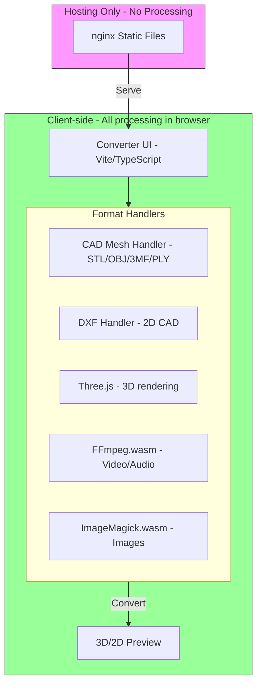
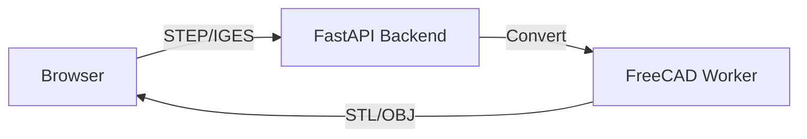

# CAD/CAM File Converter - Implementation Plan

## Executive Summary

This plan outlines the implementation of a comprehensive CAD/CAM file conversion tool for RIPlay, targeting CNC shops, engineers, and designers working with SolidWorks, Inventor, PowerMill, Fusion 360, and similar software.

## Current State Analysis

### Existing Implementation
- **Location**: [`tools/converter/index.html`](tools/converter/index.html)
- **Current approach**: iframe embedding external service (convert.to.it)
- **Limitations**: No control over conversions, no CAD/CAM-specific features, dependency on external service

### Reference Repository: p2r3/convert ✅ ANALYZED
- **GitHub**: https://github.com/p2r3/convert
- **Live site**: https://convert.to.it
- **License**: GPL-2.0 (compatible with self-hosting and modification)
- **Goal**: Clone this functionality and host it ourselves on the VPS

#### Technology Stack
| Component | Technology |
|-----------|------------|
| Language | TypeScript |
| Build Tool | Vite + Bun |
| 3D Engine | Three.js (already integrated) |
| Video/Audio | FFmpeg.wasm (WebAssembly) |
| Images | ImageMagick.wasm, Canvas API |
| Archives | JSZip |
| Deployment | Docker + nginx |

#### Architecture Highlights
1. **100% Client-side** - All conversions happen in the browser using WebAssembly
2. **Handler-based plugin system** - Easy to extend with new formats
3. **Auto-routing** - Automatically finds conversion paths between formats
4. **Batch support** - Already handles multiple files
5. **No backend required** - Can be hosted as static files

#### Current Format Support (Relevant to CAD/CAM)
| Format | Status | Notes |
|--------|--------|-------|
| GLB | ✅ Input | Renders 3D model to PNG/JPEG/WebP |
| STL | ❌ Missing | Need to add handler |
| OBJ | ❌ Missing | Need to add handler |
| 3MF | ❌ Missing | Need to add handler |
| STEP | ❌ Missing | Complex - may need server-side |
| IGES | ❌ Missing | Complex - may need server-side |
| DXF | ❌ Missing | Need to add handler |
| SVG | ✅ Partial | Via svgTrace handler |

#### Key Files to Understand
- [`src/FormatHandler.ts`](3rd_party/convert/src/FormatHandler.ts) - Interface for all handlers
- [`src/handlers/threejs.ts`](3rd_party/convert/src/handlers/threejs.ts) - Example 3D handler using Three.js
- [`src/handlers/index.ts`](3rd_party/convert/src/handlers/index.ts) - Handler registration
- [`src/main.ts`](3rd_party/convert/src/main.ts) - Main application logic

### Available Infrastructure
- **VPS-2 at OVHcloud**
  - 6 vCores
  - 12 GB RAM
  - 100 GB Storage
- **Sufficient for**: Docker containers, conversion workers, file storage

---

## CAD/CAM Format Analysis

### Format Categories

#### 1. Mesh/Surface Formats (Client-side capable)
| Format | Extension | Use Case | JS Library Support |
|--------|-----------|----------|-------------------|
| STL | .stl | 3D printing, CNC mesh | Three.js, STLLoader |
| OBJ | .obj | 3D modeling exchange | Three.js, OBJLoader |
| 3MF | .3mf | Modern 3D printing | Three.js, 3MFLoader |
| PLY | .ply | 3D scanning | Three.js, PLYLoader |
| AMF | .amf | Additive manufacturing | Limited JS support |

#### 2. CAD Exchange Formats (Server-side required)
| Format | Extension | Use Case | Conversion Tool |
|--------|-----------|----------|-----------------|
| STEP | .step, .stp | Industry standard CAD exchange | FreeCAD, OpenCASCADE |
| IGES | .iges, .igs | Legacy CAD exchange | FreeCAD, OpenCASCADE |
| Parasolid | .x_t, .x_b | Siemens NX, SolidWorks kernel | FreeCAD (limited) |
| ACIS | .sat, .sab | Autodesk, other CAD | FreeCAD (limited) |
| JT | .jt | Siemens PLM | Limited open-source support |

#### 3. 2D Vector Formats
| Format | Extension | Use Case | JS Library Support |
|--------|-----------|----------|-------------------|
| DXF | .dxf | AutoCAD, CNC cutting | dxf-parser, dxftojs |
| DWG | .dwg | AutoCAD native | Server-side only |
| SVG | .svg | Web, laser cutting | Native browser support |
| HPGL | .plt | Plotter files | Limited support |

#### 4. Native CAD Formats (Limited support)
| Format | Extension | Software | Conversion Approach |
|--------|-----------|----------|-------------------|
| SLDPRT | .sldprt | SolidWorks | FreeCAD import (experimental) |
| IPT | .ipt | Inventor | FreeCAD import (experimental) |
| F3D | .f3d | Fusion 360 | Fusion API or export first |
| PRT | .prt | NX/Pro-E | Very limited support |

---

## Recommended Architecture

### Fork and Extend p2r3/convert (Client-side First)

The p2r3/convert repository is **100% client-side** using WebAssembly. This means:
- ✅ No backend required for mesh formats (STL, OBJ, 3MF, PLY)
- ✅ All conversions happen in the browser
- ✅ Can be hosted as static files on any web server
- ✅ Privacy-friendly - files never leave the user's browser



### Server-side Extension (Optional - Phase 3)

For STEP/IGES/Parasolid formats that cannot be converted client-side:



### File Structure (After Fork)

```
tools/converter/           # Forked from p2r3/convert
    src/
        handlers/
            cadMesh.ts     # NEW: STL/OBJ/3MF/PLY handler
            dxfHandler.ts  # NEW: DXF to SVG handler
            stepHandler.ts # NEW: STEP/IGES via API
            threejs.ts     # EXISTING: GLB support
            FFmpeg.ts      # EXISTING: Video/audio
            ImageMagick.ts # EXISTING: Images
            ...
        main.ts            # Main application
        FormatHandler.ts   # Handler interface
    dist/                  # Built static files
    package.json
    vite.config.js
```

### Technology Stack

#### Frontend
- **Framework**: Vanilla JS (consistent with existing site)
- **3D Preview**: Three.js with OrbitControls
- **2D Preview**: SVG rendering for DXF
- **File handling**: FileSaver.js, JSZip

#### Backend
- **API Server**: Node.js with Express
- **Job Queue**: Bull + Redis (handles concurrent conversions)
- **CAD Engine**: FreeCAD (Python-based, open-source)
- **Mesh Tools**: OpenCASCADE, trimesh, meshio
- **Storage**: Local filesystem with cleanup policy

#### Docker Containers
```yaml
services:
  - api: Node.js Express server
  - redis: Job queue backend
  - freecad-worker: FreeCAD Python environment
  - nginx: Reverse proxy and static files
```

---

## Conversion Matrix

### Phase 1: Client-side Mesh Conversions (No Backend)
| From | To | Method | Status |
|------|-----|--------|--------|
| STL | OBJ | Three.js geometry | Phase 1 |
| STL | GLB | Three.js GLTFExporter | Phase 1 |
| STL | 3MF | Three.js 3MFExporter | Phase 1 |
| OBJ | STL | Three.js STLLoader | Phase 1 |
| OBJ | GLB | Three.js GLTFExporter | Phase 1 |
| OBJ | 3MF | Three.js 3MFExporter | Phase 1 |
| PLY | STL/OBJ/GLB | Three.js conversion | Phase 1 |
| 3MF | STL/OBJ/GLB | Three.js 3MFLoader | Phase 1 |
| GLB | STL/OBJ | Three.js GLTFLoader | Phase 1 |

### Phase 2: 2D CAD Conversions
| From | To | Method | Status |
|------|-----|--------|--------|
| DXF | SVG | dxf-parser + svg.js | Phase 2 |
| DXF | PDF | SVG → PDF conversion | Phase 2 |
| SVG | DXF | svg-to-dxf library | Phase 2 |

### Phase 3: Server-side CAD Conversions (Optional Backend)
| From | To | Method | Status |
|------|-----|--------|--------|
| STEP | STL | FreeCAD backend | Phase 3 |
| STEP | OBJ | FreeCAD backend | Phase 3 |
| STEP | GLB | FreeCAD backend | Phase 3 |
| IGES | STL/OBJ | FreeCAD backend | Phase 3 |
| Parasolid | STEP | FreeCAD backend | Phase 3 |

### Already Supported (p2r3/convert)
| Category | Formats |
|----------|---------|
| Video | MP4, AVI, MOV, WebM, MKV, etc. |
| Audio | MP3, WAV, OGG, FLAC, etc. |
| Images | PNG, JPG, WebP, GIF, SVG, etc. |
| Documents | PDF, Markdown, HTML |
| Archives | ZIP, TAR, etc. |
| 3D | GLB (input only → images) |

---

## API Design

### Endpoints

```
POST /api/convert
  - Upload file and specify target format
  - Returns job ID for tracking

GET /api/status/:jobId
  - Check conversion status
  - Returns progress percentage

GET /api/download/:jobId
  - Download converted file

POST /api/preview
  - Generate preview thumbnail
  - Returns base64 image or 3D data

GET /api/formats
  - List supported format conversions
```

### Request/Response Example

```json
// POST /api/convert
{
  "source_format": "step",
  "target_format": "stl",
  "options": {
    "mesh_quality": "high",
    "units": "mm"
  }
}

// Response
{
  "job_id": "abc123",
  "status": "queued",
  "estimated_time": 15
}
```

---

## Implementation Phases

### Phase 0: Fork and Deploy p2r3/convert ✅ READY
**Goal**: Self-host the existing converter as foundation

- [x] Analyze repository structure and architecture
- [ ] Fork repository to RIPlay GitHub account
- [ ] Build and test locally with Bun + Vite
- [ ] Deploy to VPS using Docker configuration
- [ ] Configure nginx for riplay.cz/tools/converter/
- [ ] Remove iframe, serve directly

**Commands to deploy**:
```bash
# Clone with submodules
git clone --recursive https://github.com/p2r3/convert

# Install Bun and dependencies
bun install

# Build for production
bun run build

# Or use Docker
docker compose -f docker/docker-compose.yml up -d
```

### Phase 1: Add CAD Mesh Format Handlers (STL, OBJ, 3MF, PLY)
**Goal**: Extend Three.js handler for CAD mesh formats

**Files to create/modify**:
- Create: `src/handlers/cadMesh.ts` - New handler for CAD mesh formats
- Modify: `src/handlers/index.ts` - Register new handler

**Handler implementation**:
```typescript
// src/handlers/cadMesh.ts
import * as THREE from "three";
import { STLLoader } from "three/addons/loaders/STLLoader.js";
import { OBJLoader } from "three/addons/loaders/OBJLoader.js";
import { PLYLoader } from "three/addons/loaders/PLYLoader.js";
// 3MF requires additional setup

class cadMeshHandler implements FormatHandler {
  public name = "cadMesh";
  public supportedFormats = [
    { name: "Stereolithography", format: "stl", extension: "stl", 
      mime: "model/stl", from: true, to: true, internal: "stl" },
    { name: "Wavefront OBJ", format: "obj", extension: "obj", 
      mime: "model/obj", from: true, to: true, internal: "obj" },
    { name: "Polygon File Format", format: "ply", extension: "ply", 
      mime: "model/ply", from: true, to: true, internal: "ply" },
    { name: "3D Manufacturing Format", format: "3mf", extension: "3mf", 
      mime: "model/3mf", from: true, to: true, internal: "3mf" },
    // Output formats
    { name: "GL Transmission Format Binary", format: "glb", extension: "glb",
      mime: "model/gltf-binary", from: false, to: true, internal: "glb" },
  ];
  // ... conversion logic
}
```

**Conversions enabled**:
| From | To | Method |
|------|-----|--------|
| STL | OBJ | Three.js geometry conversion |
| STL | GLB | Three.js GLTFExporter |
| OBJ | STL | Three.js STLLoader + export |
| OBJ | GLB | Three.js GLTFExporter |
| PLY | STL/OBJ/GLB | Three.js conversion |
| 3MF | STL/OBJ/GLB | Three.js 3MFLoader |

### Phase 2: Add DXF Handler for 2D CAD
**Goal**: Support DXF files for CNC/laser cutting workflows

**Dependencies to add**:
- `dxf-parser` - Parse DXF files
- `svg.js` or native SVG for output

**Handler implementation**:
```typescript
// src/handlers/dxfHandler.ts
import DxfParser from "dxf-parser";

class dxfHandler implements FormatHandler {
  public name = "dxf";
  public supportedFormats = [
    { name: "AutoCAD DXF", format: "dxf", extension: "dxf",
      mime: "image/vnd.dxf", from: true, to: false, internal: "dxf" },
    { name: "Scalable Vector Graphics", format: "svg", extension: "svg",
      mime: "image/svg+xml", from: false, to: true, internal: "svg" },
    { name: "Portable Document Format", format: "pdf", extension: "pdf",
      mime: "application/pdf", from: false, to: true, internal: "pdf" },
  ];
  // ... DXF to SVG/PDF conversion
}
```

### Phase 3: Server-side STEP/IGES Conversion (Optional - Requires Backend)
**Goal**: Support professional CAD exchange formats

**Approach**: Create a separate backend service that the client can call

**Backend setup** (Python + FastAPI):
```python
# backend/converter.py
from fastapi import FastAPI, UploadFile
import FreeCAD as App

app = FastAPI()

@app.post("/convert/step-to-stl")
async def convert_step_to_stl(file: UploadFile):
    # FreeCAD conversion logic
    pass
```

**Frontend integration**:
```typescript
// src/handlers/stepHandler.ts
class stepHandler implements FormatHandler {
  async doConvert(files, inputFormat, outputFormat) {
    // Call backend API
    const response = await fetch("/api/convert/step-to-stl", {
      method: "POST",
      body: formData
    });
    return response.arrayBuffer();
  }
}
```

### Phase 4: CNC-specific Features
**Goal**: Add value for CNC shop users

- [ ] Mesh analysis (manifold check, holes, normals)
- [ ] Bounding box display with dimensions
- [ ] Unit conversion (mm/inch)
- [ ] Scale/rotate tools
- [ ] Measurement in 3D preview
- [ ] G-code preview (optional)

### Phase 5: UI/UX Polish
- [ ] Add CAD/CAM format category in UI
- [ ] 3D preview with orbit controls
- [ ] 2D preview for DXF/SVG
- [ ] Batch conversion progress
- [ ] Mobile responsiveness
**Goal**: Replace iframe with functional client-side converter

- [ ] Create new converter UI with drag-and-drop upload
- [ ] Implement Three.js for STL/OBJ/PLY conversions
- [ ] Add 3MF support using Three.js 3MF exporter/importer
- [ ] Implement DXF parser for 2D drawings
- [ ] Add SVG export for DXF files
- [ ] Create 3D preview with Three.js viewer
- [ ] Add 2D preview for DXF/SVG files
- [ ] Implement batch file upload and conversion
- [ ] Add ZIP download for batch results

**Libraries to include**:
- Three.js (STLLoader, OBJLoader, 3MFLoader, PLYLoader)
- JSZip for batch downloads
- dxf-parser for DXF reading
- svg.js for SVG generation

### Phase 2: Server-side CAD Conversions (VPS Backend)
**Goal**: Add support for STEP, IGES, Parasolid formats

- [ ] Set up Node.js API server with Express on VPS
- [ ] Install and configure FreeCAD Python environment
- [ ] Create conversion worker for STEP/IGES files
- [ ] Implement job queue with Bull + Redis
- [ ] Add progress tracking for server-side jobs
- [ ] Create API endpoints for file upload/download
- [ ] Integrate server API calls in frontend

### Phase 3: CNC-specific Features
**Goal**: Add value for CNC shop users

- [ ] Add mesh analysis tools (manifold check, holes detection)
- [ ] Implement unit conversion (mm/inch)
- [ ] Add bounding box display with dimensions
- [ ] Create measurement tools in 3D preview
- [ ] Add mesh repair functionality
- [ ] Implement scale/rotate tools

### Phase 4: Polish & Optimization
- [ ] Add conversion history (local storage)
- [ ] Implement file size optimization
- [ ] Add progress indicators
- [ ] Create error handling and user feedback
- [ ] Add keyboard shortcuts
- [ ] Mobile responsiveness

---

## CNC-Specific Features to Consider

### For CNC Shop Users
1. **Unit Conversion**: mm/inch automatic detection and conversion
2. **Mesh Analysis**: Check for manifold errors, holes, non-planar faces
3. **Bounding Box Display**: Show workpiece dimensions
4. **Scale Tools**: Resize for material constraints
5. **Orientation Helper**: Suggest optimal cutting orientation

### For CAD Users
1. **Assembly Explode**: View assembly components
2. **Section View**: Cross-section analysis
3. **Measurement Tool**: Distance, angle, radius measurement
4. **Property Extraction**: Volume, surface area, center of mass

---

## Security Considerations

1. **File Validation**: Verify file headers before processing
2. **Size Limits**: Max 50MB per file (configurable)
3. **Rate Limiting**: Prevent abuse with request limits
4. **File Cleanup**: Auto-delete after 1 hour
5. **Input Sanitization**: Prevent command injection
6. **Virus Scanning**: Optional ClamAV integration

---

## Resource Requirements

### VPS Resource Allocation
- **API Server**: 1 vCore, 2GB RAM
- **Redis**: 0.5 vCore, 1GB RAM
- **FreeCAD Worker**: 2 vCores, 4GB RAM (peak during conversion)
- **Nginx**: 0.5 vCore, 512MB RAM
- **Storage**: 20GB for temporary files, 80GB for system/logs

### Estimated Capacity
- **Concurrent conversions**: 3-5
- **Files per hour**: ~100-200 (depending on complexity)
- **Average conversion time**: 5-30 seconds

---

## Alternatives Considered

### 1. External API Services
- **Aspose.CAD**: Good quality, expensive ($1000+/month)
- **CAD Exchanger**: Professional, per-conversion pricing
- **AnyConv**: Free tier limited, no API control
- **Decision**: Self-hosted for cost and privacy

### 2. Pure Client-side
- **Pros**: No server cost, instant conversion
- **Cons**: Limited format support, large file issues
- **Decision**: Hybrid approach - client for mesh, server for CAD

### 3. Desktop Application
- **Pros**: Full FreeCAD power, no server needed
- **Cons**: Requires installation, not web-accessible
- **Decision**: Web tool for accessibility

---

## Success Metrics

1. **Format Coverage**: Support 15+ CAD/CAM formats
2. **Conversion Speed**: <30 seconds for typical files
3. **Accuracy**: Maintain dimensional accuracy within tolerance
4. **Uptime**: 99% availability
5. **User Adoption**: Track usage via analytics

---

## Next Steps

1. **Approve this plan** - Confirm architecture and priorities
2. **Set up VPS environment** - Docker, Node.js, FreeCAD
3. **Begin Phase 1 implementation** - Basic API infrastructure
4. **Iterate based on testing** - Real-world file testing

---

## User Requirements (Confirmed)

1. **Client-side priority** - Implement client-side conversions where possible (STL, OBJ, 3MF, DXF, SVG)
2. **Batch conversion** - Support multiple file conversions
3. **No external fallback** - Remove convert.to.it iframe dependency
4. **Anonymous usage** - No user authentication required
5. **Server-side for complex formats** - STEP, IGES, Parasolid require backend processing

---

## Revised Implementation Approach

### Phase 1: Client-side Mesh Conversions (No backend needed)
Focus on formats that can be converted entirely in the browser using JavaScript libraries:

| Conversion | Library | Status |
|------------|---------|--------|
| STL ↔ OBJ | Three.js | Client-side |
| STL ↔ 3MF | Three.js | Client-side |
| OBJ ↔ 3MF | Three.js | Client-side |
| DXF → SVG | dxf-parser + svg.js | Client-side |
| PLY ↔ STL | Three.js | Client-side |

### Phase 2: Server-side CAD Conversions (VPS backend)
For complex CAD formats that require server processing:

| Conversion | Tool | Status |
|------------|------|--------|
| STEP → STL/OBJ | FreeCAD | Server-side |
| IGES → STL/OBJ | FreeCAD | Server-side |
| Parasolid → STEP | FreeCAD | Server-side |

### Phase 3: Batch Processing
- Multiple file upload with drag-and-drop
- Queue management for batch jobs
- Progress tracking per file
- ZIP download of converted files