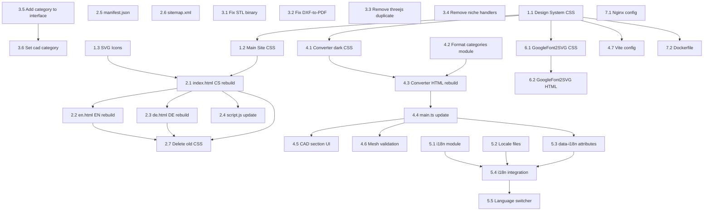

# RIPlay Comprehensive Overhaul Plan

> **Date:** 2026-02-19  
> **Status:** Draft — Single source of truth for all implementation work  
> **Scope:** Unified design system, main site rebuild, converter redesign, CAD/CAM section, i18n, SEO

---

## Table of Contents

1. [Unified Design System](#1-unified-design-system)
2. [Main Site Architecture](#2-main-site-architecture)
3. [General Converter UI Redesign](#3-general-converter-ui-redesign)
4. [CAD/CAM Converter Section](#4-cadcam-converter-section)
5. [Conversion Matrix Specification](#5-conversion-matrix-specification)
6. [Localization Strategy](#6-localization-strategy)
7. [SEO Normalization](#7-seo-normalization)
8. [File Structure](#8-file-structure)
9. [Implementation Order](#9-implementation-order)

---

## 1. Unified Design System

### 1.1 Design Philosophy

**Brand: Freelancer Cyberpunk — Engineered Precision**

Cold steel, dark interfaces, sharp accents of fire against cool metallic grays. Monospaced accent typography. Nothing template-generic or playful. The site should feel like a precision instrument — a tool built by someone who builds tools.

### 1.2 Color Palette

All colors defined as CSS custom properties in [`css/riplay-design-system.css`](css/riplay-design-system.css).

#### Core Backgrounds

| Variable | Hex | Usage |
|----------|-----|-------|
| `--rds-bg-void` | `#07080c` | Page background, deepest layer |
| `--rds-bg-primary` | `#0c0e14` | Main content background |
| `--rds-bg-surface` | `#12151e` | Cards, panels, elevated surfaces |
| `--rds-bg-elevated` | `#1a1e2a` | Hover states, active panels |
| `--rds-bg-overlay` | `rgba(7, 8, 12, 0.85)` | Modal overlays, backdrop |

#### Accent Colors — Fire

| Variable | Hex | Usage |
|----------|-----|-------|
| `--rds-accent-ember` | `#f97316` | Primary accent — buttons, links, highlights |
| `--rds-accent-ember-light` | `#fb923c` | Hover states for accent |
| `--rds-accent-ember-dark` | `#ea580c` | Active/pressed states |
| `--rds-accent-molten` | `#ef4444` | Warnings, destructive actions, critical |
| `--rds-accent-molten-light` | `#f87171` | Hover for warnings |
| `--rds-accent-forge` | `#f59e0b` | Secondary accent — badges, highlights |

#### Metal/Neutral Colors

| Variable | Hex | Usage |
|----------|-----|-------|
| `--rds-metal-100` | `#f1f5f9` | Primary text, headings |
| `--rds-metal-200` | `#e2e8f0` | Body text |
| `--rds-metal-300` | `#cbd5e1` | Secondary text |
| `--rds-metal-400` | `#94a3b8` | Muted text, placeholders |
| `--rds-metal-500` | `#64748b` | Disabled text, borders |
| `--rds-metal-600` | `#475569` | Subtle borders |
| `--rds-metal-700` | `#334155` | Dividers |
| `--rds-metal-800` | `#1e293b` | Subtle backgrounds |

#### Semantic Colors

| Variable | Hex | Usage |
|----------|-----|-------|
| `--rds-success` | `#22c55e` | Success states, completed |
| `--rds-info` | `#3b82f6` | Info states, links in context |
| `--rds-warning` | `#f59e0b` | Warning states |
| `--rds-error` | `#ef4444` | Error states |

#### Glassmorphism

| Variable | Value | Usage |
|----------|-------|-------|
| `--rds-glass-bg` | `rgba(18, 21, 30, 0.65)` | Glass card backgrounds |
| `--rds-glass-border` | `rgba(241, 245, 249, 0.06)` | Glass card borders |
| `--rds-glass-border-hover` | `rgba(249, 115, 22, 0.15)` | Glass card hover borders |
| `--rds-glass-blur` | `12px` | Backdrop blur amount |

#### Gradients

| Variable | Value | Usage |
|----------|-------|-------|
| `--rds-gradient-ember` | `linear-gradient(135deg, #f97316 0%, #ef4444 100%)` | Primary CTA gradient |
| `--rds-gradient-forge` | `linear-gradient(135deg, #f59e0b 0%, #f97316 100%)` | Secondary accent gradient |
| `--rds-gradient-steel` | `linear-gradient(135deg, #1a1e2a 0%, #0c0e14 100%)` | Surface gradient |
| `--rds-gradient-hero` | `linear-gradient(180deg, #0c0e14 0%, #12151e 50%, #0c0e14 100%)` | Hero section background |
| `--rds-gradient-glow` | `radial-gradient(circle, rgba(249,115,22,0.08) 0%, transparent 70%)` | Subtle background glow |

### 1.3 Typography

#### Font Stack

```css
--rds-font-body: 'Inter', system-ui, -apple-system, sans-serif;
--rds-font-mono: 'JetBrains Mono', 'Fira Code', 'SF Mono', monospace;
--rds-font-heading: 'Inter', system-ui, -apple-system, sans-serif;
```

**Google Fonts import:**
```html
<link href="https://fonts.googleapis.com/css2?family=Inter:wght@300;400;500;600;700;800&family=JetBrains+Mono:wght@400;500;600;700&display=swap" rel="stylesheet">
```

#### Type Scale

| Variable | Size | Weight | Line Height | Usage |
|----------|------|--------|-------------|-------|
| `--rds-text-display` | `4rem` / `64px` | 800 | 1.1 | Hero h1 |
| `--rds-text-h1` | `2.75rem` / `44px` | 700 | 1.2 | Section titles |
| `--rds-text-h2` | `2rem` / `32px` | 700 | 1.3 | Subsections |
| `--rds-text-h3` | `1.5rem` / `24px` | 600 | 1.4 | Card titles |
| `--rds-text-h4` | `1.25rem` / `20px` | 600 | 1.4 | Subheadings |
| `--rds-text-body` | `1rem` / `16px` | 400 | 1.7 | Body text |
| `--rds-text-body-lg` | `1.125rem` / `18px` | 400 | 1.7 | Lead text |
| `--rds-text-small` | `0.875rem` / `14px` | 400 | 1.5 | Captions, labels |
| `--rds-text-xs` | `0.75rem` / `12px` | 500 | 1.4 | Badges, tags |
| `--rds-text-mono-sm` | `0.85rem` / `13.6px` | 400 | 1.5 | Code, format labels |

#### Heading Gradient Treatment

Hero headings use a gradient text effect:

```css
.rds-heading-gradient {
  background: linear-gradient(135deg, #f1f5f9 0%, #f97316 60%, #ef4444 100%);
  -webkit-background-clip: text;
  -webkit-text-fill-color: transparent;
  background-clip: text;
}
```

### 1.4 Spacing Scale

```css
--rds-space-1: 0.25rem;   /*  4px */
--rds-space-2: 0.5rem;    /*  8px */
--rds-space-3: 0.75rem;   /* 12px */
--rds-space-4: 1rem;      /* 16px */
--rds-space-5: 1.25rem;   /* 20px */
--rds-space-6: 1.5rem;    /* 24px */
--rds-space-8: 2rem;      /* 32px */
--rds-space-10: 2.5rem;   /* 40px */
--rds-space-12: 3rem;     /* 48px */
--rds-space-16: 4rem;     /* 64px */
--rds-space-20: 5rem;     /* 80px */
--rds-space-24: 6rem;     /* 96px */
--rds-space-32: 8rem;     /* 128px */
```

### 1.5 Border Radius

```css
--rds-radius-sm: 4px;
--rds-radius-md: 8px;
--rds-radius-lg: 12px;
--rds-radius-xl: 16px;
--rds-radius-2xl: 20px;
--rds-radius-full: 9999px;
```

### 1.6 Shadows

```css
--rds-shadow-sm: 0 1px 2px rgba(0, 0, 0, 0.3);
--rds-shadow-md: 0 4px 6px -1px rgba(0, 0, 0, 0.4), 0 2px 4px -1px rgba(0, 0, 0, 0.3);
--rds-shadow-lg: 0 10px 25px -5px rgba(0, 0, 0, 0.5), 0 4px 10px -5px rgba(0, 0, 0, 0.3);
--rds-shadow-xl: 0 20px 40px -10px rgba(0, 0, 0, 0.5);
--rds-shadow-glow-ember: 0 0 30px rgba(249, 115, 22, 0.15);
--rds-shadow-glow-ember-hover: 0 0 40px rgba(249, 115, 22, 0.25);
--rds-shadow-glow-molten: 0 0 30px rgba(239, 68, 68, 0.15);
```

### 1.7 Animations & Transitions

```css
--rds-transition-fast: 150ms ease;
--rds-transition-base: 250ms ease;
--rds-transition-slow: 350ms ease;
--rds-transition-bounce: 400ms cubic-bezier(0.34, 1.56, 0.64, 1);

/* Hover lift */
--rds-hover-lift: translateY(-4px);
--rds-hover-lift-lg: translateY(-8px);
```

#### Keyframe Animations

```css
@keyframes rds-fade-in-up {
  from { opacity: 0; transform: translateY(20px); }
  to { opacity: 1; transform: translateY(0); }
}

@keyframes rds-pulse-glow {
  0%, 100% { box-shadow: 0 0 20px rgba(249, 115, 22, 0.1); }
  50% { box-shadow: 0 0 40px rgba(249, 115, 22, 0.2); }
}

@keyframes rds-shimmer {
  0% { background-position: -200% 0; }
  100% { background-position: 200% 0; }
}

@keyframes rds-border-glow {
  0%, 100% { border-color: rgba(249, 115, 22, 0.1); }
  50% { border-color: rgba(249, 115, 22, 0.25); }
}
```

### 1.8 Component Library

#### Buttons

```css
/* Primary CTA */
.rds-btn-primary {
  background: var(--rds-gradient-ember);
  color: white;
  padding: 0.875rem 2rem;
  border-radius: var(--rds-radius-lg);
  font-weight: 600;
  font-size: var(--rds-text-body);
  border: none;
  cursor: pointer;
  transition: all var(--rds-transition-base);
  box-shadow: 0 4px 20px rgba(249, 115, 22, 0.3);
}
.rds-btn-primary:hover {
  transform: var(--rds-hover-lift);
  box-shadow: 0 8px 30px rgba(249, 115, 22, 0.4);
}

/* Ghost/Secondary */
.rds-btn-ghost {
  background: transparent;
  color: var(--rds-metal-200);
  padding: 0.875rem 2rem;
  border: 1px solid var(--rds-metal-600);
  border-radius: var(--rds-radius-lg);
  font-weight: 600;
  cursor: pointer;
  transition: all var(--rds-transition-base);
}
.rds-btn-ghost:hover {
  background: rgba(241, 245, 249, 0.05);
  border-color: var(--rds-metal-400);
  transform: var(--rds-hover-lift);
}

/* Monospace tool button */
.rds-btn-tool {
  background: var(--rds-bg-elevated);
  color: var(--rds-accent-ember);
  padding: 0.75rem 1.5rem;
  border: 1px solid rgba(249, 115, 22, 0.2);
  border-radius: var(--rds-radius-md);
  font-family: var(--rds-font-mono);
  font-weight: 600;
  font-size: var(--rds-text-small);
  text-transform: uppercase;
  letter-spacing: 0.05em;
  cursor: pointer;
  transition: all var(--rds-transition-base);
}
.rds-btn-tool:hover {
  background: rgba(249, 115, 22, 0.1);
  border-color: var(--rds-accent-ember);
  box-shadow: var(--rds-shadow-glow-ember);
}
```

#### Cards

```css
/* Glass card — used across all three sub-sites */
.rds-card {
  background: var(--rds-glass-bg);
  backdrop-filter: blur(var(--rds-glass-blur));
  -webkit-backdrop-filter: blur(var(--rds-glass-blur));
  border: 1px solid var(--rds-glass-border);
  border-radius: var(--rds-radius-xl);
  padding: var(--rds-space-8);
  transition: all var(--rds-transition-slow);
  position: relative;
  overflow: hidden;
}

.rds-card::before {
  content: '';
  position: absolute;
  top: 0;
  left: 0;
  right: 0;
  height: 2px;
  background: var(--rds-gradient-ember);
  opacity: 0;
  transition: opacity var(--rds-transition-base);
}

.rds-card:hover {
  transform: var(--rds-hover-lift-lg);
  border-color: var(--rds-glass-border-hover);
  box-shadow: var(--rds-shadow-glow-ember);
}

.rds-card:hover::before {
  opacity: 1;
}
```

#### Navigation

```css
.rds-navbar {
  position: fixed;
  top: 0;
  left: 0;
  right: 0;
  z-index: 1000;
  display: flex;
  justify-content: space-between;
  align-items: center;
  padding: var(--rds-space-4) var(--rds-space-8);
  background: rgba(7, 8, 12, 0.9);
  backdrop-filter: blur(20px);
  -webkit-backdrop-filter: blur(20px);
  border-bottom: 1px solid var(--rds-glass-border);
  transition: background var(--rds-transition-base);
}

/* Scrolled state — applied via JS */
.rds-navbar--scrolled {
  background: rgba(7, 8, 12, 0.97);
  border-bottom-color: rgba(249, 115, 22, 0.08);
}
```

#### Mobile Hamburger Menu

```css
.rds-hamburger {
  display: none; /* visible at <= 768px */
  flex-direction: column;
  gap: 5px;
  cursor: pointer;
  padding: var(--rds-space-2);
  z-index: 1001;
}

.rds-hamburger span {
  display: block;
  width: 24px;
  height: 2px;
  background: var(--rds-metal-200);
  transition: all var(--rds-transition-base);
  transform-origin: center;
}

.rds-hamburger.active span:nth-child(1) {
  transform: rotate(45deg) translate(5px, 5px);
}
.rds-hamburger.active span:nth-child(2) {
  opacity: 0;
}
.rds-hamburger.active span:nth-child(3) {
  transform: rotate(-45deg) translate(5px, -5px);
}

@media (max-width: 768px) {
  .rds-hamburger { display: flex; }
  
  .rds-nav-links {
    position: fixed;
    top: 0;
    right: -100%;
    width: 280px;
    height: 100vh;
    background: var(--rds-bg-surface);
    border-left: 1px solid var(--rds-glass-border);
    flex-direction: column;
    padding: var(--rds-space-20) var(--rds-space-8);
    transition: right var(--rds-transition-slow);
  }
  
  .rds-nav-links.open {
    right: 0;
  }
}
```

#### Form Inputs

```css
.rds-input {
  width: 100%;
  padding: 0.875rem 1.25rem;
  border: 1px solid var(--rds-metal-600);
  border-radius: var(--rds-radius-lg);
  background: rgba(12, 14, 20, 0.6);
  color: var(--rds-metal-100);
  font-family: var(--rds-font-body);
  font-size: var(--rds-text-body);
  transition: all var(--rds-transition-base);
}
.rds-input:focus {
  outline: none;
  border-color: var(--rds-accent-ember);
  box-shadow: 0 0 0 3px rgba(249, 115, 22, 0.15);
}
.rds-input::placeholder {
  color: var(--rds-metal-500);
}
```

#### Loading States

```css
/* Skeleton loading */
.rds-skeleton {
  background: linear-gradient(90deg,
    var(--rds-bg-surface) 25%,
    var(--rds-bg-elevated) 50%,
    var(--rds-bg-surface) 75%);
  background-size: 200% 100%;
  animation: rds-shimmer 1.5s infinite;
  border-radius: var(--rds-radius-md);
}

/* Spinner */
.rds-spinner {
  width: 24px;
  height: 24px;
  border: 2px solid var(--rds-metal-600);
  border-top-color: var(--rds-accent-ember);
  border-radius: 50%;
  animation: spin 0.8s linear infinite;
}

/* Progress bar */
.rds-progress {
  height: 4px;
  background: var(--rds-bg-elevated);
  border-radius: var(--rds-radius-full);
  overflow: hidden;
}
.rds-progress-bar {
  height: 100%;
  background: var(--rds-gradient-ember);
  border-radius: var(--rds-radius-full);
  transition: width var(--rds-transition-slow);
}
```

#### Modal / Popup

```css
.rds-modal-overlay {
  position: fixed;
  inset: 0;
  background: var(--rds-bg-overlay);
  backdrop-filter: blur(4px);
  z-index: 2000;
  display: flex;
  align-items: center;
  justify-content: center;
}

.rds-modal {
  background: var(--rds-bg-surface);
  border: 1px solid var(--rds-glass-border);
  border-radius: var(--rds-radius-2xl);
  padding: var(--rds-space-8);
  max-width: 480px;
  width: 90%;
  box-shadow: var(--rds-shadow-xl);
}
```

### 1.9 Shared CSS File Strategy

The design system lives in a single file that all three sub-sites import:

- **File:** [`css/riplay-design-system.css`](css/riplay-design-system.css) — Custom properties + reset + components
- **Main site:** `<link rel="stylesheet" href="css/riplay-design-system.css">` + `<link rel="stylesheet" href="css/main-site.css">`
- **Converter:** `<link rel="stylesheet" href="/css/riplay-design-system.css">` + local `style.css` for converter-specific styles
- **GoogleFont2SVG:** `<link rel="stylesheet" href="/css/riplay-design-system.css">` + local `index.css` for tool-specific styles

In the Docker/VPS deployment, the converter fetches the design system CSS from the main domain using an absolute URL or the CSS is bundled at build time via Vite.

---

## 2. Main Site Architecture

### 2.1 Content Strategy Resolution

**Problem:** CS/EN pages pitch "workflow automation"; DE pages pitch "local AI agents" — completely different businesses.

**Decision: Merge toward a unified freelancer pitch that incorporates both.**

The unified narrative:

> RIPlay — freelance IT automation specialist. I build custom automation solutions for individuals and SMBs: workflow automation, system integration, AI-powered agents (local or cloud), and data processing. Open-source first, privacy-respecting, no vendor lock-in.

**Services to unify across all languages (6 cards):**

1. **Workflow Automation** — Automating repetitive processes (email, approvals, data entry)
2. **System Integration** — Connecting tools and APIs into cohesive workflows
3. **AI Agents** — Local or cloud-based AI solutions for customer support, data analysis, content generation
4. **Data Processing** — ETL, reporting dashboards, automated data pipelines
5. **Security & Privacy** — GDPR-compliant solutions, local deployment, open-source stack
6. **Training & Support** — Team training on deployed solutions, documentation, ongoing maintenance

This keeps the DE page's strong "local AI" angle as one service among several, while CS/EN keep their broader automation pitch. All three languages now describe the same business.

### 2.2 Section Structure

Each language file follows this identical section structure:

```
┌─────────────────────────────┐
│  NAVBAR (fixed)             │  Logo | Nav links | Lang switcher | Hamburger
├─────────────────────────────┤
│  HERO                       │  Gradient heading | Subtitle | 2 CTAs
├─────────────────────────────┤
│  SERVICES (6 cards grid)    │  Workflow | Integration | AI | Data | Security | Training
├─────────────────────────────┤
│  TOOLS (2 cards)            │  GoogleFont2SVG | Universal Converter
├─────────────────────────────┤
│  ABOUT / WHY US             │  Value props list | Visual element
├─────────────────────────────┤
│  CONTACT                    │  Info column | Formspree form
├─────────────────────────────┤
│  FOOTER                     │  Logo | Links | Copyright
└─────────────────────────────┘
```

### 2.3 Navigation

Desktop layout:
```
[Logo]  [Služby] [Nástroje] [O nás] [Kontakt]  [🇨🇿] [🇬🇧] [🇩🇪]  [☰ mobile only]
```

- Logo links to current language homepage
- Nav links are smooth-scroll anchors
- Language flags always show all 3 options, current lang has `opacity: 1` / active state
- Hamburger appears at `<= 768px`, triggers slide-out nav panel

### 2.4 Mobile Navigation

Implementation in [`js/script.js`](js/script.js):

```javascript
// Hamburger toggle
const hamburger = document.querySelector('.rds-hamburger');
const navLinks = document.querySelector('.rds-nav-links');

hamburger.addEventListener('click', () => {
  hamburger.classList.toggle('active');
  navLinks.classList.toggle('open');
  document.body.classList.toggle('nav-open'); // prevent scroll
});

// Close on link click
navLinks.querySelectorAll('a').forEach(link => {
  link.addEventListener('click', () => {
    hamburger.classList.remove('active');
    navLinks.classList.remove('open');
    document.body.classList.remove('nav-open');
  });
});
```

### 2.5 Scroll Animations

Using IntersectionObserver — already partially implemented in [`js/script.js`](js/script.js:79). Extend to all cards and sections:

```javascript
const observer = new IntersectionObserver((entries) => {
  entries.forEach(entry => {
    if (entry.isIntersecting) {
      entry.target.classList.add('rds-visible');
      observer.unobserve(entry.target);
    }
  });
}, { threshold: 0.1, rootMargin: '0px 0px -60px 0px' });

document.querySelectorAll('.rds-animate-in').forEach(el => observer.observe(el));
```

CSS:
```css
.rds-animate-in {
  opacity: 0;
  transform: translateY(24px);
  transition: opacity 0.6s ease, transform 0.6s ease;
}
.rds-animate-in.rds-visible {
  opacity: 1;
  transform: translateY(0);
}
```

### 2.6 Contact Form

Current contact forms use Formspree (`action="https://formspree.io/f/xwvnpejd" method="POST"`) — this works and should be kept. The dead JS code in [`js/script.js`](js/script.js:27) that targets `getElementById('contactForm')` must be removed — the HTML forms use `class="contact-form"`, not `id="contactForm"`.

### 2.7 Hero Background Enhancement

Replace the current SVG pattern with a subtle animated grid + radial glow:

```css
.rds-hero {
  min-height: 100vh;
  background: var(--rds-gradient-hero);
  position: relative;
  overflow: hidden;
}

.rds-hero::before {
  content: '';
  position: absolute;
  inset: 0;
  background:
    radial-gradient(circle at 30% 40%, rgba(249, 115, 22, 0.06) 0%, transparent 50%),
    radial-gradient(circle at 70% 60%, rgba(239, 68, 68, 0.04) 0%, transparent 50%);
  pointer-events: none;
}

.rds-hero::after {
  content: '';
  position: absolute;
  inset: 0;
  background-image: url("data:image/svg+xml,..."); /* subtle grid pattern in --rds-metal-700 at 3% opacity */
  pointer-events: none;
  opacity: 0.4;
}
```

---

## 3. General Converter UI Redesign

### 3.1 Current Problems

1. **Light theme** clashes with dark main site — [`tools/converter/style.css`](tools/converter/style.css:1) uses `--highlight-color: #1C77FF` with light gray backgrounds
2. **Two-column format list** is confusing — shows every format from every handler simultaneously
3. **No format categorization** — users see a flat list of 50+ formats
4. **Duplicate GLB handlers** — both [`threejs.ts`](tools/converter/src/handlers/threejs.ts) and [`cadMesh.ts`](tools/converter/src/handlers/cadMesh.ts) handle GLB input
5. **DXF→PDF broken** — [`dxfHandler.ts`](tools/converter/src/handlers/dxfHandler.ts:363) outputs SVG but names file .svg instead of .pdf
6. **STL export is ASCII-only** — [`cadMesh.ts`](tools/converter/src/handlers/cadMesh.ts:227) uses `{ binary: false }`
7. **No mobile usability** — format containers use `50vw` width

### 3.2 New UI Design

The converter gets a full dark-theme redesign matching the design system.

#### Layout

```
┌───────────────────────────────────────────────────────┐
│  HEADER BAR (fixed)                                   │
│  [Logo → riplay.cz] [Universal Converter] [Lang] [←]  │
├───────────────────────────────────────────────────────┤
│                                                       │
│  ┌─────────────────────────────────────────────────┐  │
│  │  DROP ZONE                                      │  │
│  │  "Drop files here or click to browse"          │  │
│  │  [icon: upload cloud]                           │  │
│  └─────────────────────────────────────────────────┘  │
│                                                       │
│  ┌──────────────────┐   →   ┌──────────────────┐    │
│  │  FROM FORMAT      │       │  TO FORMAT        │    │
│  │  [Auto-detected]  │       │  [Select target]  │    │
│  │                   │       │                   │    │
│  │  Category tabs:   │       │  Shows ONLY valid │    │
│  │  Documents        │       │  targets for the  │    │
│  │  Images           │       │  selected source  │    │
│  │  Audio            │       │                   │    │
│  │  Video            │       │                   │    │
│  │  Archives         │       │                   │    │
│  │  CAD/3D           │       │                   │    │
│  │  Other            │       │                   │    │
│  └──────────────────┘       └──────────────────┘    │
│                                                       │
│           [ 🔥 CONVERT ]                              │
│                                                       │
└───────────────────────────────────────────────────────┘
```

Key changes:
- **Dark background** using design system variables
- **Drop zone** with ember accent border, dashed
- **Category tabs** to filter formats (Documents, Images, Audio, Video, Archives, CAD/3D, Other)
- **Smart target filtering** — selecting source format shows only valid conversion targets
- **Single-column mobile** — format panels stack vertically

#### Drop Zone Styles

```css
.converter-dropzone {
  background: var(--rds-bg-surface);
  border: 2px dashed var(--rds-metal-600);
  border-radius: var(--rds-radius-2xl);
  padding: var(--rds-space-16) var(--rds-space-8);
  text-align: center;
  cursor: pointer;
  transition: all var(--rds-transition-base);
}

.converter-dropzone:hover,
.converter-dropzone.dragover {
  border-color: var(--rds-accent-ember);
  background: rgba(249, 115, 22, 0.03);
  box-shadow: var(--rds-shadow-glow-ember);
}
```

#### Category Tab Styles

```css
.converter-category-tab {
  font-family: var(--rds-font-mono);
  font-size: var(--rds-text-xs);
  text-transform: uppercase;
  letter-spacing: 0.08em;
  padding: var(--rds-space-2) var(--rds-space-4);
  border: 1px solid var(--rds-metal-700);
  border-radius: var(--rds-radius-full);
  background: transparent;
  color: var(--rds-metal-400);
  cursor: pointer;
  transition: all var(--rds-transition-fast);
}

.converter-category-tab.active {
  background: rgba(249, 115, 22, 0.1);
  border-color: var(--rds-accent-ember);
  color: var(--rds-accent-ember);
}
```

### 3.3 Handler Decisions

#### KEEP (Core Utility)

| Handler | File | Reason |
|---------|------|--------|
| FFmpeg | [`FFmpeg.ts`](tools/converter/src/handlers/FFmpeg.ts) | Core video/audio — high traffic value |
| ImageMagick | [`ImageMagick.ts`](tools/converter/src/handlers/ImageMagick.ts) | Core image conversions |
| cadMesh | [`cadMesh.ts`](tools/converter/src/handlers/cadMesh.ts) | CAD/CAM mesh conversions — USP |
| dxfHandler | [`dxfHandler.ts`](tools/converter/src/handlers/dxfHandler.ts) | DXF CAD conversions — USP |
| pdftoimg | [`pdftoimg.ts`](tools/converter/src/handlers/pdftoimg.ts) | PDF → images — common need |
| svgTrace | [`svgTrace.ts`](tools/converter/src/handlers/svgTrace.ts) | Image → SVG tracing — useful |
| markdown | [`markdown.ts`](tools/converter/src/handlers/markdown.ts) | MD ↔ HTML — useful for developers |
| jszip | [`jszip.ts`](tools/converter/src/handlers/jszip.ts) | Any → ZIP — generally useful |
| renameZip | [`rename.ts`](tools/converter/src/handlers/rename.ts) | Office → ZIP explore — useful |
| renameTxt | [`rename.ts`](tools/converter/src/handlers/rename.ts) | JSON/XML/YAML → TXT — useful |
| sqlite3 | [`sqlite.ts`](tools/converter/src/handlers/sqlite.ts) | SQLite → CSV — developer tool |

#### REMOVE (Niche/Gaming)

| Handler | File | Reason |
|---------|------|--------|
| threejs | [`threejs.ts`](tools/converter/src/handlers/threejs.ts) | **Duplicate** — cadMesh does everything this does and more. Both handle GLB input, cadMesh also handles STL/OBJ/PLY |
| vtf | [`vtf.ts`](tools/converter/src/handlers/vtf.ts) | Valve Texture Format — gaming niche, 28KB handler for minimal use case |
| mcmap | [`mcmap.ts`](tools/converter/src/handlers/mcmap.ts) | Minecraft maps — off-brand |
| nbt | [`nbt.ts`](tools/converter/src/handlers/nbt.ts) | Minecraft NBT — off-brand |
| petozip | [`petozip.ts`](tools/converter/src/handlers/petozip.ts) | Windows PE extraction — niche |
| flptojson | [`flptojson.ts`](tools/converter/src/handlers/flptojson.ts) | FL Studio — niche |
| flo | [`flo.ts`](tools/converter/src/handlers/flo.ts) | Flo audio format — niche |
| pyTurtle | [`pyTurtle.ts`](tools/converter/src/handlers/pyTurtle.ts) | SVG → Python turtle code — novelty |
| meyda | [`meyda.ts`](tools/converter/src/handlers/meyda.ts) | Audio spectrograms — niche |
| htmlEmbed | [`htmlEmbed.ts`](tools/converter/src/handlers/htmlEmbed.ts) | Embeds resources in HTML — limited real use |
| svgForeignObject | [`svgForeignObject.ts`](tools/converter/src/handlers/svgForeignObject.ts) | HTML → SVG via foreignObject — limited real use |

#### FIX (Bugs)

| Handler | Issue | Fix |
|---------|-------|-----|
| [`dxfHandler.ts`](tools/converter/src/handlers/dxfHandler.ts:362) | DXF→PDF outputs SVG content with ".svg" extension | Implement actual PDF output using `jsPDF` library. Import jsPDF, render SVG to canvas, export canvas to PDF bytes. |
| [`cadMesh.ts`](tools/converter/src/handlers/cadMesh.ts:227) | STL export is ASCII-only | Change `{ binary: false }` to `{ binary: true }` on line 227 in the STLExporter call. Binary STL is smaller and faster. |
| [`cadMesh.ts`](tools/converter/src/handlers/cadMesh.ts:60) + [`threejs.ts`](tools/converter/src/handlers/threejs.ts:15) | Duplicate GLB input handler | Remove threejs handler entirely. The cadMesh handler already supports GLB input with all the same output formats plus more. |

### 3.4 Format Categories for UI

```typescript
const FORMAT_CATEGORIES = {
  'Documents': ['pdf', 'html', 'md', 'txt', 'json', 'xml', 'yaml', 'csv'],
  'Images': ['png', 'jpg', 'jpeg', 'gif', 'webp', 'svg', 'bmp', 'tiff', 'ico', 'avif'],
  'Audio': ['mp3', 'wav', 'ogg', 'flac', 'aac', 'm4a', 'wma', 'opus'],
  'Video': ['mp4', 'webm', 'avi', 'mov', 'mkv', 'mpeg', 'ogv'],
  'Archives': ['zip', 'tar', 'gz'],
  'CAD/3D': ['stl', 'obj', 'ply', 'glb', 'dxf', '3mf', 'amf'],
  'Other': ['sqlite', 'db']
};
```

---

## 4. CAD/CAM Converter Section

### 4.1 Separate UI vs Shared UI

**Decision:** The CAD/CAM converter is a **dedicated section within the converter UI**, not a separate page. It is accessed via a tab/toggle in the converter header or a direct URL route.

The reason: maintaining a single deployment and codebase is simpler. The CAD/CAM section shares the same handler infrastructure but has its own UI layout and aesthetic treatment.

### 4.2 Blueprint/Engineering Aesthetic

The CAD/CAM section adds an engineering-grid overlay to the standard dark theme:

```css
.cad-section {
  background:
    /* Grid lines */
    linear-gradient(rgba(249, 115, 22, 0.03) 1px, transparent 1px),
    linear-gradient(90deg, rgba(249, 115, 22, 0.03) 1px, transparent 1px),
    /* Sub-grid */
    linear-gradient(rgba(249, 115, 22, 0.015) 1px, transparent 1px),
    linear-gradient(90deg, rgba(249, 115, 22, 0.015) 1px, transparent 1px),
    var(--rds-bg-primary);
  background-size:
    100px 100px,
    100px 100px,
    20px 20px,
    20px 20px;
}

.cad-format-badge {
  font-family: var(--rds-font-mono);
  font-size: var(--rds-text-xs);
  font-weight: 700;
  text-transform: uppercase;
  letter-spacing: 0.1em;
  padding: var(--rds-space-1) var(--rds-space-3);
  border: 1px solid rgba(249, 115, 22, 0.3);
  border-radius: var(--rds-radius-sm);
  color: var(--rds-accent-ember);
  background: rgba(249, 115, 22, 0.05);
}
```

### 4.3 Supported Formats

| Format | Extension | Type | Import | Export | Library |
|--------|-----------|------|--------|--------|---------|
| STL | .stl | Mesh | ✅ | ✅ | Three.js STLLoader/Exporter |
| OBJ | .obj | Mesh | ✅ | ✅ | Three.js OBJLoader/Exporter |
| PLY | .ply | Mesh | ✅ | ✅ | Three.js PLYLoader/Exporter |
| GLB | .glb | Mesh | ✅ | ✅ | Three.js GLTFLoader/Exporter |
| DXF | .dxf | 2D CAD | ✅ | ❌* | dxf-parser |
| SVG | .svg | 2D Vector | ❌ | ✅ | Native |
| PNG | .png | Raster | ❌ | ✅ | Canvas API |
| PDF | .pdf | Document | ❌ | ✅ | jsPDF |

*DXF export from SVG would require svg-to-dxf library — deferred to a future phase.

### 4.4 CAD/CAM Conversion Matrix

| From ↓ / To → | STL | OBJ | PLY | GLB | SVG | PNG | PDF |
|----------------|-----|-----|-----|-----|-----|-----|-----|
| **STL** | — | ✅ | ✅ | ✅ | ✅† | ✅† | ❌ |
| **OBJ** | ✅ | — | ✅ | ✅ | ✅† | ✅† | ❌ |
| **PLY** | ✅ | ✅ | — | ✅ | ✅† | ✅† | ❌ |
| **GLB** | ✅ | ✅ | ✅ | — | ✅† | ✅† | ❌ |
| **DXF** | ❌ | ❌ | ❌ | ❌ | ✅ | ✅ | ✅ |

†3D→2D outputs are rendered projections (wireframe trace or rasterized), not engineering drawings. This MUST be communicated with a warning.

### 4.5 Intelligent Safeguards

#### SVG Complexity Warning for Fusion 360

When converting DXF→SVG, if the SVG exceeds ~5000 path segments, show:

> ⚠ **High complexity SVG** — This file contains {count} path elements. Importing into Fusion 360 may be slow or fail. Consider simplifying the DXF in your CAD software first, or export to PNG for reference only.

#### 3D to 2D Projection Warning

Already partially implemented in [`main.ts`](tools/converter/src/main.ts:490). Expand to all 3D→2D paths:

> ⚠ **3D Render Only** — This output is a perspective projection of the 3D model, NOT an engineering drawing. Do not use for manufacturing dimensions. For proper orthographic projections, use your CAD software's drawing tools.

#### Mesh Validation

After loading any 3D file, run basic checks:

```typescript
function validateMesh(geometry: THREE.BufferGeometry): MeshValidation {
  return {
    vertexCount: geometry.attributes.position.count,
    faceCount: geometry.index ? geometry.index.count / 3 : geometry.attributes.position.count / 3,
    hasNormals: !!geometry.attributes.normal,
    boundingBox: geometry.boundingBox,
    isManifold: checkManifold(geometry), // basic check
  };
}
```

Display this info in the UI before conversion.

#### Format Compatibility Notes by Target Software

| Target Software | Best Formats | Notes |
|----------------|--------------|-------|
| SolidWorks | STL (binary), OBJ | Import → Insert → Features → BossMesh |
| Fusion 360 | STL, OBJ | Mesh workspace; SVG import is unreliable for complex files |
| FreeCAD | STL, OBJ, PLY | Part → Shape from Mesh |
| Blender | GLB, OBJ, STL, PLY | Native support for all |
| PrusaSlicer / Cura | STL (binary), 3MF | STL binary preferred for file size |

### 4.6 Separating CAD Handlers in Codebase

Currently all handlers are registered in [`tools/converter/src/handlers/index.ts`](tools/converter/src/handlers/index.ts). To enable the UI to distinguish CAD handlers from general handlers, add a `category` property to the `FormatHandler` interface:

```typescript
// In FormatHandler.ts — add optional category
export interface FormatHandler {
  name: string;
  category?: 'general' | 'cad';  // NEW
  supportedFormats?: FileFormat[];
  supportAnyInput?: boolean;
  ready: boolean;
  init: () => Promise<void>;
  doConvert: (...) => Promise<FileData[]>;
}
```

Then in cadMesh and dxfHandler:
```typescript
public category: 'cad' = 'cad';
```

The UI can filter handlers by category when rendering the CAD/CAM section.

---

## 5. Conversion Matrix Specification

### 5.1 General Converter — Complete Matrix

Organized by source format category. Only real-world useful conversion paths are included.

#### Image Conversions (via ImageMagick + svgTrace)

| From ↓ / To → | PNG | JPG | WebP | GIF | SVG | BMP | TIFF | ICO | AVIF | PDF |
|----------------|-----|-----|------|-----|-----|-----|------|-----|------|-----|
| **PNG** | — | ✅ | ✅ | ✅ | ✅* | ✅ | ✅ | ✅ | ✅ | ❌ |
| **JPG** | ✅ | — | ✅ | ✅ | ✅* | ✅ | ✅ | ✅ | ✅ | ❌ |
| **WebP** | ✅ | ✅ | — | ✅ | ✅* | ✅ | ✅ | ✅ | ✅ | ❌ |
| **GIF** | ✅ | ✅ | ✅ | — | ❌ | ✅ | ✅ | ✅ | ✅ | ❌ |
| **SVG** | ✅ | ✅ | ✅ | ❌ | — | ❌ | ❌ | ❌ | ❌ | ❌ |
| **BMP** | ✅ | ✅ | ✅ | ✅ | ✅* | — | ✅ | ✅ | ✅ | ❌ |
| **TIFF** | ✅ | ✅ | ✅ | ✅ | ✅* | ✅ | — | ✅ | ✅ | ❌ |

*SVG output from raster images uses image tracing (svgTrace handler). Quality depends on source image.

#### Video Conversions (via FFmpeg)

| From ↓ / To → | MP4 | WebM | AVI | MOV | MKV | OGV | GIF | MP3 | WAV | OGG |
|----------------|-----|------|-----|-----|-----|-----|-----|-----|-----|-----|
| **MP4** | — | ✅ | ✅ | ✅ | ✅ | ✅ | ✅ | ✅ | ✅ | ✅ |
| **WebM** | ✅ | — | ✅ | ✅ | ✅ | ✅ | ✅ | ✅ | ✅ | ✅ |
| **AVI** | ✅ | ✅ | — | ✅ | ✅ | ✅ | ✅ | ✅ | ✅ | ✅ |
| **MOV** | ✅ | ✅ | ✅ | — | ✅ | ✅ | ✅ | ✅ | ✅ | ✅ |
| **MKV** | ✅ | ✅ | ✅ | ✅ | — | ✅ | ✅ | ✅ | ✅ | ✅ |
| **MPEG** | ✅ | ✅ | ✅ | ✅ | ✅ | ✅ | ✅ | ✅ | ✅ | ✅ |
| **OGV** | ✅ | ✅ | ✅ | ✅ | ✅ | — | ✅ | ✅ | ✅ | ✅ |

#### Audio Conversions (via FFmpeg)

| From ↓ / To → | MP3 | WAV | OGG | FLAC | AAC | M4A | OPUS |
|----------------|-----|-----|-----|------|-----|-----|------|
| **MP3** | — | ✅ | ✅ | ✅ | ✅ | ✅ | ✅ |
| **WAV** | ✅ | — | ✅ | ✅ | ✅ | ✅ | ✅ |
| **OGG** | ✅ | ✅ | — | ✅ | ✅ | ✅ | ✅ |
| **FLAC** | ✅ | ✅ | ✅ | — | ✅ | ✅ | ✅ |
| **AAC** | ✅ | ✅ | ✅ | ✅ | — | ✅ | ✅ |
| **M4A** | ✅ | ✅ | ✅ | ✅ | ✅ | — | ✅ |

#### Document Conversions (various handlers)

| From ↓ / To → | HTML | TXT | CSV | SVG | PNG |
|----------------|------|-----|-----|-----|-----|
| **Markdown** | ✅ | ❌ | ❌ | ❌ | ❌ |
| **HTML** | — | ❌ | ❌ | ❌ | ❌ |
| **PDF** | ❌ | ❌ | ❌ | ❌ | ✅ |
| **SQLite** | ❌ | ❌ | ✅ | ❌ | ❌ |
| **JSON** | ❌ | ✅ | ❌ | ❌ | ❌ |
| **XML** | ❌ | ✅ | ❌ | ❌ | ❌ |
| **YAML** | ❌ | ✅ | ❌ | ❌ | ❌ |

#### Archive Operations

| From ↓ / To → | ZIP |
|----------------|-----|
| **Any file** | ✅ (jszip) |
| **DOCX/XLSX/PPTX** | ✅ (rename to ZIP for exploration) |

### 5.2 CAD/CAM Converter — Complete Matrix

See [Section 4.4](#44-cadcam-conversion-matrix) for the full matrix.

#### Usage by Target Software

| Conversion Path | Useful For |
|----------------|------------|
| STL → OBJ | Blender import, UV mapping workflows |
| STL → GLB | Web 3D viewers, AR/VR applications |
| OBJ → STL | 3D printing from modeling software output |
| OBJ → GLB | Web deployment of 3D models |
| PLY → STL | 3D scan → 3D printing pipeline |
| PLY → OBJ | 3D scan → modeling software |
| GLB → STL | Web model → 3D printing |
| DXF → SVG | CNC cutting paths → web/print |
| DXF → PNG | Drawing preview/thumbnail generation |
| DXF → PDF | Drawing archival and sharing |

---

## 6. Localization Strategy

### 6.1 Main Site i18n Approach

**Decision: Keep separate HTML files per language.**

Rationale:
- The site is static and hosted on GitHub Pages — no server-side rendering available
- A JSON/JS-based i18n system for the main site would require JavaScript to render content, which is bad for SEO (crawlers see empty content)
- Three HTML files is manageable and ensures full SSR/SSG SEO compliance
- The DE page already has the most complete SEO setup — other pages should be brought up to that level

**What changes:**
- All three files must use identical section structure (currently they diverge)
- All three files must have the same SEO features (OG tags, Twitter cards, structured data, hreflang, manifest)
- Content must tell the same business story in each language (see [Section 2.1](#21-content-strategy-resolution))

### 6.2 Converter i18n

**Decision: Use JSON locale files + `data-i18n` attributes**, following the pattern from [`tools/googlefont2svg/i18n.js`](tools/googlefont2svg/i18n.js).

#### Implementation

1. Create locale directory: `tools/converter/locales/`
2. Create locale files: `en.json`, `cs.json`, `de.json`
3. Create `tools/converter/src/i18n.ts` — TypeScript version of the GoogleFont2SVG i18n system
4. Add `data-i18n` attributes to all static text in [`tools/converter/index.html`](tools/converter/index.html)
5. Handler-generated text (format names, error messages) should be looked up from locale files via format keys

#### Locale File Structure

```
tools/converter/locales/
├── en.json
├── cs.json
└── de.json
```

Example `en.json`:

```json
{
  "header": {
    "title": "Universal Converter",
    "backButton": "Back to RIPlay",
    "cadBadge": "CAD/CAM"
  },
  "dropzone": {
    "title": "Drop files here or click to browse",
    "subtitle": "Supports multiple files of the same type",
    "selectedSingle": "Selected: {filename}",
    "selectedMultiple": "{filename} and {count} more"
  },
  "formats": {
    "fromTitle": "Convert from:",
    "toTitle": "Convert to:",
    "searchPlaceholder": "Search formats...",
    "categories": {
      "documents": "Documents",
      "images": "Images",
      "audio": "Audio",
      "video": "Video",
      "archives": "Archives",
      "cad": "CAD/3D",
      "other": "Other"
    }
  },
  "convert": {
    "button": "Convert",
    "finding": "Finding conversion route...",
    "trying": "Trying {path}...",
    "success": "Converted {from} to {to}!",
    "pathUsed": "Path used: {path}",
    "failed": "Failed to find conversion route.",
    "error": "Unexpected error while converting"
  },
  "warnings": {
    "3dTo2d": "This is a 3D render, not a proper engineering projection. For CNC work, use proper CAD software.",
    "svgComplexity": "This file contains {count} path elements. Importing into Fusion 360 may be slow or fail."
  },
  "mode": {
    "simple": "Simple mode",
    "advanced": "Advanced mode"
  }
}
```

### 6.3 GoogleFont2SVG i18n Fix

The i18n system exists in [`tools/googlefont2svg/i18n.js`](tools/googlefont2svg/i18n.js) with locale files in [`tools/googlefont2svg/locales/`](tools/googlefont2svg/locales/), but the HTML at [`tools/googlefont2svg/index.html`](tools/googlefont2svg/index.html) does not use `data-i18n` attributes. Fix:

1. Add `data-i18n` attributes to all translatable elements in `index.html`
2. Ensure the i18n system initializes before content is visible (use a brief loading state or inline critical text)

### 6.4 Language Switcher Design

All three sub-sites use the same language switcher component:

```html
<div class="rds-lang-switcher">
  <a href="/index.html" class="rds-lang-flag" data-lang="cs" title="Česky">
    
  </a>
  <a href="/en.html" class="rds-lang-flag" data-lang="en" title="English">
    
  </a>
  <a href="/de.html" class="rds-lang-flag" data-lang="de" title="Deutsch">
    
  </a>
</div>
```

For the converter and GoogleFont2SVG, the language switcher doesn't navigate to a different page — it calls `i18n.setLanguage(lang)` and saves the preference to `localStorage`.

```css
.rds-lang-switcher {
  display: flex;
  align-items: center;
  gap: var(--rds-space-3);
}

.rds-lang-flag img {
  border-radius: 3px;
  box-shadow: 0 1px 3px rgba(0, 0, 0, 0.3);
  transition: all var(--rds-transition-base);
  opacity: 0.6;
}

.rds-lang-flag.active img,
.rds-lang-flag img:hover {
  opacity: 1;
  transform: scale(1.1);
  box-shadow: 0 2px 8px rgba(249, 115, 22, 0.3);
}
```

---

## 7. SEO Normalization

### 7.1 Current State Gap Analysis

| Feature | [`index.html`](index.html) CS | [`en.html`](en.html) EN | [`de.html`](de.html) DE |
|---------|------|------|------|
| `<title>` | ✅ | ✅ | ✅ |
| `<meta description>` | ✅ | ✅ | ✅ |
| `<meta keywords>` | ✅ | ✅ | ✅ |
| `<link rel="canonical">` | ✅ | ✅ | ✅ |
| hreflang CS | ✅ | ✅ | ✅ |
| hreflang EN | ✅ | ✅ | ✅ |
| hreflang DE | ❌ | ❌ | ✅ |
| `<link rel="manifest">` | ❌ | ❌ | ✅ |
| `<meta theme-color>` | ❌ | ❌ | ✅ |
| OG tags | ❌ | ❌ | ✅ |
| Twitter cards | ❌ | ❌ | ✅ |
| OG locale alternates | ❌ | ❌ | ✅ |
| Structured data: LocalBusiness | ✅ basic | ✅ basic | ✅ enhanced |
| Structured data: ItemList | ❌ | ❌ | ✅ |
| Structured data: FAQPage | ❌ | ❌ | ✅ |
| Structured data: aggregateRating | ❌ | ❌ | ✅ |
| SVG icons (vs emoji) | ❌ emoji | ❌ emoji | ✅ SVG |

### 7.2 Required Additions to CS and EN

Both [`index.html`](index.html) and [`en.html`](en.html) need:

1. **Add hreflang for DE:**
   ```html
   <link rel="alternate" hreflang="de" href="https://riplay.cz/de.html">
   ```

2. **Add manifest link:**
   ```html
   <link rel="manifest" href="manifest.json">
   <meta name="theme-color" content="#f97316">
   <meta name="msapplication-TileColor" content="#07080c">
   ```
   Update theme-color from `#1C77FF` to `#f97316` (ember accent) in [`manifest.json`](manifest.json) too.

3. **Add Open Graph tags** (localized per language):
   ```html
   <meta property="og:type" content="website">
   <meta property="og:url" content="https://riplay.cz/en.html">
   <meta property="og:title" content="RIPlay – Automation for Business | Save Time and Costs">
   <meta property="og:description" content="...">
   <meta property="og:image" content="https://riplay.cz/logo-trans-bkgr.png">
   <meta property="og:locale" content="en_US">
   <meta property="og:locale:alternate" content="cs_CZ">
   <meta property="og:locale:alternate" content="de_DE">
   ```

4. **Add Twitter Card tags:**
   ```html
   <meta name="twitter:card" content="summary_large_image">
   <meta name="twitter:url" content="https://riplay.cz/en.html">
   <meta name="twitter:title" content="RIPlay – Automation for Business">
   <meta name="twitter:description" content="...">
   <meta name="twitter:image" content="https://riplay.cz/logo-trans-bkgr.png">
   ```

5. **Enhance structured data** — add `aggregateRating`, `ItemList` (services), and `FAQPage` schemas matching DE page pattern.

6. **Replace emoji icons with SVG icons** — create proper SVG sprite in [`img/icons.svg`](img/icons.svg) as DE page already uses.

### 7.3 Converter SEO

The converter at [`tools/converter/index.html`](tools/converter/index.html) already has good SEO (OG, Twitter, structured data, FAQ). Add:

1. **hreflang alternates** (once converter supports i18n):
   ```html
   <link rel="alternate" hreflang="en" href="https://riplay.cz/tools/converter/?lang=en">
   <link rel="alternate" hreflang="cs" href="https://riplay.cz/tools/converter/?lang=cs">
   <link rel="alternate" hreflang="de" href="https://riplay.cz/tools/converter/?lang=de">
   ```

2. **Update OG image** — create a proper social preview image for the converter instead of using the generic logo.

---

## 8. File Structure

### 8.1 Proposed File Tree

Files marked `[NEW]` are created, `[MOD]` are modified, `[DEL]` are deleted. Unmarked files are unchanged.

```
riplay/
├── index.html                          [MOD] SEO normalization, design system, content unification, mobile nav
├── en.html                             [MOD] SEO normalization, design system, content unification, mobile nav
├── de.html                             [MOD] Design system update, content unification, mobile nav
├── manifest.json                        [MOD] Update theme_color to #f97316
├── favicon.svg
├── logo-trans-bkgr.png
├── logo.png
├── robots.txt
├── sitemap.xml                          [MOD] Add converter and googlefont2svg URLs
├── .gitignore
├── .gitmodules
├── .nojekyll
├── CHANGELOG.md
├── README.md
│
├── css/
│   ├── riplay-design-system.css         [NEW] Shared design system — variables, reset, components
│   ├── main-site.css                    [NEW] Main site specific styles (sections, hero, layout)
│   └── style.css                        [DEL] Replaced by riplay-design-system.css + main-site.css
│
├── img/
│   ├── icons.svg                        [MOD] Complete SVG sprite with all service/tool icons
│   ├── cs.png
│   ├── en.png
│   └── de.svg
│
├── js/
│   └── script.js                        [MOD] Add hamburger menu, fix contact form dead code, enhance IntersectionObserver
│
├── plans/
│   ├── comprehensive-overhaul-plan.md   [NEW] This document
│   ├── cad-cam-converter-plan.md
│   ├── implementation-prerequisites.md
│   └── kilo-code-mcp-infrastructure-plan.md
│
├── docs/                                 (unchanged)
│
├── tools/
│   ├── converter/
│   │   ├── index.html                   [MOD] Dark theme redesign, category tabs, i18n attributes, mobile layout
│   │   ├── style.css                    [MOD] Full dark theme rewrite using design system variables
│   │   ├── package.json                 [MOD] Add jsPDF dependency, remove unused handler deps
│   │   ├── locales/                     [NEW] i18n locale files
│   │   │   ├── en.json                  [NEW]
│   │   │   ├── cs.json                  [NEW]
│   │   │   └── de.json                  [NEW]
│   │   ├── src/
│   │   │   ├── FormatHandler.ts         [MOD] Add optional category field
│   │   │   ├── main.ts                  [MOD] Category filtering, smart target filtering, i18n integration
│   │   │   ├── i18n.ts                  [NEW] TypeScript i18n module
│   │   │   ├── formatCategories.ts      [NEW] Format category definitions
│   │   │   └── handlers/
│   │   │       ├── index.ts             [MOD] Remove niche handlers, keep core ones
│   │   │       ├── cadMesh.ts           [MOD] Fix STL binary export, add category: 'cad'
│   │   │       ├── dxfHandler.ts        [MOD] Fix PDF output with jsPDF, add category: 'cad'
│   │   │       ├── FFmpeg.ts             (unchanged)
│   │   │       ├── ImageMagick.ts        (unchanged)
│   │   │       ├── pdftoimg.ts           (unchanged)
│   │   │       ├── svgTrace.ts           (unchanged)
│   │   │       ├── markdown.ts           (unchanged)
│   │   │       ├── jszip.ts              (unchanged)
│   │   │       ├── rename.ts             (unchanged)
│   │   │       ├── sqlite.ts             (unchanged)
│   │   │       ├── threejs.ts           [DEL] Replaced by cadMesh
│   │   │       ├── vtf.ts              [DEL] Niche - Valve textures
│   │   │       ├── mcmap.ts            [DEL] Niche - Minecraft
│   │   │       ├── nbt.ts              [DEL] Niche - Minecraft
│   │   │       ├── petozip.ts          [DEL] Niche - PE extraction
│   │   │       ├── flptojson.ts        [DEL] Niche - FL Studio
│   │   │       ├── flo.ts             [DEL] Niche - Flo audio
│   │   │       ├── flo.worker.ts      [DEL] Worker for flo
│   │   │       ├── pyTurtle.ts        [DEL] Niche - SVG to Python
│   │   │       ├── meyda.ts           [DEL] Niche - spectrograms
│   │   │       ├── htmlEmbed.ts       [DEL] Limited utility
│   │   │       └── svgForeignObject.ts [DEL] Limited utility
│   │   └── docker/
│   │       └── nginx/
│   │           └── default.conf         [MOD] Add COOP/COEP headers for SharedArrayBuffer
│   │
│   └── googlefont2svg/
│       ├── index.html                   [MOD] Add data-i18n attributes, link design system CSS
│       ├── index.css                    [MOD] Update to use design system variables
│       └── i18n.js                       (unchanged — already functional)
│
└── 3rd_party/
    └── convert/                          (unchanged — read-only reference submodule)
```

### 8.2 Shared CSS Import Strategy

#### Main Site HTML files

```html
<link rel="stylesheet" href="css/riplay-design-system.css">
<link rel="stylesheet" href="css/main-site.css">
```

#### Converter — Development (Vite dev server)

In [`tools/converter/index.html`](tools/converter/index.html):
```html
<link rel="stylesheet" href="/css/riplay-design-system.css">
<link rel="stylesheet" href="style.css">
```

During development with Vite, the design system CSS needs to be accessible. Add a Vite alias or symlink.

In [`tools/converter/vite.config.js`](tools/converter/vite.config.js), add a resolve alias:
```javascript
resolve: {
  alias: {
    '/css/riplay-design-system.css': path.resolve(__dirname, '../../css/riplay-design-system.css')
  }
}
```

For production Docker build, copy the CSS into the build:
```dockerfile
# In Dockerfile build stage
COPY ../../css/riplay-design-system.css /app/public/css/riplay-design-system.css
```

#### GoogleFont2SVG

Since it is served as static files from GitHub Pages, it can use a relative path:
```html
<link rel="stylesheet" href="/css/riplay-design-system.css">
<link rel="stylesheet" href="index.css">
```

### 8.3 Nginx Configuration Fix

The current [`tools/converter/docker/nginx/default.conf`](tools/converter/docker/nginx/default.conf) is missing COOP/COEP headers required for SharedArrayBuffer (needed by FFmpeg.wasm multi-threading).

Updated configuration:

```nginx
server {
    listen 80;
    server_name _;

    root /usr/share/nginx/html;
    index index.html;

    # Required for SharedArrayBuffer (FFmpeg.wasm)
    add_header Cross-Origin-Embedder-Policy "require-corp" always;
    add_header Cross-Origin-Opener-Policy "same-origin" always;

    # Cache control
    location ~* \.(js|css|wasm|png|jpg|svg|ico|woff2?)$ {
        expires 1y;
        add_header Cache-Control "public, max-age=31536000, immutable";
        add_header Cross-Origin-Embedder-Policy "require-corp" always;
        add_header Cross-Origin-Opener-Policy "same-origin" always;
    }

    location ~* \.html$ {
        add_header Cache-Control "no-cache, no-store, must-revalidate";
        add_header Cross-Origin-Embedder-Policy "require-corp" always;
        add_header Cross-Origin-Opener-Policy "same-origin" always;
    }

    location = / {
        return 302 $scheme://$http_host/convert/;
    }

    location /convert/ {
        try_files $uri $uri/ /convert/index.html;
    }
}
```

---

## 9. Implementation Order

### Phase 1: Design System Foundation

| # | Task | Dependencies | Files |
|---|------|-------------|-------|
| 1.1 | Create `css/riplay-design-system.css` with all variables, reset, and component classes | None | `css/riplay-design-system.css` |
| 1.2 | Create `css/main-site.css` with main site layout styles extracted from current `css/style.css` | 1.1 | `css/main-site.css` |
| 1.3 | Create complete SVG icon sprite | None | `img/icons.svg` |

### Phase 2: Main Site Rebuild

| # | Task | Dependencies | Files |
|---|------|-------------|-------|
| 2.1 | Rebuild `index.html` (CS) — new design system, unified content, SEO normalization, mobile nav, SVG icons | 1.1, 1.2, 1.3 | `index.html` |
| 2.2 | Rebuild `en.html` (EN) — mirror CS structure with English content | 2.1 | `en.html` |
| 2.3 | Rebuild `de.html` (DE) — mirror CS structure with German content, update from "local AI only" to unified pitch | 2.1 | `de.html` |
| 2.4 | Update `js/script.js` — add hamburger menu logic, fix contact form dead code, enhance scroll animations | 2.1 | `js/script.js` |
| 2.5 | Update `manifest.json` — new theme color | None | `manifest.json` |
| 2.6 | Update `sitemap.xml` — add tool page URLs | None | `sitemap.xml` |
| 2.7 | Delete old `css/style.css` | 2.1, 2.2, 2.3 | `css/style.css` |

### Phase 3: Converter Bug Fixes & Cleanup

| # | Task | Dependencies | Files |
|---|------|-------------|-------|
| 3.1 | Fix STL binary export in cadMesh handler — change `binary: false` to `binary: true` | None | `tools/converter/src/handlers/cadMesh.ts` |
| 3.2 | Fix DXF→PDF — implement real PDF output using jsPDF | None | `tools/converter/src/handlers/dxfHandler.ts`, `tools/converter/package.json` |
| 3.3 | Remove duplicate threejs handler | None | `tools/converter/src/handlers/threejs.ts`, `tools/converter/src/handlers/index.ts` |
| 3.4 | Remove niche handlers (vtf, mcmap, nbt, petozip, flptojson, flo, pyTurtle, meyda, htmlEmbed, svgForeignObject) | None | Multiple handler files, `tools/converter/src/handlers/index.ts` |
| 3.5 | Add `category` field to FormatHandler interface | None | `tools/converter/src/FormatHandler.ts` |
| 3.6 | Add `category: 'cad'` to cadMesh and dxfHandler | 3.5 | `tools/converter/src/handlers/cadMesh.ts`, `tools/converter/src/handlers/dxfHandler.ts` |

### Phase 4: Converter UI Redesign

| # | Task | Dependencies | Files |
|---|------|-------------|-------|
| 4.1 | Rewrite `tools/converter/style.css` — full dark theme using design system | 1.1 | `tools/converter/style.css` |
| 4.2 | Create format categories module | None | `tools/converter/src/formatCategories.ts` |
| 4.3 | Rebuild `tools/converter/index.html` — new drop zone, category tabs, dark layout | 4.1, 4.2 | `tools/converter/index.html` |
| 4.4 | Update `tools/converter/src/main.ts` — category filtering, smart target filtering, new UI bindings | 4.2, 4.3 | `tools/converter/src/main.ts` |
| 4.5 | Add CAD/CAM section with blueprint grid aesthetic | 4.1, 4.3 | `tools/converter/style.css`, `tools/converter/index.html` |
| 4.6 | Add mesh validation display and safeguard warnings | 4.4 | `tools/converter/src/main.ts` |
| 4.7 | Update Vite config for design system CSS import | 1.1 | `tools/converter/vite.config.js` |

### Phase 5: Converter i18n

| # | Task | Dependencies | Files |
|---|------|-------------|-------|
| 5.1 | Create TypeScript i18n module | None | `tools/converter/src/i18n.ts` |
| 5.2 | Create locale files (en, cs, de) | None | `tools/converter/locales/en.json`, `cs.json`, `de.json` |
| 5.3 | Add `data-i18n` attributes to converter HTML | 4.3 | `tools/converter/index.html` |
| 5.4 | Integrate i18n into main.ts | 5.1, 5.2, 5.3, 4.4 | `tools/converter/src/main.ts` |
| 5.5 | Add language switcher to converter header | 5.4 | `tools/converter/index.html` |

### Phase 6: GoogleFont2SVG Update

| # | Task | Dependencies | Files |
|---|------|-------------|-------|
| 6.1 | Update `tools/googlefont2svg/index.css` to use design system variables | 1.1 | `tools/googlefont2svg/index.css` |
| 6.2 | Update `tools/googlefont2svg/index.html` — link design system CSS, add `data-i18n` attributes | 6.1 | `tools/googlefont2svg/index.html` |

### Phase 7: Infrastructure

| # | Task | Dependencies | Files |
|---|------|-------------|-------|
| 7.1 | Update Nginx config — add COOP/COEP headers, cache rules | None | `tools/converter/docker/nginx/default.conf` |
| 7.2 | Update Dockerfile — copy design system CSS into build | 1.1 | `tools/converter/docker/Dockerfile` |

### Parallelization

The following can be done simultaneously:

- **Parallel Group A:** Phase 1 (all items) + Phase 3.1, 3.2, 3.3, 3.4 (converter bug fixes — no design system dependency)
- **Parallel Group B:** Phase 2 (main site rebuild) and Phase 3.5, 3.6 (FormatHandler interface changes)
- **Parallel Group C:** Phase 5.1, 5.2 (i18n module + locales) can start during Phase 4

### Dependency Graph



---

## Appendix A: CSS Variable Quick Reference

Complete copypasta for [`css/riplay-design-system.css`](css/riplay-design-system.css) `:root` block:

```css
:root {
  /* Backgrounds */
  --rds-bg-void: #07080c;
  --rds-bg-primary: #0c0e14;
  --rds-bg-surface: #12151e;
  --rds-bg-elevated: #1a1e2a;
  --rds-bg-overlay: rgba(7, 8, 12, 0.85);

  /* Accent — Fire */
  --rds-accent-ember: #f97316;
  --rds-accent-ember-light: #fb923c;
  --rds-accent-ember-dark: #ea580c;
  --rds-accent-molten: #ef4444;
  --rds-accent-molten-light: #f87171;
  --rds-accent-forge: #f59e0b;

  /* Metal / Neutral */
  --rds-metal-100: #f1f5f9;
  --rds-metal-200: #e2e8f0;
  --rds-metal-300: #cbd5e1;
  --rds-metal-400: #94a3b8;
  --rds-metal-500: #64748b;
  --rds-metal-600: #475569;
  --rds-metal-700: #334155;
  --rds-metal-800: #1e293b;

  /* Semantic */
  --rds-success: #22c55e;
  --rds-info: #3b82f6;
  --rds-warning: #f59e0b;
  --rds-error: #ef4444;

  /* Glass */
  --rds-glass-bg: rgba(18, 21, 30, 0.65);
  --rds-glass-border: rgba(241, 245, 249, 0.06);
  --rds-glass-border-hover: rgba(249, 115, 22, 0.15);
  --rds-glass-blur: 12px;

  /* Gradients */
  --rds-gradient-ember: linear-gradient(135deg, #f97316 0%, #ef4444 100%);
  --rds-gradient-forge: linear-gradient(135deg, #f59e0b 0%, #f97316 100%);
  --rds-gradient-steel: linear-gradient(135deg, #1a1e2a 0%, #0c0e14 100%);
  --rds-gradient-hero: linear-gradient(180deg, #0c0e14 0%, #12151e 50%, #0c0e14 100%);
  --rds-gradient-glow: radial-gradient(circle, rgba(249,115,22,0.08) 0%, transparent 70%);

  /* Typography */
  --rds-font-body: 'Inter', system-ui, -apple-system, sans-serif;
  --rds-font-mono: 'JetBrains Mono', 'Fira Code', 'SF Mono', monospace;
  --rds-font-heading: 'Inter', system-ui, -apple-system, sans-serif;
  
  --rds-text-display: 4rem;
  --rds-text-h1: 2.75rem;
  --rds-text-h2: 2rem;
  --rds-text-h3: 1.5rem;
  --rds-text-h4: 1.25rem;
  --rds-text-body: 1rem;
  --rds-text-body-lg: 1.125rem;
  --rds-text-small: 0.875rem;
  --rds-text-xs: 0.75rem;
  --rds-text-mono-sm: 0.85rem;

  /* Spacing */
  --rds-space-1: 0.25rem;
  --rds-space-2: 0.5rem;
  --rds-space-3: 0.75rem;
  --rds-space-4: 1rem;
  --rds-space-5: 1.25rem;
  --rds-space-6: 1.5rem;
  --rds-space-8: 2rem;
  --rds-space-10: 2.5rem;
  --rds-space-12: 3rem;
  --rds-space-16: 4rem;
  --rds-space-20: 5rem;
  --rds-space-24: 6rem;
  --rds-space-32: 8rem;

  /* Radii */
  --rds-radius-sm: 4px;
  --rds-radius-md: 8px;
  --rds-radius-lg: 12px;
  --rds-radius-xl: 16px;
  --rds-radius-2xl: 20px;
  --rds-radius-full: 9999px;

  /* Shadows */
  --rds-shadow-sm: 0 1px 2px rgba(0, 0, 0, 0.3);
  --rds-shadow-md: 0 4px 6px -1px rgba(0, 0, 0, 0.4), 0 2px 4px -1px rgba(0, 0, 0, 0.3);
  --rds-shadow-lg: 0 10px 25px -5px rgba(0, 0, 0, 0.5), 0 4px 10px -5px rgba(0, 0, 0, 0.3);
  --rds-shadow-xl: 0 20px 40px -10px rgba(0, 0, 0, 0.5);
  --rds-shadow-glow-ember: 0 0 30px rgba(249, 115, 22, 0.15);
  --rds-shadow-glow-ember-hover: 0 0 40px rgba(249, 115, 22, 0.25);
  --rds-shadow-glow-molten: 0 0 30px rgba(239, 68, 68, 0.15);

  /* Transitions */
  --rds-transition-fast: 150ms ease;
  --rds-transition-base: 250ms ease;
  --rds-transition-slow: 350ms ease;
  --rds-transition-bounce: 400ms cubic-bezier(0.34, 1.56, 0.64, 1);

  /* Hover */
  --rds-hover-lift: translateY(-4px);
  --rds-hover-lift-lg: translateY(-8px);
}
```

---

## Appendix B: Migration from Old CSS Variables

| Old Variable (`css/style.css`) | New Variable | Notes |
|-------------------------------|-------------|-------|
| `--primary-color: #8b5cf6` | `--rds-accent-ember: #f97316` | Purple → Ember orange |
| `--primary-dark: #7c3aed` | `--rds-accent-ember-dark: #ea580c` | |
| `--primary-light: #a78bfa` | `--rds-accent-ember-light: #fb923c` | |
| `--secondary-color: #06b6d4` | `--rds-accent-forge: #f59e0b` | Cyan → Amber |
| `--accent-color: #f472b6` | `--rds-accent-molten: #ef4444` | Pink → Red |
| `--dark-bg: #0f0f1a` | `--rds-bg-primary: #0c0e14` | Slightly darker |
| `--dark-card: #1a1a2e` | `--rds-bg-surface: #12151e` | |
| `--dark-elevated: #252542` | `--rds-bg-elevated: #1a1e2a` | |
| `--text-dark: #f1f5f9` | `--rds-metal-100: #f1f5f9` | Same value |
| `--text-light: #94a3b8` | `--rds-metal-400: #94a3b8` | Same value |
| `--white: #ffffff` | `--rds-metal-100` or plain `white` | |
| `--glass-bg: rgba(26,26,46,0.8)` | `--rds-glass-bg: rgba(18,21,30,0.65)` | Adjusted for new palette |

| Old Variable (`googlefont2svg/index.css`) | New Variable | Notes |
|------------------------------------------|-------------|-------|
| `--primary-color: #6366f1` | `--rds-accent-ember: #f97316` | Indigo → Ember |
| `--primary-dark: #4f46e5` | `--rds-accent-ember-dark: #ea580c` | |
| `--secondary-color: #10b981` | `--rds-success: #22c55e` | Emerald → Success green |
| `--dark-bg: #0a0d1a` | `--rds-bg-primary: #0c0e14` | |
| `--dark-card: #1a2236` | `--rds-bg-surface: #12151e` | |

| Old Variable (`converter/style.css`) | New Variable | Notes |
|-------------------------------------|-------------|-------|
| `--highlight-color: #1C77FF` | `--rds-accent-ember: #f97316` | Blue → Ember |
| Light gray backgrounds | `--rds-bg-surface` / `--rds-bg-elevated` | Light → Dark |
| White format lists | `--rds-glass-bg` with glass border | |

---

## Appendix C: Handler Removal Checklist

When removing a handler, do the following:

1. Delete the handler `.ts` file from `tools/converter/src/handlers/`
2. Delete any associated worker files (e.g., `flo.worker.ts`)
3. Delete any associated subdirectories (e.g., `handlers/qoi-fu/`, `handlers/sppd/`, `handlers/envelope/`, `handlers/image-to-txt/`)
4. Remove the import line from [`tools/converter/src/handlers/index.ts`](tools/converter/src/handlers/index.ts)
5. Remove the `try { handlers.push(...) } catch (_) { }` line from `index.ts`
6. Remove any dependencies from [`tools/converter/package.json`](tools/converter/package.json) that were only used by the removed handler
7. Run `bun install` to update lockfile
8. Build and verify no import errors: `bun run build`

**Handlers to remove and their files:**

| Handler | Files to Delete | Dependencies to Check |
|---------|----------------|----------------------|
| threejs | `threejs.ts` | Three.js — KEEP (used by cadMesh) |
| vtf | `vtf.ts` | None unique |
| mcmap | `mcmap.ts` | None unique |
| nbt | `nbt.ts` | `prismarine-nbt` — remove from package.json |
| petozip | `petozip.ts` | None unique |
| flptojson | `flptojson.ts` | None unique |
| flo | `flo.ts`, `flo.worker.ts` | None unique |
| pyTurtle | `pyTurtle.ts` | None unique |
| meyda | `meyda.ts` | `meyda` — remove from package.json |
| htmlEmbed | `htmlEmbed.ts` | None unique |
| svgForeignObject | `svgForeignObject.ts` | None unique |

Also check and clean up these handler subdirectories that may contain dead code:
- `tools/converter/src/handlers/qoi-fu/`
- `tools/converter/src/handlers/sppd/`
- `tools/converter/src/handlers/envelope/`
- `tools/converter/src/handlers/image-to-txt/`

---

*End of comprehensive overhaul plan.*
