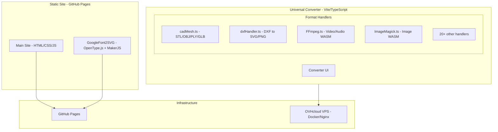
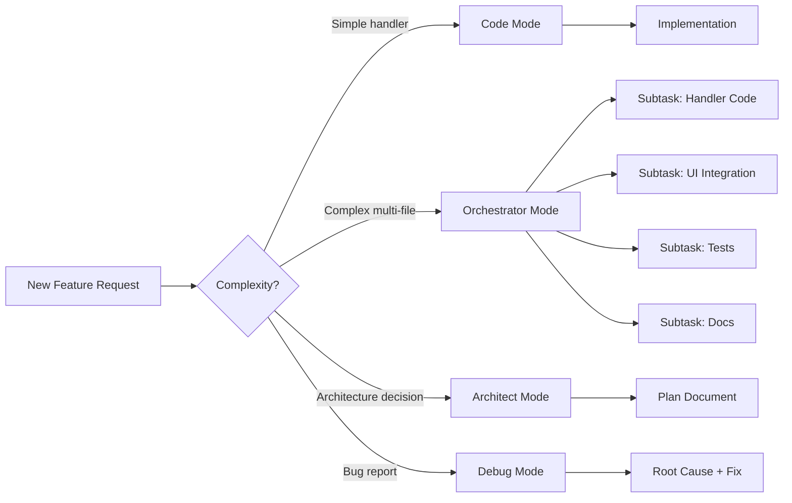
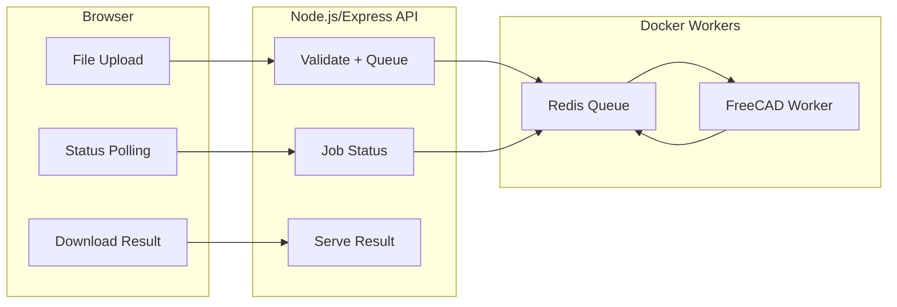

# Kilo Code MCP Infrastructure & Tooling Plan for RIPlay

> **Date:** 2026-02-19  
> **Project:** riplay.cz — Full-stack web platform with file conversion tools  
> **Current Stack:** Static HTML/CSS/JS + Vite/TypeScript converter + Three.js/WASM + Docker/Nginx  
> **VPS:** OVHcloud VPS-2 (6 vCores, 12GB RAM, 100GB SSD)

---

## Table of Contents

1. [Project Context Summary](#1-project-context-summary)
2. [MCP Server Recommendations](#2-mcp-server-recommendations)
3. [Kilo Code Skills & Configuration](#3-kilo-code-skills--configuration)
4. [Toolchain & Ecosystem Integration](#4-toolchain--ecosystem-integration)
5. [Scalability & Future-Proofing](#5-scalability--future-proofing)
6. [Gaps & Risks](#6-gaps--risks)
7. [Implementation Roadmap](#7-implementation-roadmap)

---

## 1. Project Context Summary

### Current Architecture



### Key Observations from Code Analysis

| Aspect | Current State | Notes |
|--------|--------------|-------|
| MCP Config | Empty — [`mcp.json`](.kilocode/mcp.json:1) has `{"mcpServers":{}}` | No MCP servers configured |
| CI/CD | Basic GitHub Pages deploy — [`github-pages.yml`](.github/workflows/github-pages.yml:1) | No build step for converter |
| Converter | 22+ format handlers in [`handlers/index.ts`](tools/converter/src/handlers/index.ts:1) | Plugin architecture via [`FormatHandler`](tools/converter/src/FormatHandler.ts:35) interface |
| Build | Vite + TypeScript — [`vite.config.js`](tools/converter/vite.config.js:1) | WASM static copy for FFmpeg, ImageMagick, Reflo |
| Docker | Bun build + Nginx static — [`Dockerfile`](tools/converter/docker/Dockerfile:1) | Multi-stage, production-ready |
| 3D/CAD | Three.js loaders/exporters — [`cadMesh.ts`](tools/converter/src/handlers/cadMesh.ts:1) | STL, OBJ, PLY, GLB with image rendering |
| 2D CAD | dxf-parser — [`dxfHandler.ts`](tools/converter/src/handlers/dxfHandler.ts:1) | DXF to SVG/PNG, PDF stub |
| Font Tools | OpenType.js + MakerJS — [`index.js`](tools/googlefont2svg/index.js:1) | Font to SVG/DXF with Google Fonts API |

---

## 2. MCP Server Recommendations

### Tier 1: Essential — Install Immediately

These MCP servers provide the highest immediate value for the riplay.cz project.

#### 2.1 Context7 MCP Server
- **Purpose:** Real-time library/API documentation lookup during development
- **Why:** Already referenced in your global rules. Provides up-to-date docs for Three.js, Vite, TypeScript, dxf-parser, OpenType.js, and every npm dependency without leaving the editor
- **Install:** `npx -y @context7/mcp@latest`
- **Config:**
```json
{
  "mcpServers": {
    "context7": {
      "command": "npx",
      "args": ["-y", "@context7/mcp@latest"]
    }
  }
}
```
- **Value:** Eliminates hallucinated API calls; ensures code generation uses correct, current library signatures

#### 2.2 Filesystem MCP Server
- **Purpose:** Structured file operations — read, write, search, move files across the workspace
- **Why:** The project has a complex multi-tool structure with `tools/converter/`, `tools/googlefont2svg/`, `3rd_party/convert/`, `docs/`, `plans/`. Filesystem MCP gives Kilo Code reliable file manipulation beyond basic tool calls
- **Install:** `npx -y @anthropic/mcp-filesystem`
- **Config:**
```json
{
  "mcpServers": {
    "filesystem": {
      "command": "npx",
      "args": ["-y", "@anthropic/mcp-filesystem", "c:/develop/riplay"]
    }
  }
}
```

#### 2.3 GitHub MCP Server
- **Purpose:** Repository management — issues, PRs, branches, releases, Actions workflows
- **Why:** Your project is on GitHub with Pages deployment. This enables Kilo Code to create issues for new converter features, manage PRs, trigger deployments, and inspect workflow runs
- **Install:** `npx -y @anthropic/mcp-github`
- **Config:**
```json
{
  "mcpServers": {
    "github": {
      "command": "npx",
      "args": ["-y", "@anthropic/mcp-github"],
      "env": {
        "GITHUB_TOKEN": "<your-github-pat>"
      }
    }
  }
}
```

#### 2.4 Docker MCP Server
- **Purpose:** Container management — build, run, inspect, logs for Docker containers
- **Why:** Your converter uses Docker for production deployment ([`Dockerfile`](tools/converter/docker/Dockerfile:1)). Future server-side STEP/IGES conversion will need FreeCAD workers in containers. Docker MCP lets Kilo Code build images, inspect running containers, and debug deployment issues
- **Install:** `npx -y @anthropic/mcp-docker`
- **Config:**
```json
{
  "mcpServers": {
    "docker": {
      "command": "npx",
      "args": ["-y", "@anthropic/mcp-docker"]
    }
  }
}
```

### Tier 2: High Value — Install for Active Development

#### 2.5 Puppeteer / Browser MCP Server
- **Purpose:** Browser automation for testing converter UI, screenshot verification, E2E testing
- **Why:** Your converter is 100% client-side with WASM. Visual regression testing and automated conversion verification require browser interaction. Puppeteer is already a devDependency in [`package.json`](tools/converter/package.json:14)
- **Install:** `npx -y @anthropic/mcp-puppeteer`
- **Config:**
```json
{
  "mcpServers": {
    "puppeteer": {
      "command": "npx",
      "args": ["-y", "@anthropic/mcp-puppeteer"]
    }
  }
}
```

#### 2.6 PostgreSQL / SQLite MCP Server
- **Purpose:** Database management for future backend features — user analytics, conversion logs, job queues
- **Why:** Phase 3 of your [`cad-cam-converter-plan.md`](plans/cad-cam-converter-plan.md:388) calls for a FastAPI backend with job queues. A database MCP server enables Kilo Code to design schemas, write migrations, and query data directly
- **Recommended:** Start with SQLite MCP for local dev, migrate to PostgreSQL MCP when backend goes live
- **Install:** `npx -y @anthropic/mcp-sqlite` or `npx -y @anthropic/mcp-postgres`

#### 2.7 Fetch / HTTP MCP Server
- **Purpose:** Make HTTP requests to external APIs — Google Fonts API, npm registry, CDN endpoints
- **Why:** Your GoogleFont2SVG tool calls the Google Fonts API ([`index.js`](tools/googlefont2svg/index.js:211)). Fetch MCP enables testing API endpoints, checking CDN availability, and validating deployment URLs
- **Install:** `npx -y @anthropic/mcp-fetch`
- **Config:**
```json
{
  "mcpServers": {
    "fetch": {
      "command": "npx",
      "args": ["-y", "@anthropic/mcp-fetch"]
    }
  }
}
```

### Tier 3: Strategic — Install When Needed

#### 2.8 Sentry MCP Server
- **Purpose:** Error tracking and monitoring integration
- **Why:** Production error monitoring for WASM crashes, conversion failures, and client-side exceptions
- **When:** After deploying to production VPS

#### 2.9 Cloudflare MCP Server
- **Purpose:** CDN, DNS, and edge function management
- **Why:** If you move to Cloudflare for CDN/DNS (recommended for WASM binary delivery performance)
- **When:** During CDN migration

#### 2.10 Linear / Jira MCP Server
- **Purpose:** Project management integration
- **Why:** Track converter feature requests, bug reports, and development sprints
- **When:** When team grows beyond solo development

#### 2.11 Memory / Knowledge Graph MCP Server
- **Purpose:** Persistent context about project decisions, architecture patterns, and conventions
- **Why:** Maintains institutional knowledge across sessions — remembers that DXF Y-axis is flipped, that SharedArrayBuffer needs COOP/COEP headers, etc.
- **Install:** `npx -y @anthropic/mcp-memory`

### Recommended Combined MCP Configuration

```json
{
  "mcpServers": {
    "context7": {
      "command": "npx",
      "args": ["-y", "@context7/mcp@latest"]
    },
    "filesystem": {
      "command": "npx",
      "args": ["-y", "@anthropic/mcp-filesystem", "c:/develop/riplay"]
    },
    "github": {
      "command": "npx",
      "args": ["-y", "@anthropic/mcp-github"],
      "env": {
        "GITHUB_TOKEN": "<your-github-pat>"
      }
    },
    "docker": {
      "command": "npx",
      "args": ["-y", "@anthropic/mcp-docker"]
    },
    "fetch": {
      "command": "npx",
      "args": ["-y", "@anthropic/mcp-fetch"]
    },
    "puppeteer": {
      "command": "npx",
      "args": ["-y", "@anthropic/mcp-puppeteer"]
    },
    "memory": {
      "command": "npx",
      "args": ["-y", "@anthropic/mcp-memory"]
    }
  }
}
```

---

## 3. Kilo Code Skills & Configuration

### 3.1 Custom Modes

Create project-specific modes to maximize productivity:

#### Converter Handler Mode
- **Purpose:** Specialized mode for creating new format handlers
- **File patterns:** `tools/converter/src/handlers/*.ts`, `tools/converter/src/handlers/index.ts`
- **Instructions:** Always follow the [`FormatHandler`](tools/converter/src/FormatHandler.ts:35) interface. Register new handlers in [`index.ts`](tools/converter/src/handlers/index.ts:1). Use try/catch wrapper pattern for handler registration. Test with both binary and text file inputs.
- **Context:** Auto-include `FormatHandler.ts` and `handlers/index.ts` as reference files

#### Frontend Tool Mode
- **Purpose:** Building new tool pages under `tools/`
- **File patterns:** `tools/**/*`
- **Instructions:** Follow the i18n pattern from GoogleFont2SVG (CS/EN/DE locales). Use the glassmorphism design system from [`style.css`](css/style.css:1). Ensure responsive design at 768px and 1024px breakpoints.

#### DevOps Mode
- **Purpose:** Docker, Nginx, CI/CD, and deployment tasks
- **File patterns:** `**/docker/**`, `**/Dockerfile`, `**/*.yml`, `**/nginx/**`
- **Instructions:** Use multi-stage Docker builds. Configure COOP/COEP headers for SharedArrayBuffer. Follow the deployment checklist in [`deployment.md`](docs/deployment.md:1).

### 3.2 Recommended Skills Configuration

| Skill Area | Configuration | Rationale |
|-----------|---------------|-----------|
| **TypeScript Strict** | Enable strict mode awareness | Converter uses TypeScript with strict config |
| **WASM Integration** | Know FFmpeg.wasm, ImageMagick.wasm patterns | Core conversion engine relies on WASM |
| **Three.js 3D** | Loader/Exporter patterns | CAD mesh handler uses Three.js extensively |
| **SVG Manipulation** | DOM-based SVG generation | DXF handler generates SVG programmatically |
| **Docker Multi-stage** | Build + runtime separation | Production deployment pattern |
| **Vite Plugin System** | Static copy, path resolution | Build configuration for WASM assets |

### 3.3 Project Rules (.kilocode/rules)

Create project-specific rules:

```markdown
# RIPlay Project Rules

## Converter Handler Development
- All new handlers MUST implement the FormatHandler interface from src/FormatHandler.ts
- Handler registration in handlers/index.ts MUST use try/catch wrapper
- Binary file formats MUST use Uint8Array, never string encoding
- All conversions MUST be client-side unless explicitly marked as server-side
- WASM modules MUST be lazy-loaded via dynamic import

## File Format Conventions
- DXF Y-axis is inverted relative to SVG — always negate Y coordinates
- STL files can be ASCII or binary — detect via magic bytes
- SVG output MUST include proper xmlns and viewBox attributes
- Font files (TTF/OTF/WOFF) use OpenType.js for parsing

## Internationalization
- All user-facing text MUST support CS, EN, DE locales
- Use JSON locale files following the pattern in tools/googlefont2svg/locales/
- Never hardcode user-visible strings in JavaScript/TypeScript

## Deployment
- Static assets served via Nginx with immutable cache headers
- WASM files require Cross-Origin-Embedder-Policy: require-corp
- SharedArrayBuffer requires Cross-Origin-Opener-Policy: same-origin
- HTML files MUST have no-cache headers
```

### 3.4 Mode Usage Strategy



---

## 4. Toolchain & Ecosystem Integration

### 4.1 Vector File Format Libraries

| Format | Library | Status | Notes |
|--------|---------|--------|-------|
| **DXF** | `dxf-parser` v1.1.2 | ✅ In use | Parse DXF to JSON entities |
| **SVG** | Native DOM API | ✅ In use | Programmatic SVG generation |
| **TTF/OTF** | `opentype.js` | ✅ In use | Font parsing in GoogleFont2SVG |
| **WOFF/WOFF2** | `opentype.js` | ✅ Supported | Same library handles WOFF |
| **DXF Export** | `makerjs` | ✅ In use | DXF export in GoogleFont2SVG |
| **SVG to DXF** | `svg-to-dxf` | ⬜ Recommended | Reverse conversion path |
| **PDF Generation** | `jspdf` + `svg2pdf.js` | ⬜ Recommended | Complete the PDF output stub in dxfHandler |
| **STL/OBJ/PLY/GLB** | Three.js loaders/exporters | ✅ In use | Full 3D mesh pipeline |
| **3MF** | `three/addons/loaders/3MFLoader` | ⬜ Planned | Listed in CAD plan |
| **STEP/IGES** | OpenCASCADE.js or FreeCAD backend | ⬜ Phase 3 | Requires server-side processing |

### 4.2 Backend Processing Pipeline (Phase 3)

When server-side conversion is needed:



**Recommended Stack:**
- **API:** Express.js or Fastify (Node.js) — consistent with existing TypeScript ecosystem
- **Queue:** BullMQ + Redis — battle-tested job queue for Node.js
- **CAD Engine:** FreeCAD headless in Docker — open-source, supports STEP/IGES/Parasolid
- **File Storage:** Local filesystem with TTL cleanup (1 hour) — matches security requirements in [`cad-cam-converter-plan.md`](plans/cad-cam-converter-plan.md:504)

### 4.3 Frontend Delivery Optimization

| Optimization | Tool | Impact |
|-------------|------|--------|
| **WASM Compression** | Brotli pre-compression in Nginx | 60-70% size reduction for WASM binaries |
| **Code Splitting** | Vite dynamic imports | Already in use — handlers lazy-loaded |
| **CDN** | Cloudflare or BunnyCDN | Serve WASM/JS from edge nodes |
| **Service Worker** | Workbox | Offline capability for converter |
| **Image Optimization** | Sharp or squoosh-cli | Convert logo PNG to WebP/AVIF |

### 4.4 Testing Infrastructure

| Layer | Tool | Purpose |
|-------|------|---------|
| **Unit Tests** | Vitest | Test individual handler conversion logic |
| **Integration Tests** | Vitest + jsdom | Test handler registration and routing |
| **E2E Tests** | Playwright or Puppeteer | Test full conversion flow in browser |
| **Visual Regression** | Playwright screenshots | Verify SVG/PNG output consistency |
| **Performance** | Lighthouse CI | Track WASM load times and conversion speed |

### 4.5 Monitoring & Analytics

| Tool | Purpose | Priority |
|------|---------|----------|
| **Plausible Analytics** | Privacy-friendly usage tracking | High — GDPR compliant |
| **Sentry** | Client-side error tracking | High — catch WASM crashes |
| **Uptime Robot** | VPS availability monitoring | Medium |
| **Grafana + Prometheus** | Server metrics when backend launches | Low — Phase 3 |

---

## 5. Scalability & Future-Proofing

### 5.1 Plugin Architecture for New Tools

The existing [`FormatHandler`](tools/converter/src/FormatHandler.ts:35) interface is well-designed for extensibility. To make onboarding new conversion features even more seamless:

#### Recommended: Handler Auto-Discovery

Instead of manually importing and registering each handler in [`index.ts`](tools/converter/src/handlers/index.ts:1), implement auto-discovery:

```typescript
// handlers/index.ts — proposed auto-discovery pattern
const handlerModules = import.meta.glob('./*.ts', { eager: false });

const handlers: FormatHandler[] = [];
for (const path in handlerModules) {
  if (path === './index.ts') continue;
  try {
    const module = await handlerModules[path]();
    const HandlerClass = module.default;
    if (HandlerClass && typeof HandlerClass === 'function') {
      handlers.push(new HandlerClass());
    } else if (HandlerClass && HandlerClass.name) {
      handlers.push(HandlerClass);
    }
  } catch (e) {
    console.warn('Failed to load handler from ' + path, e);
  }
}
```

**Benefits:**
- Drop a new `.ts` file in `handlers/` and it auto-registers
- No merge conflicts when multiple handlers are added simultaneously
- Cleaner separation of concerns

#### Recommended: Handler Metadata Schema

Add a standardized metadata export to each handler for UI generation:

```typescript
export const metadata = {
  category: 'cad-2d',        // cad-2d, cad-3d, image, video, audio, document, archive
  icon: 'drafting-compass',   // Icon identifier for UI
  description: 'Convert DXF drawings to SVG vector graphics',
  tags: ['cad', 'cnc', 'laser', 'vector'],
  maxFileSize: 50 * 1024 * 1024,  // 50MB
  estimatedSpeed: 'fast',     // fast, medium, slow
};
```

### 5.2 New Tool Onboarding Template

Create a scaffolding template for new tools:

```
tools/<tool-name>/
├── index.html          # Tool UI
├── index.css           # Tool styles
├── index.js or src/    # Tool logic
├── i18n.js             # Internationalization
├── locales/
│   ├── cs.json
│   ├── en.json
│   └── de.json
└── README.md           # Tool documentation
```

### 5.3 Monorepo Considerations

As the tool count grows, consider:

| Approach | When | Tool |
|----------|------|------|
| **Current structure** | 1-5 tools | Manual management |
| **npm workspaces** | 5-10 tools | Shared dependencies, unified build |
| **Turborepo** | 10+ tools | Incremental builds, caching, parallel execution |
| **Nx** | Enterprise scale | Full monorepo management with dependency graph |

**Recommendation:** Migrate to **npm workspaces** when you add the 3rd tool. This gives you:
- Shared `node_modules` across tools
- Unified `npm run build` from root
- Per-tool versioning
- No additional tooling overhead

### 5.4 API Versioning Strategy

For the future backend API:

```
/api/v1/convert     — Current conversion endpoints
/api/v1/formats     — Supported format listing
/api/v1/status/:id  — Job status
```

Use URL-based versioning from day one. This prevents breaking changes when adding new conversion capabilities.

### 5.5 Feature Flag System

Implement a simple feature flag system for gradual rollout of new converters:

```typescript
const FEATURES = {
  STEP_CONVERSION: false,    // Server-side STEP support
  BATCH_DOWNLOAD: true,      // ZIP batch download
  MESH_ANALYSIS: false,      // CNC mesh analysis tools
  DARK_MODE: true,           // UI dark mode
};
```

Store in a JSON config file that can be updated without redeployment.

---

## 6. Gaps & Risks

### 6.1 Critical Gaps

| Gap | Impact | Mitigation |
|-----|--------|------------|
| **No MCP servers configured** | Missing AI-assisted development capabilities | Install Tier 1 servers immediately |
| **No automated testing** | Conversion regressions go undetected | Add Vitest unit tests for each handler |
| **No CI/CD for converter** | Manual build/deploy process | Add GitHub Actions workflow for converter build |
| **PDF output is a stub** | [`dxfHandler.ts`](tools/converter/src/handlers/dxfHandler.ts:363) outputs SVG instead of PDF | Integrate jsPDF + svg2pdf.js |
| **No error monitoring** | Client-side WASM crashes are invisible | Add Sentry or similar |
| **Google Fonts API key exposed** | [`index.js`](tools/googlefont2svg/index.js:7) has hardcoded API key | Move to environment variable or restrict key |

### 6.2 Dependency Risks

| Dependency | Risk Level | Concern | Mitigation |
|-----------|-----------|---------|------------|
| `dxf-parser` v1.1.2 | **Medium** | Last npm publish was 2020; limited entity support | Fork and maintain; or evaluate `dxf` npm package as alternative |
| `@ffmpeg/ffmpeg` v0.12.x | **Low** | Active project but WASM builds can be fragile | Pin exact versions; test upgrades in isolation |
| `three` v0.182.x | **Low** | Very active; breaking changes in minor versions | Pin version; test loader/exporter compatibility on upgrade |
| `opentype.js` | **Low** | Stable, well-maintained | No action needed |
| `makerjs` | **Medium** | Microsoft project, maintenance varies | Already bundled as [`browser.maker.js`](tools/googlefont2svg/lib/browser.maker.js:1); self-contained |
| `imagetracer` v0.2.2 | **Medium** | Small package, limited maintenance | Consider `potrace` WASM as alternative for SVG tracing |
| Google Fonts API | **Low** | Google API, stable | Cache font list locally as fallback |

### 6.3 MCP Ecosystem Risks

| Risk | Description | Mitigation |
|------|-------------|------------|
| **MCP server instability** | Some community MCP servers may have breaking updates | Pin MCP server versions in config |
| **MCP server startup time** | npx-based servers have cold start overhead | Use locally installed servers for frequently-used ones |
| **Token/credential management** | GitHub tokens, API keys in MCP config | Use environment variables, never commit tokens |
| **MCP server conflicts** | Multiple servers may compete for same resources | Test server combinations; disable unused servers |

### 6.4 Architecture Risks

| Risk | Description | Mitigation |
|------|-------------|------------|
| **WASM binary size** | FFmpeg + ImageMagick + future WASM = large downloads | Lazy-load per handler; use CDN with Brotli compression |
| **SharedArrayBuffer restrictions** | Requires HTTPS + COOP/COEP headers | Already documented in [`deployment.md`](docs/deployment.md:160); enforce in CI |
| **Client-side memory limits** | Large CAD files may exceed browser memory | Add file size validation; show warnings for files over 50MB |
| **Cross-browser WASM support** | Safari has historically lagged on WASM features | Test on Safari; provide graceful degradation |
| **3rd_party/convert drift** | Upstream p2r3/convert may diverge from your fork | Track upstream releases; cherry-pick relevant updates |

### 6.5 Missing MCP Capabilities

| Desired Capability | Current MCP Status | Workaround |
|-------------------|-------------------|------------|
| **SVG manipulation** | No dedicated SVG MCP server | Use filesystem MCP + code mode with SVG DOM knowledge |
| **WASM debugging** | No WASM-specific MCP server | Use browser DevTools via Puppeteer MCP |
| **Font file inspection** | No font-specific MCP server | Use OpenType.js programmatically |
| **3D model preview** | No 3D rendering MCP server | Use Puppeteer MCP to screenshot Three.js renders |
| **DXF/CAD validation** | No CAD-specific MCP server | Build custom validation in handler code |

---

## 7. Implementation Roadmap

### Phase 1: Foundation — MCP & Dev Environment

```
[ ] Install and configure Tier 1 MCP servers (Context7, Filesystem, GitHub, Docker)
[ ] Create .kilocode/rules/riplay-rules.md with project-specific rules
[ ] Create custom Kilo Code modes (Converter Handler, Frontend Tool, DevOps)
[ ] Move Google Fonts API key to environment variable
[ ] Add Vitest to converter project for unit testing
```

### Phase 2: CI/CD & Quality

```
[ ] Create GitHub Actions workflow for converter build + test
[ ] Add Vitest unit tests for cadMesh and dxfHandler
[ ] Add Playwright E2E tests for conversion flow
[ ] Integrate Sentry for client-side error monitoring
[ ] Add Plausible Analytics for usage tracking
```

### Phase 3: Converter Enhancement

```
[ ] Implement PDF output in dxfHandler using jsPDF + svg2pdf.js
[ ] Add svg-to-dxf reverse conversion handler
[ ] Implement handler auto-discovery via import.meta.glob
[ ] Add handler metadata schema for UI generation
[ ] Create new tool scaffolding template
```

### Phase 4: Backend & Scale

```
[ ] Set up Express/Fastify API on VPS for server-side conversions
[ ] Deploy Redis + BullMQ for job queue
[ ] Create FreeCAD Docker worker for STEP/IGES conversion
[ ] Implement API versioning (v1)
[ ] Add CDN for WASM binary delivery
[ ] Migrate to npm workspaces for multi-tool management
```

### Phase 5: Production Hardening

```
[ ] Add feature flag system
[ ] Implement file size validation and memory guards
[ ] Add Service Worker for offline converter capability
[ ] Set up Grafana + Prometheus monitoring on VPS
[ ] Create automated backup strategy for VPS
```

---

## Appendix A: Complete MCP Server Reference

| Server | Category | Use Case | Priority |
|--------|----------|----------|----------|
| Context7 | Documentation | Library/API docs lookup | Tier 1 |
| Filesystem | File Operations | Structured file manipulation | Tier 1 |
| GitHub | Version Control | Repo, issues, PRs, Actions | Tier 1 |
| Docker | Infrastructure | Container management | Tier 1 |
| Puppeteer | Testing | Browser automation, E2E | Tier 2 |
| SQLite/PostgreSQL | Database | Schema, queries, migrations | Tier 2 |
| Fetch | HTTP | API testing, endpoint validation | Tier 2 |
| Memory | Knowledge | Persistent project context | Tier 2 |
| Sentry | Monitoring | Error tracking integration | Tier 3 |
| Cloudflare | CDN/DNS | Edge delivery management | Tier 3 |
| Linear/Jira | Project Mgmt | Issue tracking integration | Tier 3 |

## Appendix B: Key File Reference

| File | Purpose |
|------|---------|
| [`.kilocode/mcp.json`](.kilocode/mcp.json:1) | MCP server configuration — currently empty |
| [`tools/converter/src/FormatHandler.ts`](tools/converter/src/FormatHandler.ts:1) | Handler interface definition |
| [`tools/converter/src/handlers/index.ts`](tools/converter/src/handlers/index.ts:1) | Handler registration |
| [`tools/converter/src/handlers/cadMesh.ts`](tools/converter/src/handlers/cadMesh.ts:1) | 3D CAD mesh handler |
| [`tools/converter/src/handlers/dxfHandler.ts`](tools/converter/src/handlers/dxfHandler.ts:1) | 2D DXF handler |
| [`tools/converter/package.json`](tools/converter/package.json:1) | Converter dependencies |
| [`tools/converter/vite.config.js`](tools/converter/vite.config.js:1) | Vite build configuration |
| [`tools/converter/docker/Dockerfile`](tools/converter/docker/Dockerfile:1) | Production Docker build |
| [`tools/googlefont2svg/index.js`](tools/googlefont2svg/index.js:1) | Font to SVG/DXF tool |
| [`.github/workflows/github-pages.yml`](.github/workflows/github-pages.yml:1) | CI/CD pipeline |
| [`docs/architecture.md`](docs/architecture.md:1) | Architecture documentation |
| [`docs/deployment.md`](docs/deployment.md:1) | Deployment guide |
| [`plans/cad-cam-converter-plan.md`](plans/cad-cam-converter-plan.md:1) | CAD/CAM feature roadmap |
